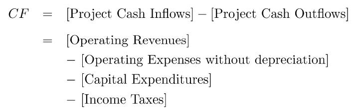
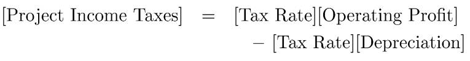
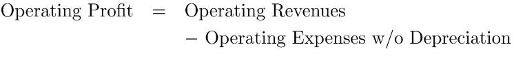
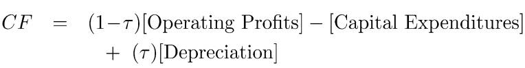
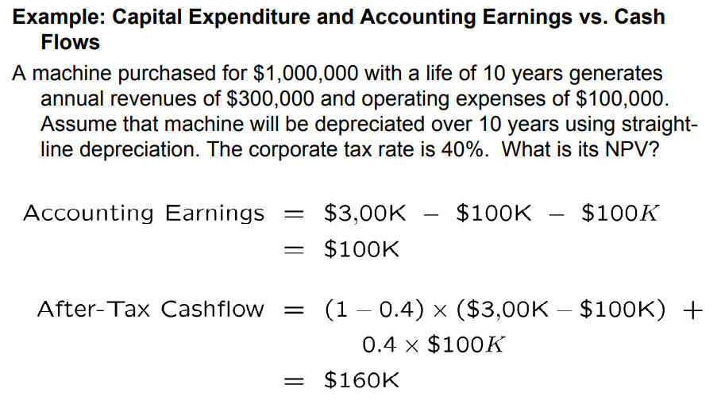

# Capital Budgeting

# NPV 准则

## 规则

> [!note]
> **NPV Rule:** 增加企业市值 `Market Value`，首先就得保证公司项目的 NPV 为正。

公司项目的现金流为

$$
\{ CF_0, CF_1,\dotsm,CF_T \}
$$

当前项目的净现值就是

$$
\text{NPV} = CF_0 + \frac{CF_1}{1+r_1} + \dotsm + \frac{CF_T}{(1+ r_T)^T}
$$

**决定公司未来发展哪些项目时，就需要考虑将 NPV 最大化（公司不是搞慈善，得赚钱）**
- 投资单一项目：只有项目的 NPV 为正，才接受
- 投资多个独立项目：接受所有 NPV 为正的项目
- 投资多个非独立项目：选择 NPV 最大的项目组合方案

## 现金流计算

现金流计算需要关注的点：
1. 现金流不是收益，经济决策不关注收益（**收益是决策真正执行完成后才有的**）
2. 现金流为税后结果
3. 现金流需要考虑全面，可能会有遗漏

- `Operationg Revenues` : 营业收入
- `Operating Expenses without depreciation` : 不考虑折旧的运营支出
- `Capital Expenditures`: 资产支出，例如花费买新设备
- `Income Taxes` : 所得税

    

- `Depreciation`: 折旧，描述资产贬值，例如生产设备放厂里也会随时间贬值。**本质是一个税盾 `tax shield`，这部分不用交税**
- `Operating Profits` : 营收利润，营业收入减去不考虑折损的运营支出

    

综上，就能得出现金流的计算公式

- $\tau$ : 表示税率

> [!note]
> 资产的折旧只影响现金流中的税额，并不会直接参与现金流计算，因为折旧即不属于现金流的流入部分，也不属于流出部分。

## 折扣率

公司开展的具体项目可以看做是公司发行了一支股票。既然是投资了一个股票，那么就存在风险。风险高，股票的价格也就越低，即该项目的 NPV 值也就越低。股票的风险都是体现在贴现率上的，项目也是一样。项目的贴现率也称之为资产成本 `Cost of Capital`，该值可以通过 `CAPM` 模型进行估算

$$
\bar{R}_\text{project} =  R_f+\beta_\text{project}\left(\bar{R}_m-R_f\right)
$$

其中 $\beta_\text{project}$ 值可以参考其他公司的类似项目。

# 调整现值

> [!NOTE]
>  `NPV` 考虑的是最终结果的好坏，未能体现出中间过程的指标。替代方案被称之为 `APV (Adjusted Present Value)`

## 投资回收期

**投资回收期 (Payback Period)：** 项目收回成本的最短年限，即能使不等式成立的最小 $k$ 值。

$$
 CF_{1}+CF_{2}+\cdots+CF_{k}\geq-CF_{0}=I_{0}
$$

> **使用方案：**
> 1. 投资回收期大于预期，则不投资该项目
> 2. 多个互斥项目，投资投资回收期最短的项目

忽视了现金流的时间性，因此添加折扣率进行修正：

$$
\frac{CF_{1}}{1+R_{1}}+\cdots+\frac{CF_{k}}{(1+R_{k})^{k}}\geq-CF_{0}=I_{0}
$$

使用修正后的投资回收期模型评估项目，同样存在缺陷：**未考虑 $K$ 时间之后的现金流**。

## 盈利指数

**盈利指数（Profitability Index）:** 项目总价值与投资成本的比值

$$
\mathsf{PI}\quad\equiv\quad\frac{\mathsf{PV}}{-CF_0}\quad=\quad\frac{\mathsf{PV}}{I_0}
$$

> **使用方案：**
> 1. 盈利指数小于 1，则不投资该项目
> 2. 多个互斥项目，选择盈利指数值最大的

「盈利指数」只是比例，并没有考虑基准值的规模，不能反应实际价值。例如，用 1 块钱赚 10 块获取的价值肯定不如用 10 块赚 20 块的多。

> [!NOTE]
> 对于个体投资，只考虑回报比例没有问题，个体投资体量太小并不会引起市场变化。但是大型投资得从规模出发（即 `NPV`），因为大型投资可能会颠覆行业，引起回报比例的变化。

## IRR

> **假设：**
> 1. 项目投资只发生在启动项目时
> 2. 现金流非负

**IRR** : 使项目实现收支平衡的收益率或回报率

$$
I_0=\frac{CF_1}{(1+\mathrm{IRR})}+\frac{CF_2}{(1+\mathrm{IRR})^2}+\cdots+\frac{CF_t}{(1+\mathrm{IRR})^t}
$$

> **使用方案：**
> 1. IRR 大于给定阈值，则投资项目
> 2. 多个互斥项目，选择 IRR 值最大的项目
