# Fixed-Income Securities

# 固定收益证券

**Fixed-Income Securities (固定收益证券)** : 相对于权益类投资标的的一类金融产品，具体分为债券（bonds），Asset-backed securities (ABS) 等，最常见的是债券。相对于股票、现金流而言，固定收益证券具有固定的收益，且交易流动相对缓慢。其种类有
- Treasury Securities (国债) 
- Corporate Securities (公司证券)
- Municipal Securities (市政证券) 
- Mortgage-Backed Securities (抵押贷款证券)
- ....

固定收益市场由三部分组成：
- Issuers (发行人) : 给出欠条，获取投资用于组织经营，并给投资人利息予以回报
- Intermediaries (中介机构) : 发行人与投资者实现交易的平台
- Investors (投资者) : 购买发行人欠条，将资金借给发行人

其价值计算就涉及
- 本金和息票的净现值
- 风险
    - Inflation 
    - Credit 信誉
    - Timing 
    - Liquidity
    - Currencey 货币种类，汇率变动

# 纯折扣债券

**pure discount bonds (纯折扣债券/贴现债券)** : 到期时一次性返回本付息的债券，因此在偿还时，金额的面值 `face value` 就有一个很简单的折扣 (今天的钱比明天的更值钱)。其净现值就是

$$
P_0 = \frac{F}{(1 + r)^T}
$$

## 利率

### 期利率

上面的公式中利率 $r$ 是在年限 $T$ 以内的一个固定，体现出每一年的利率都是定制，但现实中肯定不是

$$
\begin{aligned}
P_0 &= \frac{F}{(1 + R_1) (1+R_2) \dotsm (1 + R_T)} \\
    &= \frac{F}{(1 + r_{0,T})^T}
\end{aligned}
$$

- $R_t$ 即一年期利率 `one year Spot Rate of Interest`，描述的是一年以内的利率（每一年的内期利率都在变化，是未知的）
- $r_{0,T}$ 则表示从今天到 $T$ 时间段内的期利率（该值是能够提前给出的），可以看作是所有 $R_t$ 的均值。

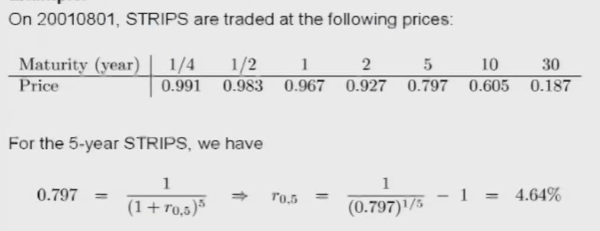

### 利率期限结构图

再将上面的等式进行展开

$$
\begin{aligned}
P_{0,1} &= \frac{F}{(1 + R_1)} \rArr r_{0,1} \\
P_{0,2} &= \frac{F}{(1 + R_1)(1 + R_2)} \rArr r_{0,2} \\
P_{0,3} &= \frac{F}{(1 + R_1)(1 + R_2)(1 + R_3)}  \rArr r_{0,2} \\
\dotsm \\
P_{0,T} &= \frac{F}{(1 + R_1) (1+R_2) \dotsm (1 + R_T)} \rArr r_{0,T}
\end{aligned}
$$

$r_{0,T}$ 随时间 $t$ 变化的曲线则被称之为 「利率期限结构图 `term structure of interest rates` 或收益曲线 `yield curve`」描述了未来利率的走向。
- 斜率为正 ： $r_{0,t}$ 未来随时间的增加而增大
- 斜率为负 : $R_t$ 未来会下降

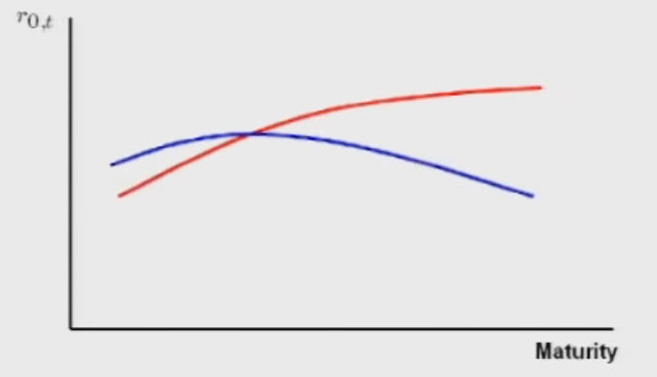

### 远期

此外继续观察上面的展开式子，只要知道了 $P_{0,t-1}、P_{0,t}$ 就能计算出 $t-1$ 到 $t$ 时间段内的期利率 $f_t$，**即得到了在时间 `t=0` 时刻对 $t-1$ 到 $t$ 时间段内的期利率的预测值 $f_t$。这样对未来某个时间段期利率的预测结果也被称之为「远期利率 `forward rates`」** 。

$$
 \frac{P_{0,t-1}}{P_{0,t}}  = 1 + f_t = \frac{(1 + r_{0, t})^t}{(t + r_{0,t-1})^{t-1}}
$$

**从关系图中可以看出只有从今天起的一年内的期利率是确定了，其他年份的期利率都是不确定的，到明年根据市场重新统计后就会变化。**

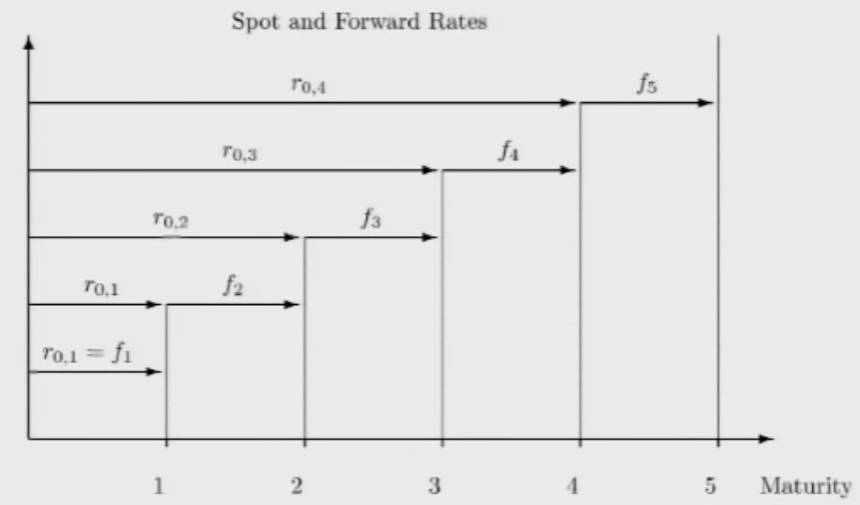

**远期交易 `forward transaction`** : 在 `t = 0` 的时刻，就决定好了未来 `t1 - t2` 时间段内的交易。

例如每年都能赚 1000 万，但是需要在今年决定明年赚的钱如何在后年给股东分红（即需要确定明年到后年之间的期利率）。现在能知道的是 $r_{0,1} = 0.05$ 与 $r_{0,2} = 0.07$ (都是已经明确知道的期利率，可查市场报告)；明年到后年之间的期利率是未知的，是需要根据现有数据预测的，即「远期利率」。

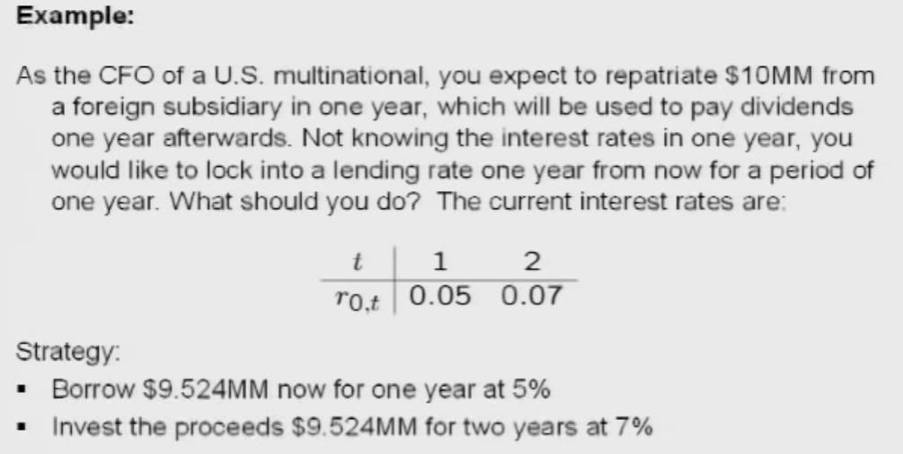

在上面情况的基础上，今年又去借了一笔 925.4 万为期一年的贷款（即发行了一年期的纯折扣债券）；借到的钱又转手借出去两年（即购入了两年期的纯折扣债券）；明年 1000 万收入到账后，就会用于偿还 925.4 万的贷款（`925.4 * (1 + 0.05) = 1000.02`）。一顿骚操作后，两年后就能得到 1090.4 万。

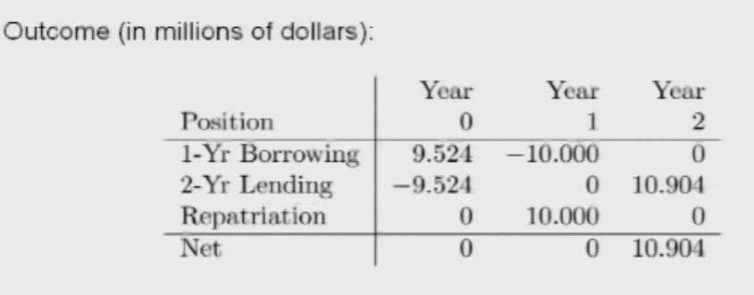

当在今天确定好这份「远期交易」规则后，一个隐含的信息被确定了，**即第一年和第二年之间的期利率被确定在了 `0.09`** 。这样就能保证未来第一年与第二年的实际期利率怎么变化，交易合同上的期利率就是 `0.09`

$$
\frac{(1 + 0.07)^2}{(1 + 0.05)} - 1 \approx 0.09 
$$

# 息票债券

**Coupon Bonds (息票债券)** : 通常每半年会支付一次回报（即息票 `Coupon`），并且在借款年限到期后，归还全部借出的本金。例如一个为期3年的 1000 元息票债券，借出钱后，能够每年收到 50 块，并且在第3年能收回本金 1000 块

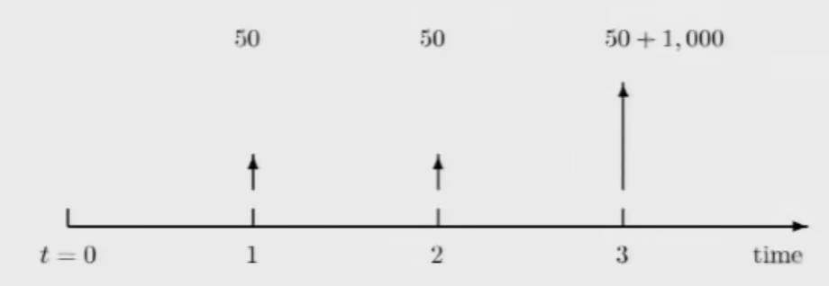

**STRIPS (Separate Trading of Registered Interest and Principal Securities) 本息分离债券** : 一帮人大量收购国家发行的「息票债券」，然后再发行小额度的债券，因为国家的「息票债券」额度大且时间长，一般人顶不住，`STRIPS` 帮助实现团购。`STRIPS` 也被称之为零息债券，其交易形式同纯折扣债券。

息票债券的净现值计算公式为

$$ 
\begin{aligned}
P_0 &= \frac{C}{1 + R_1} + \frac{C}{(1 + R_1) (1 + R_2)} + \dotsm + \frac{C + F}{(1 + R_1) \dotsm (1 + R_T)} \\
    &= \frac{C}{1 + y} + \frac{C}{(1 + y)^2} + \dotsm + \frac{C + F}{(1 + y)^T}
\end{aligned}
$$

同样未来期利率 $R_t$ 是无法获取到的，也用了一个平均值进行代替 $y$ 即「债券收益率`yield`」

- **Expectations Hypothesis Model** : 认为收益曲线应当是平坦的，和时间无关
- **Liquidity Preference Model**: 认为收益曲线的斜率应当为正，借钱时间越长，支付的利息应当越多

> [!note]
> 息票债券的相关问题可以转换为纯折扣债券进行处理。

上述的三年期 `5%`的息票债券可以被拆分为三份 STRIPS
- 一年期限 50 元的 STRIPS
- 两年期限 50 元的 STRIPS
- 三年期限 1050 的 STRIPS

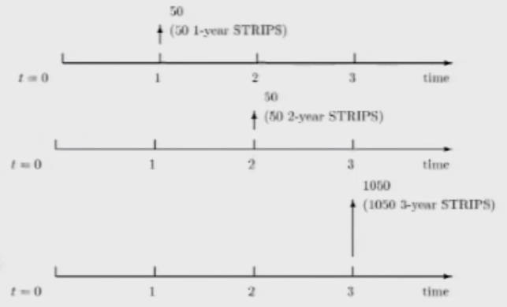

> [!note] 
> 息票债券拆分为 STRIPS 后， 息票债券的总净现值必须与 STRIPS 的总净现值一样。

假如息票债券的总净现值必须高于 STRIPS 的总净现值，就有老六来「 **卖空 (Short-Selling)** 」: 先买打包买入全部的 STRIPS，然后包装成息票债券进行出售，实现了赚取中间价。

# 一价定律

> [!note]
> **Law of One Price (一价定律)** : two identical cash flows must have the same price.

## 套利

**Arbitrage (套利)** : 当打破了「一价定律」，变可以低价买转手高价卖，且自由买卖，无交易成本，就能不劳而获赚取中间差价，这种行为就是套利，比黄牛还过分，**不用承当任何风险** 。例如存在两种同样现金流，但价格不一样的债券

$$
P_1 > CP_{0,1} + C P_{0,2} + .... + (C + F) P_{0,T} = P_2
$$

先购买 $P_2$ 然后按照 $P_1$ 价格出售，并且交易快速完成，无任何风险。

**Short Selling (卖空)** ： 套利的实现方式，不必购买 $P_2$，而是去借（直接不掏钱），然后转手按照 $P_1$ 卖掉，再将借出的 $P_2$ 还回去。当然市场也有一些阻碍「卖空」行为的措施，例如政府叫停、借钱的时候需要缴纳定金、提高借贷利息等。

## 固定收益套利

现在考虑多组息票债券
$$
\begin{aligned}
    P_1 &= C_{11}P_{0,1} + C_{12} P_{0,2} + .... + C_{1T} P_{0,T} \\
    P_2 &= C_{21}P_{0,1} + C_{22} P_{0,2} + .... + C_{2T} P_{0,T} \\
    \vdots\\
    P_n &= C_{n1}P_{0,1} + C_{n2} P_{0,2} + .... + C_{nT} P_{0,T} \ \ \  (n > T)
\end{aligned}
$$
- ${P_1,P_2,\dotsm,P_n}$ ： 分别为每个组息票债的价格，由市场决定值多少钱，已知
- ${C_{11} \dotsm C_{nT}}$ : 息票的份数，可以为0，已知
- ${P_{0,1},P_{0,2},\dotsm,P_{0,n}}$ : 息票在每年相对于今年的单位价格，由收益率 $y$ 确定，未知

上面的模型就变成了：已知 $n$ 组等式，求解未知数 $y$ 。

**有意思的地方来了，按理说每一组等式的 $y$ 应当是一样的（每一年对于每一个息票债券的收益率应当都是一个值），但是反过来对其验证：利用 $n$ 组等式，求解未知数 $y$，求解这个线性方程组可能存在无解，即存在等式不满足「一价定律」，也就是说存在「套利」的机会，这也被称之为「固定收益套利 `Fixed-Income Arbitrage`」。**

# 风险评估

## Macaulay Duration

风险体现在引起收益率 $y$ 的变化，进而导致价格 $P$ 的变化。要对风险进行评估，就是需要观察 $y$ 会如何影响 $P$，即求解 $\frac{\partial P}{\partial y}$

$$
\begin{aligned}
\text{P}& =\quad\sum_{k=1}^{T}\frac{C_{k}}{(1+y)^{k}}  \\
\frac{\partial P}{\partial y}& =\quad\frac{-1}{1+y}\sum_{k=1}^{T}k\cdot\frac{C_{k}}{(1+y)^{k}} 
\end{aligned}
$$

**Macaulay Duration (麦考利久期)** : 认为债券期限越长，债券价格对于收益率的变化越灵敏。直接用支付息票的期限作为指标，通过加权平均（钱已经到手，那就没有风险了，每个期限权重系数不一样）对所有的息票期限进行计算得到的结果就称之为「麦考利久期」，符号为 $D_m$。

$$
    D_{m} ={\sum\limits_{k=1}^{T}k\cdot\omega_{k}}
$$

其中 $\omega_k$ 的取值为

$$
\begin{aligned}
\omega_{k} &={\frac{C_{k}/(1+y)^{k}}{P}}={\frac{\mathsf{PV}(C_{k})}{P}} \\
\sum\limits_{k=-1}^{q}\omega_{k} &=1  
\end{aligned}
$$
 
将麦考利久期 $D_m$ 回代 $\frac{\partial P}{\partial y}$

$$
\begin{aligned}
    \frac{1\partial P}{P\partial y} &= -\frac{D_{m}}{1+y} \\
    &= - D^* \ \ (Modified \ Duration)
\end{aligned}
$$

**通过式子可以看出 $D_m$ 值越大，$\frac{\partial P}{\partial y}$ 数值越大，即债券价格对于收益率的变化越灵敏** 。

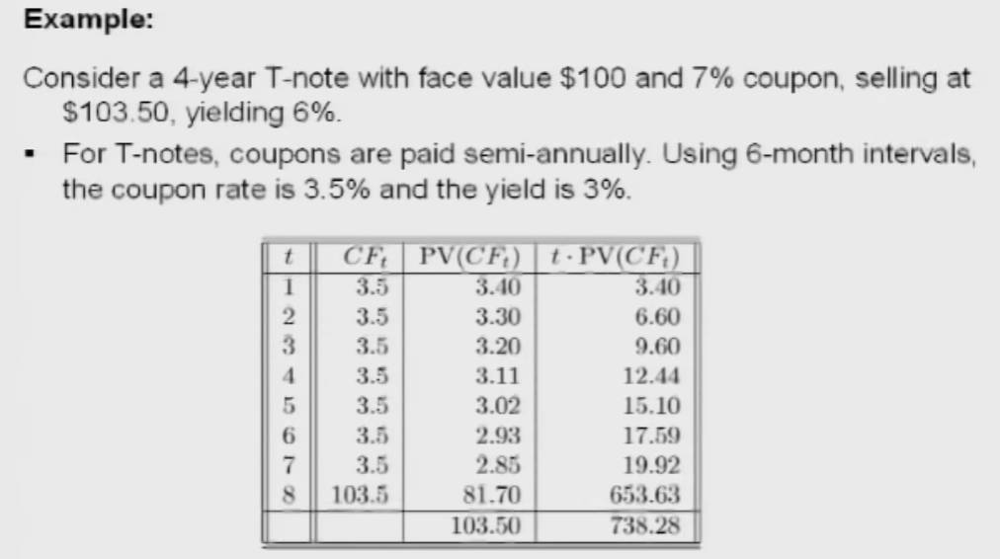

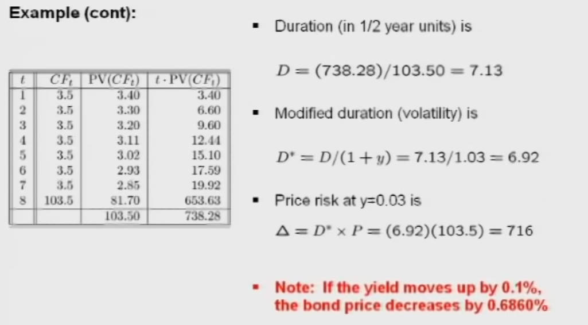

## Convexity

求 $P$ 关于 $y$ 的二阶偏微分

$$
\begin{aligned}
\frac{\partial^2P}{\partial y^2}&=\frac{1}{(1+y)^2}\sum_{k=1}^Tk\cdot(k+1)\cdot\frac{C_k}{(1+y)^k}\\
\frac{\partial P}{P\partial y^2}&=V_m
\end{aligned}
$$

## 预估价格

现在有两个风险评估指标 $D_m$ 与 $V_m$。这两个指标对价格的影响可以通过对 $P(y)$ 进行泰勒展开获取

$$
\begin{gathered}
P(y^{\prime}) \approx\quad P(y)+\frac{\partial P}{\partial y}(y)\cdot(y^{\prime}-y)+\frac{\partial^{2}P}{\partial y^{2}}(y)\cdot\frac{(y^{\prime}-y)^{2}}{2} \\
=\quad P(y)\cdot\left[1-D_{m}^{*}(y^{\prime}-y)+\frac{1}{2}V_{m}(y^{\prime}-y)^{2}\right] 
\end{gathered}
$$

通过泰勒展开式就能分析 $y \to  y'$ 时，$D_m^*$ 与 $V_m$ 会怎样影响 $P(y) \to P(y')$ 。

> [!note]
> 该近似计算只能用于评估方案的风险如何影响价格，不能用于真实价格的计算。

## 组合债券

对于多个债券的组合，$V_m$ 与 $D_m$ 的评估满足线性叠加

$$\begin{aligned}
P&=&\sum_{j}P_{j}\\
D_{m}^{*}(P)&=&-\frac{1}{P}\frac{\partial P}{\partial y}&=&\sum_{j}\frac{P_{j}}{P}D_{m,j}^{*}\\
V_{m}^{*}(P)&\equiv&-\frac{1}{P}\frac{\partial^{2}P}{\partial y^{3}}&=&\sum_{j}\frac{P_{j}}{P}V_{m,j}^{*}
\end{aligned}$$

# 公司债券

## 违约风险

前文所提及的债券模型都属于国家债券，公司债券 `Corporate Bonds` 与国家债券最主要的区别是其存在「违约风险`Default Risk`」。国家债券能保证到期后偿还所有的债务，因为印钞机就在国家的手里（只要国家还在），国家债券被称之为「无违约债券`Default Free Bonds`」，相反企业则有很大几率破产倒闭无法偿还债务。

市场为此也建立一个机制，即 「信用评级`Credit Ratings`」 (例如 Moody's、S&P 、Fitch)，用于对企业倒闭风险进行评估。等级主要分为两大类
- `Investment Grade` : 适合稳定投资。适合不想赚大钱只想有点稳定收益的人
- `Not Investment Grade` : 需要谨慎投资。这些公司为了吸引人来投资，就会提高回报，因此适合愿意冒风险赚钱的人。（想要赚大钱的人就可以不玩债券，玩股票）

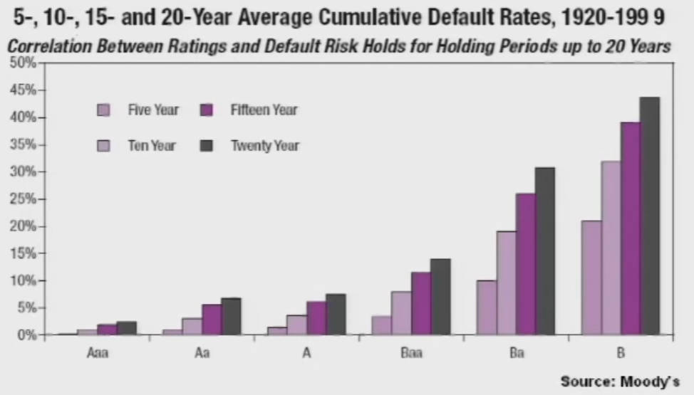

**credit spread picture (信用利差图)** : 描述公司债券收益与国债收益的差值随时间的变化。

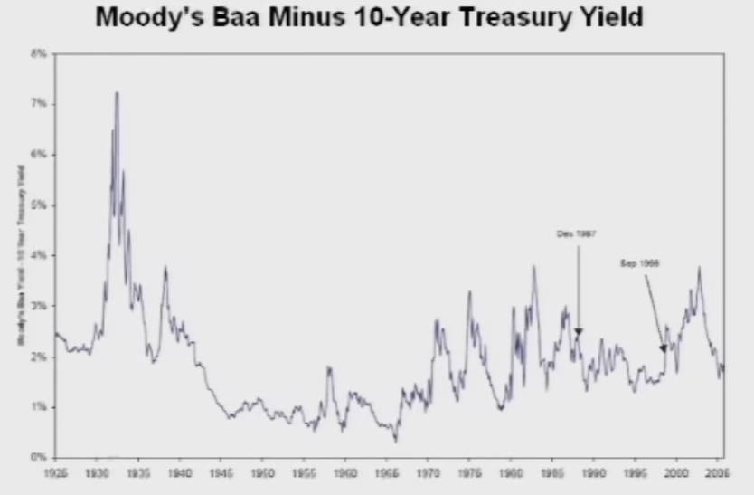

## 收益

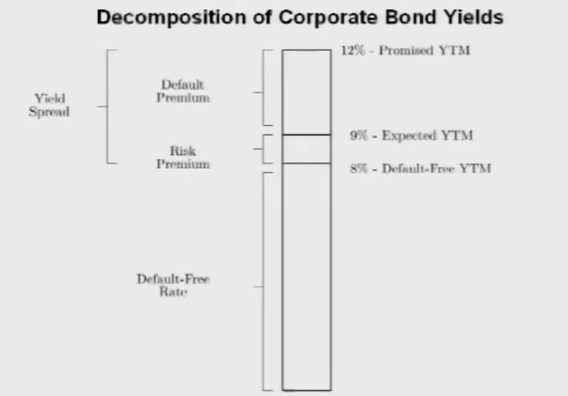

公司债券的收益主要由两大部分组成
- `Default-Free Rate` ： 无违约收益部分 (就是上文一直研究的国债模型)
- `Yield Spread` : 由于风险产生的溢价收益
    - `Default Premium` : 公司违约风险产生的溢价
    - `Risk Premium` : 市场风险产生的溢价

## 证券化

假设存在一种债券，不考虑借贷收益与利率 (即借了 1000，到还款时也只还 1000)，该债券的违约率为 `10%`，就是借出去的钱有 `10%` 的风险会打水漂。其价格就是 `1000 * 0.9 + 0 * 0.1 = 900`

现存在 **两个完全互不相关 (独立且不相关) 的债券** ，但是模型都一样的债券

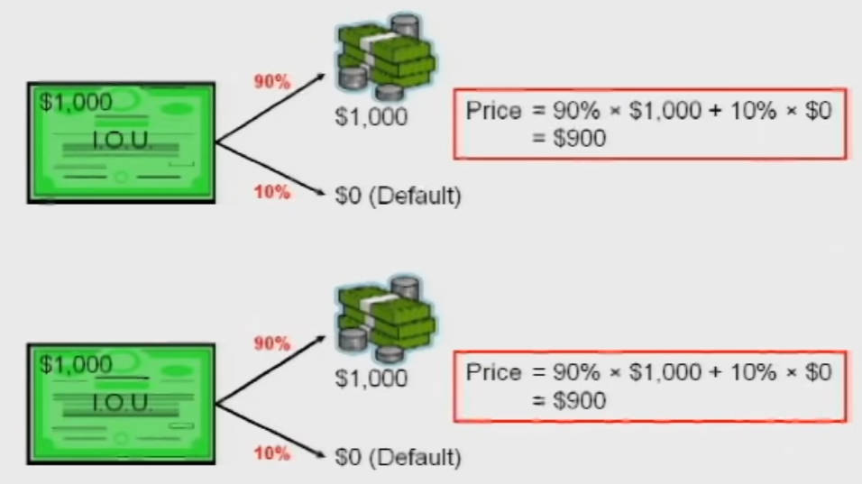

一个公司将这两种债券进行债券组合 `Portfolio`，此时债券整体的对外的违约风也险随之变化

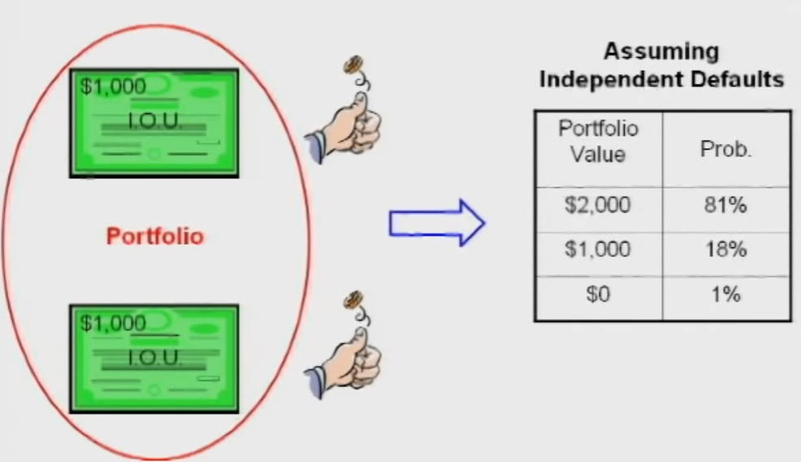

由于违约风险概率的变化，那就可以根据组后的债券重新发行新的债券: `Senior Tranche` 高级债券、`Junior Tranche`  低级债券。

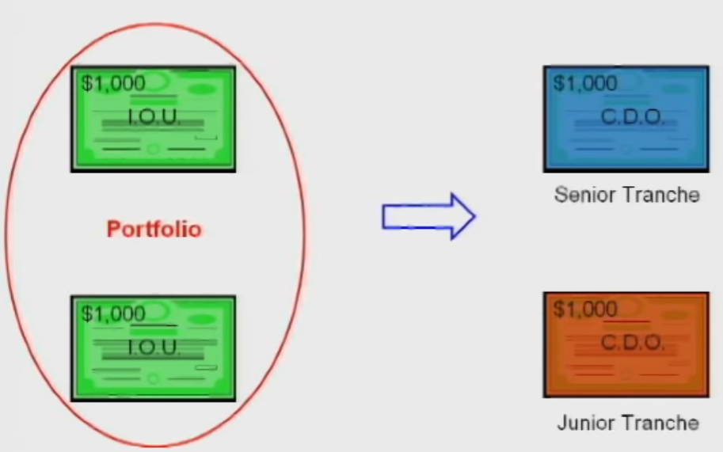

根据规则 **当组合的债券发生违约时，优先偿还高级债券** 重新发行 `Senior Tranche` 高级债券与 `Junior Tranche` 低级债券。

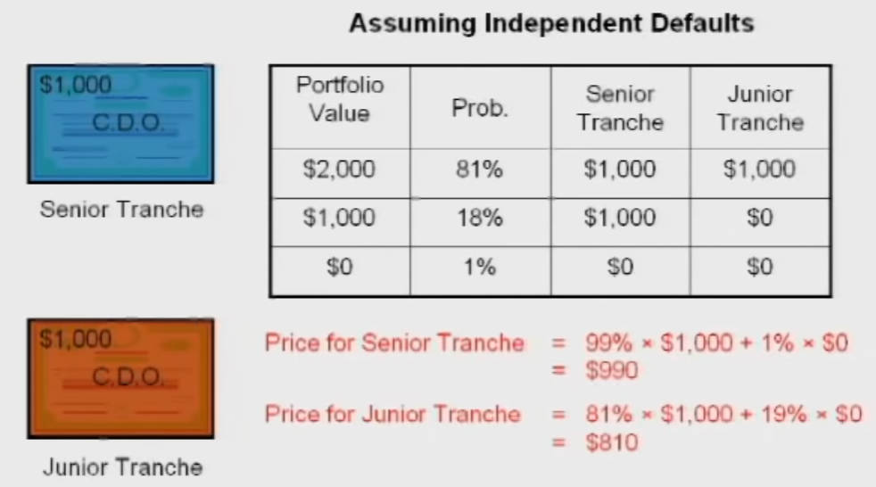

这时就能神奇的发现：
- **两个违约率 `10%` 的垃圾债券，居然组合出了一个违约率 `1%` 的高级债券。**
- **虽然也产生了一个违约率`19%`的低级债券，但是对于组合债券的公司而言，根本没有任何经济上的损失，因为该公司本质上所做的工作只是将两个 `10%` 的垃圾债券，进行内部风险重分配，重新构成了`1%` 的高级债券和违约率`19%`的低级债券** 。

「高级证券」受众群体是保守的投资者，例如养老基金、捐赠基金、基金会等；「低级证券」的受众群体则是那些喜欢高风险，高回报的 "赌狗" ，例如对冲基金。

>[!tip]
> 「超高级证券 `Super Senior Securities`」则是在「高级证券」的基础，再为债券违约加一层保障 ——— 买保险。

上面的一套骚操作就称之为「证券化过程 `Securitization Processes`」，其好处是能促使大量的组织拿出大量钱（购买债券）去借贷给需要钱的人（发行债券），并且操作流程将传统借贷中起到核心作用的「银行」排除在外，让金钱流通更快。

**那么代价是啥？**

> [!note]
> 「证券化过程」有个致命的假设：**初期的两个债券完全互不相关**。当初期的两个债券不完全相关时，就会导致 「高级证券」与「低级证券」的价格反转

假设初期的两个债券完全相关：A 违约时，B 必然违约；A 偿还债务时，B 必然偿还债务。

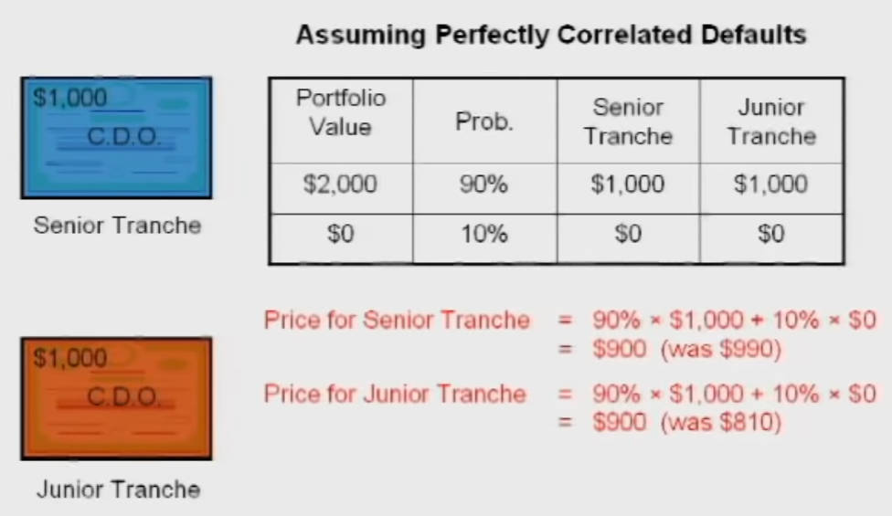

**从结果上看，「低级证券」承担的风险又全部转移回了「高级证券」，若存在大量的这种风险转移，那么市场可能就会崩溃，例如房地产的次贷危机。**
