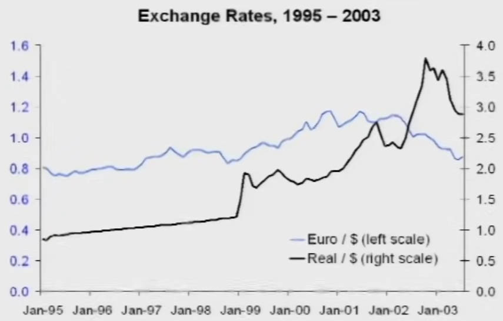
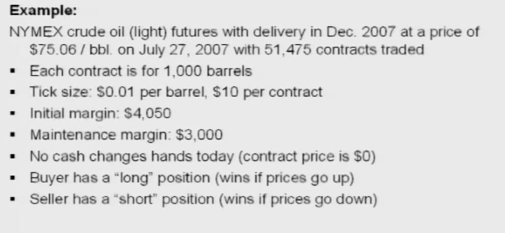
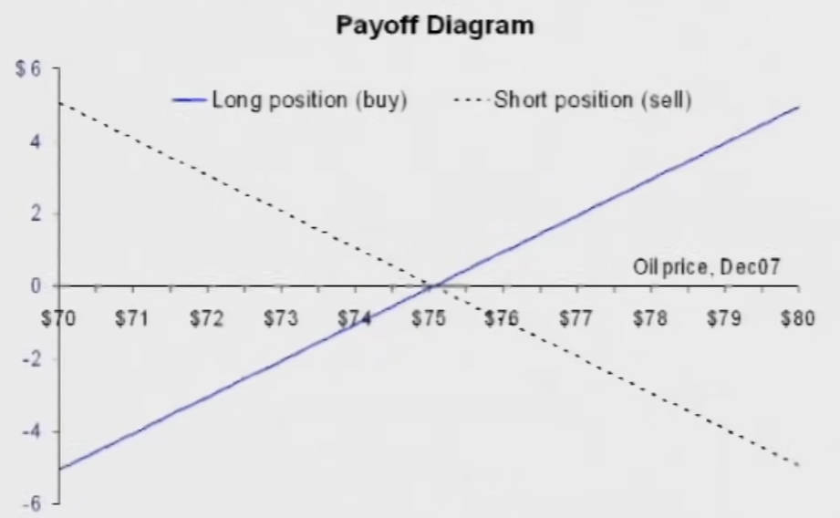
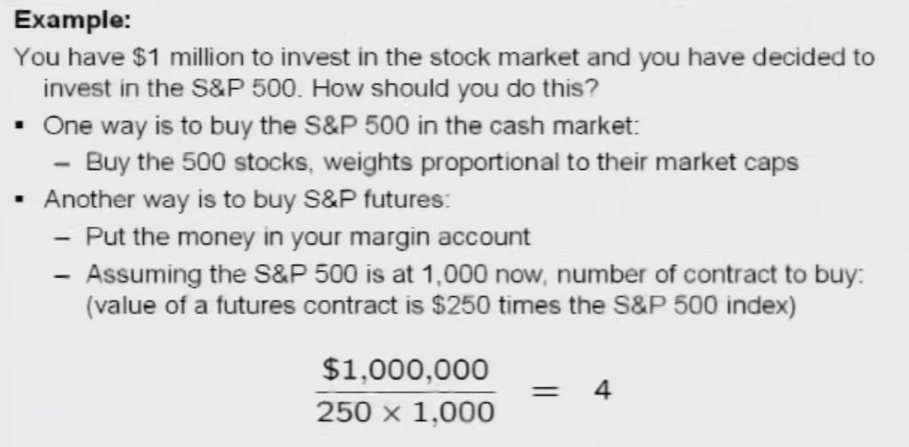
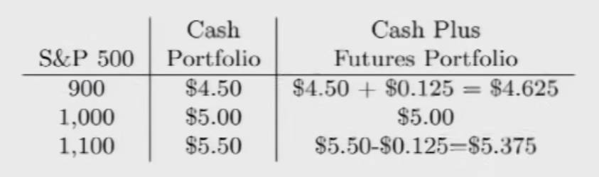

# Forward and Futures Contracts

# 概念

## 问题

在当前确定一项长远交易时，未来由于利率、外汇等因素的变动，导致交易最终的实际现值收入变化较大，例如将商品出售到国外，外汇波动为严重影响实际收入。因此需要一套工具，降低未来变化变化因素对实际价值的影响。

## 合约

>[!note]
> 为了解决上述问题，交易双方可以在当前签署交易合约，将风险限制签署合同的双方。

**Hedge (对冲)** ：其核心是风险管理，用于确保投资组合免受各种风险的影响，例如波动性增加，市场调整或其他不利的价格变动。

**Derivative (衍生品)** ：金融合约，也就是一种金融合同。合同本身并不产生内在价值，金融衍生品的价值取决于它的基础资产。这些基础资产可以是金融资产，比如说股票或者股票指数，也可以是实物如大豆等。
- `Forwards and Futures` 远期和期货，**一份规定未来在何时以何种价格交易资产的合同**
- `Options` 期权，从持有者获取的权力，能以某个价格买（`call option`）和卖 (`put option`) 资产
- `Swaps` 互换

# 远期合约

**Forward Contract (远期合约)** ：约定在未来的某个日期以今天顶下的价格交易商品。这对非金融行业的公司有利，因为这些公司只想稳定的出售商品或者购买商品，并不想关心未来市场变化如何影响价格的波动（要想知道这些变动，又得养一帮人去预测市场经济在未来可能如何变化）。
- `forward price` : 当前定下的未来交易价格
- `forward rate` : 当前定下的未来支付利率
- `long` : 做多，描述买方购买
- `short` : 做空，描述卖方出售

远期合约的特定：
- 定制化，需要买卖双方共同参与制定规则
- 非标准化，怎么制定规则没有标准
- 无平台，没有组织会提供通用平台供双方交易

> [!note]
> 远期合约存在两个重要问题：
> 1. 合约的总价值（合同上的预测价格与未来实际价格的差值）一定要是0。当总价值不是0时，其中一方就会收获额外的价值
> 2. 流动性差，跑路风险极大。当到某一时刻，由于市场价格变化总会让一方获利，失利方接受不了，就会想违约，想退出合约，但违约成本也高（获利方能获取利益较多时，肯定不会轻易放弃合约），容易导致失利一方跑路。

# 期货合约

**Future Contract (期货合约)** ：期货合约在本质上与「远期合约」一样，但为了解决远期合同中存在的问题，做出了一下改进
- 标准化，有专门的中介来维持合约以及交易规则
- 按市价计价 `marked to market`

**Marked to Market (按市价计价)** : 每天调整远期合同上的远期定价，一方向另外一方支付差价，然后撕毁远期合同，重新按照当前远期定价签订远期合同，直到最终截至时间。

**Future Clearing Coporation (期货结算公司)** ： 按市价计价能保证双方不会有过多的亏损或者获利（实在交易不下去，也能及时毁约），但是不能保证最终期限的交易环节顺利进行，还是存在跑路风险。**双方都是面向期货结算公司进行交易，这样期货结算公司就能起到中介作用进一步降低跑路风险，并且负责合约的按市价计价**。

- `Tick Size` : 价格波动的单位
- `Initial Margin` : 保证金，会用于按市价计价
- `Maintenance Margin` : 保证金的最低额度，当低于该额度时会要求缴纳一定保证金，若不缴纳就会结束合约。

根据「按市价计价」，在双方签署期货合约的当天，合约的总价值为 0 （远期价格与未来的现货价格一致，不一致就签，那是大冤种）。但随着时间推移，远期价格将随各种因素发生变化，这就使得「期货合约」产生的价值（重新签订合约时，需要支付的差价）。
- `Future Price` 远期价格，写在合同上的价格
- `Spot Price` 现货价格，商品未来出售时的实际价格
  

# 定价

首先定义符号
- $t$ 当前时刻
- $T$ 合同结算时刻
- $S_t$ 现货价格
- $F_{t,T}$ 远期价格
- $H_{t,T}$ 期货价格

在时刻$t$，远期价格与期货价格应当近似一样 (不一样的话，又可以套利了)

$$
F_{t,T} \approx H_{t,T}
$$

对于「远期合约」而言，购买方只在合同结算时刻 $T$ 产生现金流，支付 $F_{0,T}$；商品提供方则需要考价格利率的变化以及商品存储的成本。

- $S_0$ 为商品签订合同时的价格，然后存放 $0 \rightarrow T$ 时间后，价格则变为 $S_0(1 + r)^T$
- `Net Storage Cost` 为存储商品的实际费用与持有商品获得的收益 `Convenience yield` 的差值，其符号为 $FV_t$

最后要保证购买方和出售方的价格一样（不一样就会出现套利）

$$
F_{0,T} = S_0 (1 + r)^T + FV_T
$$

将上面的式子时间基础同一到现在

$$
\frac{F_{0,T}}{(1+r)^T} = S_0 + FV_0
$$

计算「远期合约」的远期价格的公式同样也应当适用于「期货合约」的期货价格计算，因为最终所购买的商品应当都等价。

$$
\frac{H_{0,T}}{(1+r)^T} \approx \frac{F_{0,T}}{(1+r)^T} = S_0 + FV_0
$$

再将时间区间由 $[0,T]$ 推广到 $[t,T]$

$$
\frac{H_{t,T}}{(1+r)^{T-t}} \approx \frac{F_{t,T}}{(1+r)^{T-t}} = S_t + FV_t
$$

# 金融期货

**Financial Future (金融期货)** ： 将「期货合约」运用到金融产品之中，成交商品是一个指数 `index` (将股票、债券等这些金融产品换算成一个指数)，例如 S&P 500。出售指数的人可以从金融商品中获取一定利益，例如股息，这样价格公式就可以改写为

$$
H_{t,T} \approx F_{t,T} = (1 + r_f - d)^{T-t} S_t 
$$

利用 $d$ 来描述股息。

**案例1：**

假如现在有 100 万想要去投资 S&P 500。
- 方案一：直接购买 S&P 500 股票，假如 100 万能购买 500 份股票，计算价格就要分别计算每一股的 S&P 500 指数对应的价格，然后根据股票总价公式进行计算，**这样干对于购买者观察价格变化太痛苦**。
- 方案二：购买 100 万的 S&P 500 的期货合约。假设 S&P 500 则规定了一份合约价格 `250 x Index`，且当前 `Index` 为 1000，那么 100 万就只需要签订 `4` 份期货合约。当指数 `Index` 发生变化，就能马上计算出`4` 份期货合约的价格。**更有趣的是「期货合约」的刷新是日更，这样就能像炒股一样，每天观察价格变化，而且计算更简单**。

**案例2：**

假如持有价值 500 万的投资组合，但是市场行情在变，价格有可能可能会下跌。这时想要将 25% 的风险踢出去，即对冲 25% 风险。想要直接提现 25% 股票有难度，但可以直接购买 5 份  S&P 500 期货合约（合约规则为 `250 x Index`，且 `Index` 为 1000，即 500 万的 `25%` 就等价于 5 份  S&P 500的价值）出售掉。这样就能保证，当指数下降 `100` 时按照 S&P 500 的规则来计价 500 万变为 450 万，但是按照市场计价 5 份  S&P 500 合约能得到赔付款 `250 x 100 x 5 = 12.5 万`，**实际减少了亏损**。

