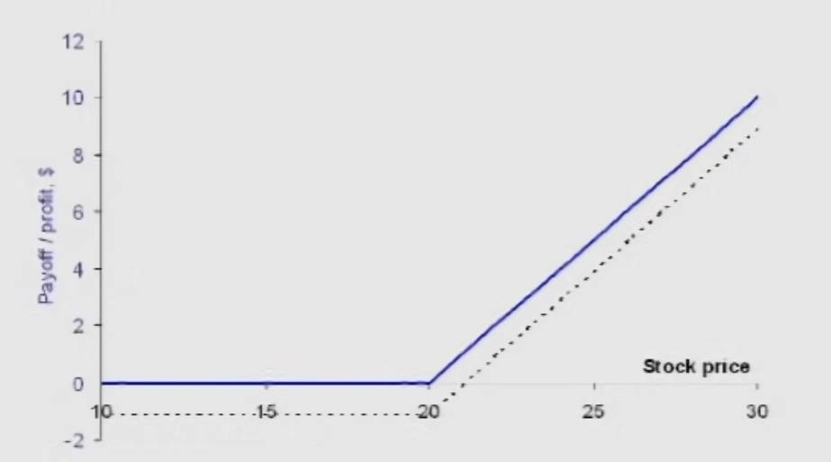
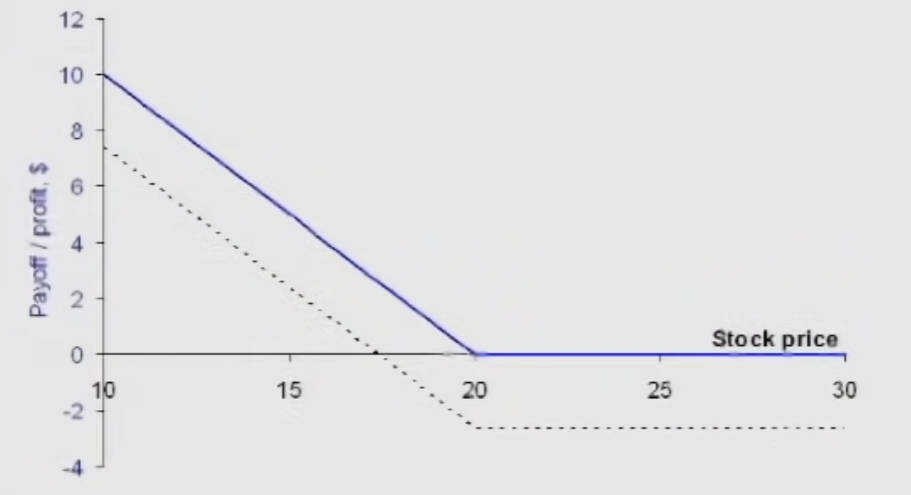
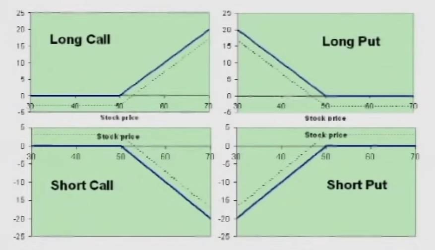
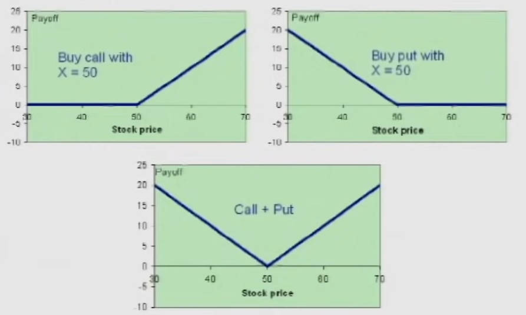
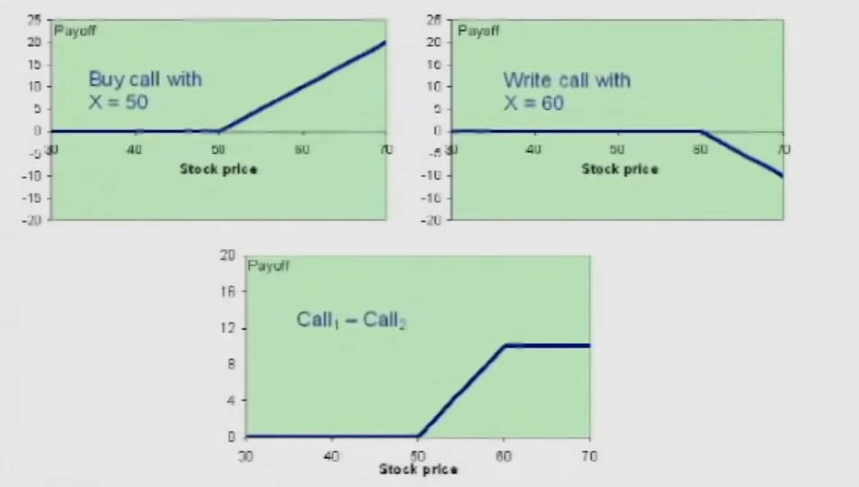
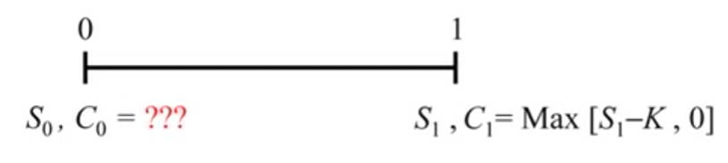
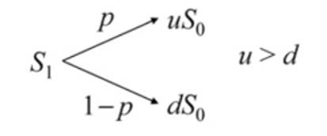
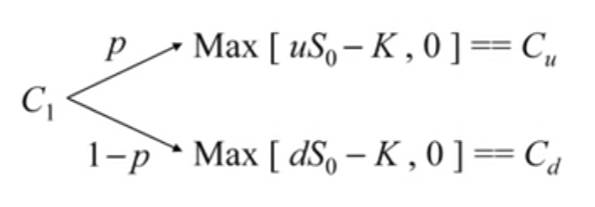
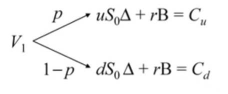
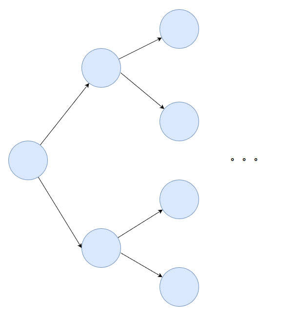

# Options

# 期权

期权是一种衍生品 `Derivative`，因为其价值来自于另外一个证券或股票。期权分为两大类
- **Warrants (认股权证)** : 公司按照其股票发行的期权
- **Options (期权)** : 由双方达成协议
    - **Calls (涨期权)** 允许期权持有者在特定日期、行权日 `Exercise Date` 或到期日 `Maturity Date`之前「购买债券」 
    - **Puts (跌期权)** 与涨期权相反，跌期权赋予的是「出售债券」

首先定义
- $S_t$ 股票价格
- $K$ 执行价格 `Strike Price`，在期权发行时就固定下来了，与时间无关

当持有一张在三个月后能以每股 80 块购买股票 (即 `K = 80`) 的「涨期权」时，其涨期权价格为

$$
C_T = \text{Max} (0, S_T - K)
$$

在三个月后，假如股票变成了每股 60 块（即 $S_T = 60$），可得 $S_T - K = -20$。由于持有的是「涨期权」，可以选择是否购买，那肯定选择不买，即 $C_t = 0$。同理可得「跌期权」的价格为

$$
P_T = \text{Max} (0, K - S_T)
$$

**Insurance Contract (保险合同)** ：期权可以看作是保险合同，能够及时止损。但是与保险不同的是期权又具备以下几个特征
- 期权可以提前执行
- 可以转让期权
- 股票期权还要关注股息

## 公司

公司的可以理解为期权的另一种服务对象，股票和债券分别是公司的涨期权和跌期权：
- **股票持有人购买的是公司的涨期权**。当前公司破产清算资产时，首先要偿还债券，剩余的钱才会分给股票持有人，可能一分钱都拿不回来；公司升值的时候，股票也跟着升值
    $$
    \text{Equity} = \max [0, V - B] = E
    $$
    - V : 公司的总资产
    - B : 公司的外债

- **债券持有人购买的是公司的跌期权**。当公司破产清算，会优先保证债券持有人的钱，保证债券持有人的利益；公司升值的时候，跟债券人也没有一毛钱关系
    $$
    \text{Debt} = \min [V, B] = D
    $$

公司的资产则为股票与债券之和：

$$
\begin{aligned}
    E + D &= \max [0, V - B] + \min [V, B] \\
          &= (V - B + \max [0, B - V]) + (B - \max [0, B - V]) \\
          &= V
\end{aligned}
$$

# 期权收益

## 收益图

> [!note]
> 期权的交易都是在未来收益之前，也就是说买卖期权是对未来收益的下注，因此研究期权的收益，其实是观察现在的交易，对未来收益的影响。

「涨期权」与「跌期权」类似一种对于股票的保险，对股票持有者有益，因此在获取这些期权的时候也肯定不是免费的，得拿出钱购买（类似在出现问题之前，提前买保险）。「涨期权」的**净收益应当是虚线（减去购买期权的成本），期权的收益是蓝线**。

「跌期权」同理也是需要花钱购买的。**此外，涨期权的收益无上限，而跌期权的收益则是有限的 (股票的价格只能跌到 0)。**

上面的曲线描述的收益都是针对购买期权的人而言，即`Long`。而对于出售期权的人而言，即`short`，收益曲线相反的。例如涨期权，
- 购买涨期权的人，赌交易期限内未来股票价会大于执行价，获得期权购买股票的收益；
- 出售涨期权的人，赌交易期限内未来股票价会低于执行价，获得出售期权的售价。如果股票价格在未来高于执行价，那现在出售的涨期权就是赔本买卖，因为这些涨期权在未来能买到价值更高的股票

> [!tip]
> 上面四张图就是期权收益的基本图，复杂的期权收益都是这四张图的叠加

## 期权组合

通过上文分析「涨期权」的收益就可以发现：**人们可以通过期权来押注未来股票的变化，并且通过期权的组合来押注未来股票的不同变化。** 「涨期权」和「跌期权」就给人们很大的灵活性，可以随意组合购买。 例如，属于同一股票的期权，分别各买一份执行价格相同的涨期权和跌期权，那么这时押注的就是未来股票会大跌或者大涨，若未来股票价格变化不大，则会导致亏本。

对于某一股票，购买一份其执行价为 `50` 的涨期权，然后又出售一份其执行价为 `60` 的涨期权。这种交易方式则是在赌未来股票的价格波动在 `50 ~ 60` 之间。

**综上所示，对于复杂的期权交易在未来的收益就可以看作是单个期权买卖收益图的叠加，类似傅里叶变换，利用不用频率的正弦波叠加获得最终的信号。**

# 定价

## 二项式期权定价模型

**问题：** XYZ 股票有一份执行价格为`K`且期限为一天的涨期权，需要计算在 $t=0$ 时，期权的价格 $C_0$ 

首先假设股票价格 $S_0 \rightarrow S_1$ 的变化是随机的，且有 $P$ 的概率会涨，$1 - p$ 的概率会跌

根据对股票价格的假设，可推到出 $t=1$ 时，$C_1$ 的价格也只有两种情况

根据上面一系列的论述就可以得出

$$
C_0 = f(S_0,K,u,d,p,r)
$$

为了求解 $C_0$ 现在不考虑期权，根据「股票价格假设」考虑另外一个投资组合：  $\Delta$ 份股票与价值 $B$ 的无风险债券。可以得出在 $t=0$ 时，资产价格为

$$
V_0 = S_0 \Delta + B
$$

根据「股票价格假设」，可以得出 $t=1$ 时的资产价格 $V_1$ ，其中 $r$ 为毛利率 `Gross Rate` 而非净利A率 `Net Rate`

$V_1$ 由于概率 $P$ 导致价格变化就能当作是 $\Delta$ 与 $B$ 是未知数的方程组，求解方程组得

$$
\begin{aligned}
    \Delta &= \frac{C_u - C_d}{u - d} S_0 \\
    B &= \frac{uC_d - dC_u}{u-d} r
\end{aligned}
$$

回带就能得

$$
V_0 = S_0 \Delta + B = \frac{1}{r} [\frac{r-d}{u-d}C_u + \frac{u-r}{u-d}C_d]
$$

上述公式计算出了在 $t=0$ 时，资产 $V_0$ 的值，**涨期权的公式模型和该资产的公式模型类似，因此就得到了涨期权的价格 $C_0$**

$$
C_0 = V_0 = \frac{1}{r} [\frac{r-d}{u-d}C_u + \frac{u-r}{u-d}C_d]
$$

该公式展示的信息：
- $C_0$ 与概率 $P$ 无关，这使得定价更为通用
- $C_0$ 是 $C_u$ 与 $C_d$ 加权平均值
- $u > r > d$ 在经济学上该关系一定成立，则 $C_u$ 与 $C_d$ 的系数一定为正。
  - $ d > r$ 表明股票最低收入比债券都高，那还买个屁的债券；
  - $ r > u$ 表明股票涨的程度比债券还低，同样买股票完全没有意义。

该定价模型就被称之为 「二项式期权定价模型`Binomial Option-Pricing Model`」。

## 多周期定价模型

现在只计算了 $0 \rightarrow 1$ 周期的 $C_0$ 价格，该价格模型还可以进一步拓展到 $0 \rightarrow n$ 的多周期定价

$$
\begin{aligned}
    C_0 &= \frac{1}{r^n}\sum_{k=0}^n p^{k}(1-p)^{n-k} \text{Max}[0,u^kd^{n-k}S_0-K]\\
    p &= \frac{r-d}{u-d}
\end{aligned}
$$

该模型就是「多周期定价模型`Multi-Period Pricing Model`」。**根据「股票价格假设」，二项式期权定价模型是一棵最简单的二叉树，而多周期定价模型则是向外生长的二叉树，增加周期数使得未来股票价格的情况就更多，计算结果更为准确，。**

## Black-Scholes Model

$$
\begin{aligned}
\frac{1}{2}\sigma^{2}S^{2}\frac{\partial^{2}C}{\partial S^{2}}~&+~rS\frac{\partial C}{\partial S}~+~\frac{\partial C}{\partial t}~=~rC \\
C(S,T) &=\text{Max}\left[S-K,0\right] \\
C(0,t) &=0 
\end{aligned}
$$

最严谨的定价模型。该模型的数学形式和「**导热方程**」模型一样，这也能从「多周期定价模型」模型中感受到：
- $C_0 \rightarrow C_n $ 的价格变化就是从二叉树左边一直传导到右边，这种变化是由于股票价格的随机波动导致
- $T_0 \rightarrow T_n$ 的温度变化也是从介质的一段传递到另外一端，温度的传播则是靠分子的布朗运动实现，布朗运动就是随机性的代名词

