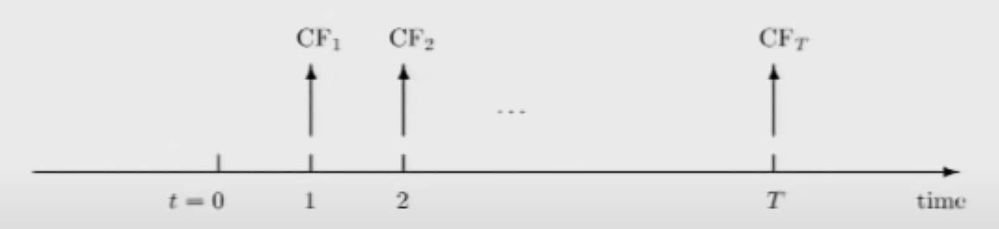
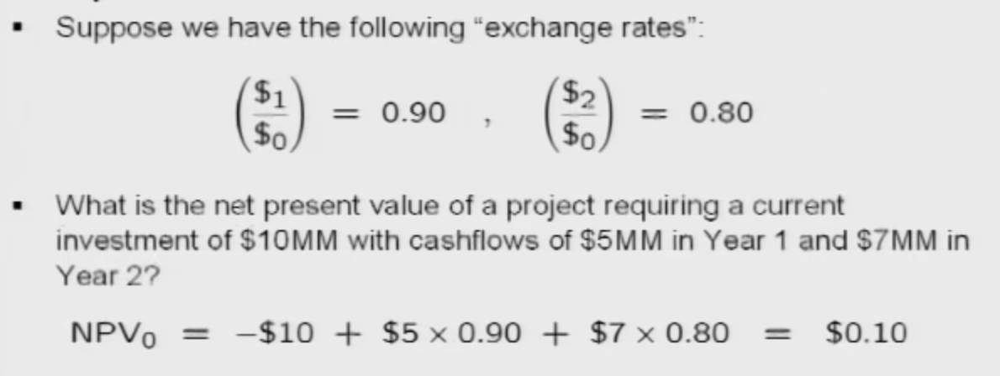
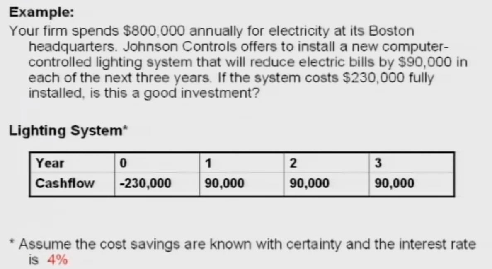
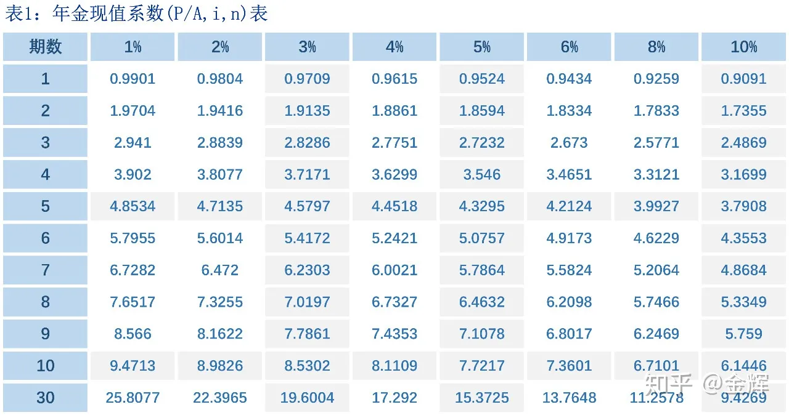

# Present Value Relation

# 现金流与资产

**Cashflows (现金流)** ：在一定时期内，在经济活动中发生的现金收入和支出，不严谨的计算公式为

$$
    现金流 = 收入 - 支出
$$
- 现金流与时间相关，今天的 1 美元和明天的 1 美元不等价
- 未来现金流存在不确定性，鬼知道明天能赚多少钱

- 每个时间点上，相等的现金流是不等价的，因为价值在随时间变化

**Assets (资产)** ： 资产有很多类型，例如房产、品牌、专利等，可以是有实体的，也可以是无实体。当前时间的资产可以定义为当前与未来的现金流序列：

$$
    Asset_t = \{CF_t, CF_{t+1}, CF_{t+2}, \dotsm\}
$$

 有一张从某个时间的现金流表，然后通过规则（即 $V_t$）评估出 「资产的价值」 

$$
    Value of Asset_t = V_t (CF_t, CF_{t+1}, CF_{t+2}, \dotsm )
$$

从图中可以看出
- 资产是从某一个时间开始计算的，因此得有一个起始时间
- 此外现金流与时间相关，对不太时间下的现金流进行比较计算，就需要统一单位
从以上两点出发，假设基准时间为 `t = 0`，并且以 `t = 0` 时的现金流基本单位（货币种类，是用美元、人民币或者日元来衡量现金流的数量）作为现金流的基准单位，即 $\$_0$ (使用美元做为基本单位)

$$
V_0(CF_0, CF_1, CF_2,\dotsm) = CF_0 + (\frac{\$_1}{\$_0}) CF_1 + (\frac{\$_2}{\$_0}) CF_2 + \dotsm
$$

# 净现值

**net present value (净现值)：** 一项投资所产生的未来现金流的折现值与项目投资成本之间的差值。一般在产生资产时，都需要先投资一笔钱作为启动资金，才能获得现金流，因此计算时，就需要将这部分体现出来，而这部分就在 $CF_0$ 中。

**present value (现值)：** 计算资产的基准时间值。要将现金流的时间与单位统一到基准值。

**net (净)：** 现金总流入现值和现金总流出现值的差额

> [!note]
> 现值与净现值的差别，不严谨的说法就是净现值扣除了初始投资 

# 汇率

**exchange rate (汇率)：** 将来现金流基本单位与基准单位的比值，即 $\frac{\$_t}{\$_0}$

- 汇率又被称之为： discount factor (折扣因子)

> [!note]
> 折扣因子由市场决定，一般小于 1，因为明天的 1 美元没有今天的 1 美元值钱，基本原因银行存在利息，今天存的 1 美元，明年就会变成 1.01 美元

净现值案例：

# 利率

通过「折扣率」可知，今天的 1 美元在明天会贬值，通过折扣率可以把未来的钱换算到今天。反而言之，今天的 1 美元在明天数量会增加，即 `1 ( 1 + r)` ，其中的 `r` 就被称之为「利率 (interest rate)」。假设每年增长的利率恒定：

$$
\begin{aligned}
    第1年：& \$_1 = \$_0 (1 + r) \\
    第2年：& \$_1 = \$_0 (1 + r)^2 \\
    第3年：& \$_1 = \$_0 (1 + r)^3 \\
    &\vdots \\
    第t年：& \$_1 = \$_0 (1 + r)^t
\end{aligned}
$$

> [!note]
> 由于「折扣因子」要求太多太复杂，就用一个常量 `r` 来近似计算。
>  $$
>    V_0  = CF_0 + \frac{CF_1}{1 + r} + \frac{CF_2}{(1+r)^2} + \dotsm
> $$

净现值案例：

# 特殊现金流

## 永续年金

**Perpetuity (永续年金)：** 每年都能固定收到一笔固定数量的钱，终止年限为无限。其现值为

$$
\begin{aligned}
PV &= \frac{C}{1 + r} + \frac{C}{(1+r)^2} + \dotsm + \frac{C}{(1+r)^n}\\
PV &= \frac{C}{1 + r} \frac{1 - \frac{1}{(1+r)^n}}{1 - \frac{1}{(1+r)}} \\
PV &= \frac{C}{r} - \frac{C}{r(1+r)^n} \\
PV &= \frac{C}{r} ,n  \rightarrow + \infty
\end{aligned}
$$

假设 `C` 以 `g` 的速度增加

$$
\begin{aligned}
    PV &= \frac{C}{1 + r} + \frac{C(1+g)}{(1+r)^2} + \frac{C(1+g)^2}{(1+r)^3} + \dotsm  +  \frac{C(1+g)^{(n-1)}}{(1+r)^n}\\
    PV &= \frac{C}{1 + r} \frac{1 - (\frac{1+g}{1+r})^n}{ 1 - \frac{1+g}{1+r}} \\
    PV &= \frac{C}{r - g} [ 1 - (\frac{1+g}{1+r})^n ]
\end{aligned}
$$

- 当 $r = g$ 时：$PV = n \frac{C}{1+r} = + \infin$
- 当 $g \gt  r$ 时 :   $PV = + \infin$
- 当 $g \lt r$ 时： $PV = \frac{C}{r - g}$

## 年金

**Annuity (年金)：** 每年都能固定收到一笔固定数量的钱，终止年限为 T，有时间限制

$$
\begin{aligned}
PV &= \frac{C}{1 + r} + \frac{C}{(1+r)^2} + \dotsm + \frac{C}{(1+r)^T}\\
PV &= \frac{C}{1 + r} \frac{1 - \frac{1}{(1+r)^T}}{1 - \frac{1}{(1+r)}} \\
PV &= \frac{C}{r} - \frac{C}{r(1+r)^T}
\end{aligned}
$$

该公式还可以理解是 $t=0$ 时的永续年金减去 $t=T$ 时的永续年金的结果，即 

$$
PV = \frac{C}{r} - \frac{C}{r} \frac{1}{(1+r)^T}
$$

- $t=0$ 时的永续年金: $\frac{C}{r}$
- $t=T$ 时的永续年金： $\frac{C}{r}$ 但是还需要将时间换算回 $t=0$ 才能进行计算，因此就能得到 $t=T$ 时的永续年金在 $t=0$ 的现值 $\frac{C}{r} \frac{1}{(1+r)^T}$

上面的公式还能进一步变形：

$$
PV = C \frac{1}{r}  \left[ 1  - \frac{1}{(1+r)^T} \right] = C \frac{1}{r} \times ADF(r,T)
$$

其中 $ADF(r,T)$ 即年金折扣系数(annuity discount factors)，可以根据上述公式计算出一个表格，方便快速计算

# 复利

**Compounding (复利)**: 就是利滚利，例如这个月的利息也会参与下个月的利息计算。
- APR, annul percentage rate (年利率)：单纯的利率
- EAR, equivalent annual rate (等值年利率)： 加上复利之后得到的总利率

$$
r_{EAR} = (1 + r/n)^n - 1
$$

- $r$ : APR
- $n$ : 计算复利的次数
- $r/n$ : 每次复利计算的利率

> [!note]
> 通常说的利息值都是年化利息，即以一年为一个周期计算得到的利息 (EAR)，但是不足一年时，不能把该利息值进行简单的按照月份平均，因为存在每月或者每天复利。

# 净杠杆率

**net leverage ratio (净杠杠率)** ： 负债 + 资产与资产的比值。例如房价为 100w，首付给了 10w，然后去银行贷款 90w，净杠杆率就是 10 : 1。当房价下降 10% 时 （即亏损 10w）拥有的资产就会亏损成 0，杠杆越高，风险越大。

# 通货膨胀

- **normal Wealth (名义财富)**: 10w 的钱到第二年变成 11w，升值了 10%，第二年的 11w 就是得到的名义财富。

在 $t$ 时，$W_t$ 的财富能购买 $I_t$ 价格的商品，经过 $k$ 年后，$W_{t+k}$ 的财富能购买 $I_{t+k}$ 价格的商品。

$$
\begin{aligned}
W_t & \lrArr I_t \\
W_{t+k} & \lrArr I_{t+k} \\ 
\end{aligned}
$$

- **Normal Return (名义回报)** ：评估名义财富增长了多少

$$
(1+r_{norm})^k = \frac{ W_{t+k}}{W_t}
$$

- **Real Wealth (真实财富)** : 名义财富只关注了金钱随时间的变化，并未考虑商品也是在随时间变化。例如 10w 资产升值 10% 变成 11w，但是商品也增价 10%， 这就导致第二年的名义财富 11w 的购买能力和第一年的 10w 一样。基于名义财富，考虑了商品价格的变化，换算得到的财富就是真实财富。

- **Inflation rate (通货膨胀率)** : 对金钱购买力的评价，反映了商品价格变化。

假设每年的通货膨胀率为 $\pi$，就能计算得到真实财富 $\hat W_{t+k}$

$$
\hat W_{t+k} = \frac{W_{t+k}}{(1 + \pi)^k}
$$

- **Real Return (真实回报)** ：评估财富真正增长了多少

$$
(1+r_{real})^k = \frac{\hat W_{t+k}}{W_t}
$$

上述公式代入真实财富的公式

$$
\begin{aligned}
    (1+r_{real})^k &= \frac{\hat W_{t+k}}{W_t} \\
    (1+r_{real})^k &= \frac{W_{t+k}}{W_t} \frac{1}{(1+\pi)^k} \\
    (1+r_{real})^k &= \frac{(1+r_{norm})^k}{(1+\pi)^k} \\
     r_{real} &= \frac{1+r_{norm}}{1+\pi} - 1 \\
     r_{real} &= r_{norm} - \pi - r_{real} \pi \\
     r_{real} & \approx r_{norm} - \pi
\end{aligned}
$$

# 额外知识

## 专利

**Patent (专利)** : 专利会过期，有法律保护，并且必须明确公开说明内容。

**Trade Secret (商业机密)** : 没有法律保护，就是一个秘密，不用公开，但是有风险。

## 抵押贷款

**抵押贷款** ： 要求借款方提供一定的抵押品作为贷款的担保，以保证贷款的到期偿还。抵押品一般为易于保存，不易损耗，容易变卖的物品，如有价证券、票据、股票、房地产等。贷款期满后，如果借款方不按期偿还贷款，银行有权将抵押品拍卖，用拍卖所得款偿还贷款。

**二级抵押贷款** ： 将已做抵押的房产再次抵押，从特定放款人处获得贷款。 放款人还可以将这些债务卖出出去，再吸一波金。

**二级抵押贷款市场** ： 指抵押贷款和相关服务权在发起这些贷款的实体和那些将利用这些债务选择权来创建抵押担保证券的实体之间买卖的市场。这种市场的活动在世界上许多国家都很活跃第二抵押贷款市场的活跃程度会对新借款人获得抵押贷款的能力产生一定程度的影响，以及当前抵押贷款持有人对现有抵押贷款进行再融资的能力。