# Risk and Return

# 基本概念

## 定义

概念符号

- `Return` 回报 ： $R_{it} = \frac{D_{it} + P_{it} - P_{it-1}}{P_{it-1}}$
- `Expected Return` 期望回报：$E[R_{it}]$ 
- `Net Risk-free Rate` 净无风险利率： $r_f$
- `Excess Return` 超额回报： $R_{it} - r_f$
- `Risk Premium`  风险溢价: $E[R_{it}] - r_f$

统计学符号

- `mean` : $\mu_i =\mathsf E[R_{it}]$
- `variance` : $\sigma_i^2=\mathsf E[(R_{it}-\mu_i)^2]$
- `standard deviation` : $\sigma_i=\sqrt{\sigma_i^2}$
- `Sample Estimators` 将上述统计结果的历史值都纳入统计

    $$
    \begin{aligned}
    \hat{\mu}_i &=\frac{1}{T}\sum\limits_{t=1}^TR_{it}\\
    \hat{\sigma}_i^2&=\frac{1}{T-1}\sum\limits_{t=1}^T(R_{it}-\hat{\mu}_i)^2\\
    \hat{\sigma}_i&=\sqrt{\hat{\sigma}_i^2}
    \end{aligned}
    $$

相关性
- `Covariance`

    $$
    \text{Cov}[R_{it},R_{jt}] = \text{E}[(R_{it}-\mu_i)(R_{jt}-\mu_j)]
    $$

- `Correlation`

    $$
    \mathsf{Corr}[R_{it},R_{jt}]~=~\frac{\mathsf{E}[(R_{it}-\mu_{i})(R_{jt}-\mu_{j})]}{\sigma_{i}\sigma_{j}}
    $$

## 有效市场

股票价格在有效市场 (`Efficient Market`) 中的特点
- 价格随机、不可预测
- 价格能实时且准确跟随行情变化
- 投资者不能从风险调整中获取收益

## 公理

> [!note]
> 风险越大，收益越大

# 投资组合

`Portfolio` 投资组合 : 一系列证券（包含债券、股票等金融产品）的组合

$$
\begin{aligned}
    \omega &= \{ \omega_1, \omega_2, \dotsm, \omega_n \} \\
    1 &=  \omega_1 + \omega_2 + \dotsm + \omega_n \\
\end{aligned}
$$

单个权重值 $\omega_i$ 则代表了某种类型的证券价值占投资组合总价值的比列

$$
\omega_i = \frac{N_i P_i}{ \sum_{k=0}^n N_k P_k}
$$
其中： $N_i$ ,  数量； $P_i$ , 价格。
- $\omega_i < 0$ : 出售了该证券或者发布证券借钱
- $\omega_i > 1$ : 存在杠杆，通过借贷购买了高价值的证券。**这里的「借贷」是发生在组合投资内部，出售（发布）一部分证券，搞到钱，然后马上购买了其他证券。**
- $\omega_i = 0$ : 描述更复杂的行为

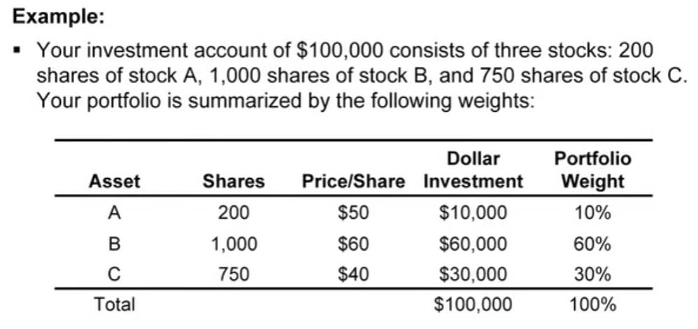

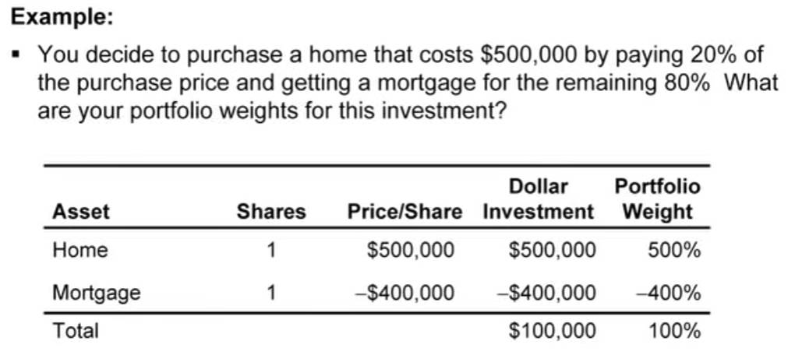

> [!note]
> 通过「投资组合」将能风险分摊到大多数的证券中，而不是吊死在一颗树上。然后调整权值 $\omega_i$ 进一步对投资组合进行控制，进一步实现风险管理。

# Mean-Variance 分析法

## 单个证券

`Mean Variance` 分析法认为好的投资证券对象需要具备两个统计特征：
- 高均值：回报多
- 低标准方差：风险小

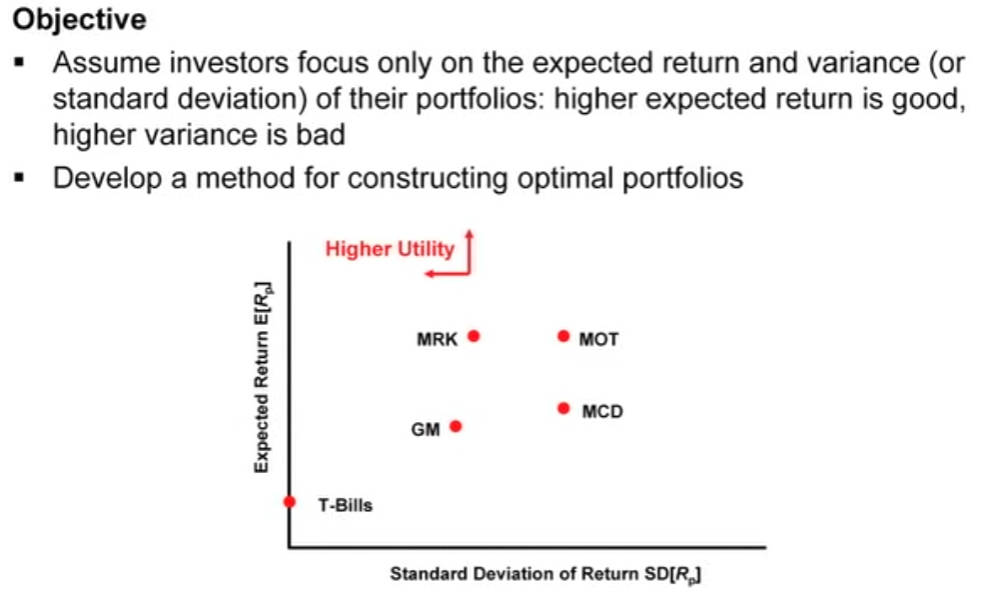

## 组合投资

均值-方差图上只展示了单个证券的回报和风险情况，需要将其拓展到投资组合进行分析，即需要计算投资组合的均值与方差
- 均值

$$
\begin{aligned}
    R_p &=\omega_1R_1+\omega_2R_2+\cdots+\omega_nR_n \\
    \mu_p &= \mathsf{E}[R_p] \\ 
          &=\omega_1\mu_1+\omega_2\mu_2+\cdots+\omega_n\mu_n
\end{aligned}
$$

- 方差

$$
\begin{aligned}
    \mathsf{Var} [R_p] &= \mathsf{E} [(R_p - \mu_p)^2] \\
                       &= \mathsf{E} [ \left(\sum_{k=1}^n \omega_k(R_k -\mu_k) \right)^2 ] \\
                       &= \sum_{i=1}^n \sum_{j=1}^n \mathsf{E} [ \omega_i\omega_j (R_i - \mu_i)(R_j - \mu_j) ] \\
                       &= \sum_{i=1}^n \sum_{j=1}^n \omega_i \omega_j \mathsf{Cov}[R_i,R_j] \\
                       &= \sum_{i=1}^n \sum_{j=1}^n \omega_i \omega_j \sigma_{ij} \\
                       &= \sum_{i=1}^n \sum_{j=1}^n \omega_i \omega_j \sigma_i \sigma_j \rho_{ij} \\
\end{aligned}
$$

## 两种证券组合

$$
\begin{aligned}
    R_p &= \omega_a R_a + \omega_b R_b \\
    \mathsf{E} [R_p] &= \omega_a \mu_a + \omega_b \mu_b \\
    \mathsf{Var} [R_p] &= \omega_{a}^{2}\sigma_{a}^{2} + \omega_{b}^{2}\sigma_{b}^{2} + 2\omega_{a}\omega_{b}\mathsf{Cov}[R_{a},R_{b}] \\
                       &= \omega_{a}^{2}\sigma_{a}^{2}+\omega_{b}^{2}\sigma_{b}^{2}+2\omega_{a}\omega_{b}\sigma_{a}\sigma_{b}\rho_{ab} \\
    \rho_{ab} &= \frac{\mathsf{Cov}[R_a,R_b]}{\sigma_a\sigma_b}
\end{aligned}
$$

- **两种证券都是股票**

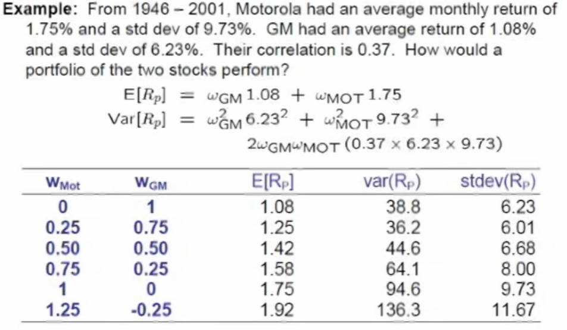

将不同权重的组合投资绘制到图上，可以看出不同组合方式下的均值和方差之间的变化是非线性的，**且杠杆越多的投资组合，风险越大。**

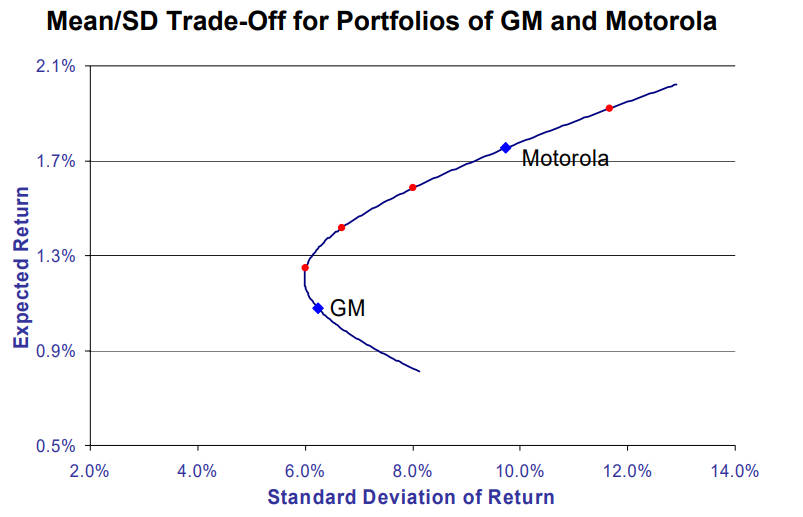

调整「相关性」，绘制均值-方差曲线。可以看到两种证券完全负相关时，即 `corr = -1`，会出现只有收益而没有风险的组合方式。 **反过来思考，就会发现一个严重问题：「相关性」会随时间变化，在相关性较小的条件下设计了一套风险较小的组合投资，当相关性突然增大时，就会导致风险突然增大。**

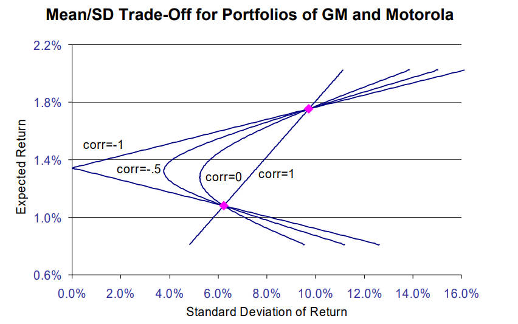

- **一种证券是国债、一种证券是股票**

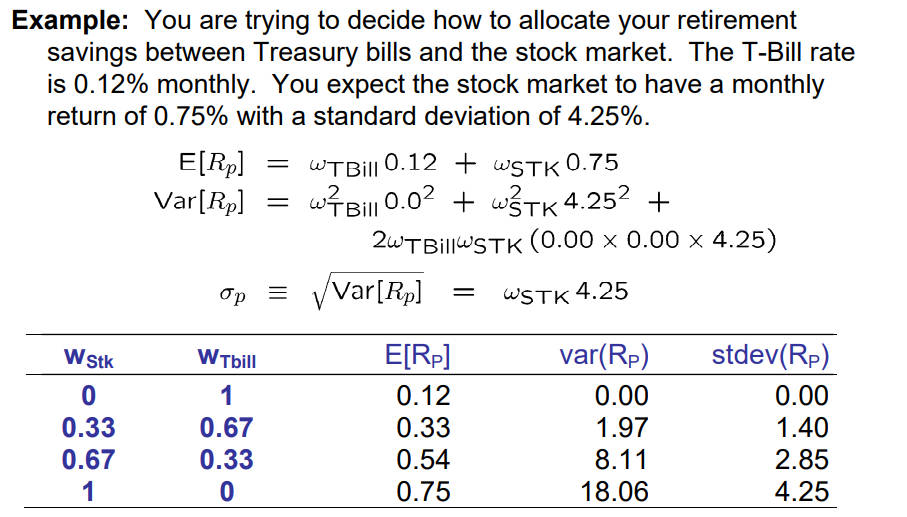

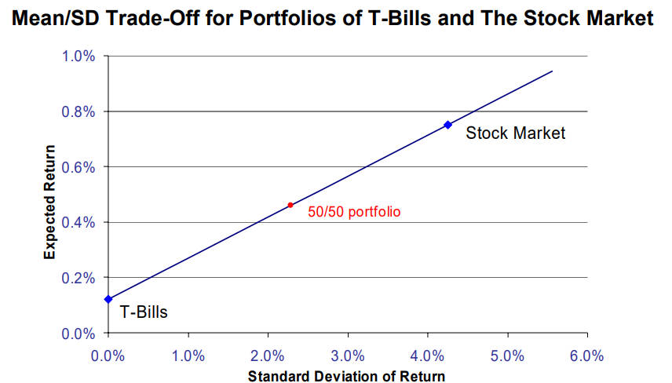

## 权值相同

假设所有证券的权值一样

$$
\omega_i = \frac{1}{n}
$$

其方差就为

$$
\begin{aligned}
    \mathsf{Var} [R_p] &= \sum_{i=1}^n \frac{\sigma_i^2}{n^2} + \frac{1}{n^2} \sum_{i \not =j}^n \mathsf{Cov} [R_i,R_j] \\
                       &= \frac{1}{n} \hat{\sigma}^2 + \frac{n-1}{n} \hat{ \mathsf{Cov}  } [R_i,R_j]
\end{aligned}
$$

当参与投资组合的证券数量特别多时：

$$
\mathsf{Var} [R_p] \approx \hat{ \mathsf{Cov}  } [R_i,R_j]
$$

随着证券的数量的增加 $\mathsf{Var} [R_p]$ 将会趋近到定值（所有的证券不是绝对无相关性的），该值就是「系统风险」

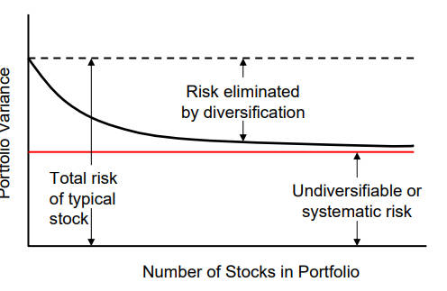

## 多种组合

对于多种组合而言，根据方差公式可以看出 $\mu_p - \mathsf{Var} [R_p]$ 的关系图一定是一个二次曲线

$$
\mathsf{Var} [R_p] = \mathsf{E} [(R_p - \mu_p)^2] 
$$

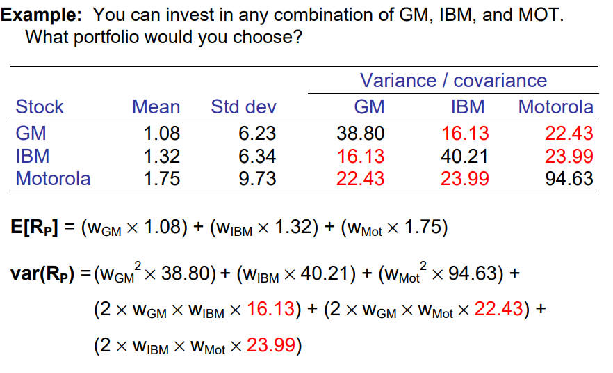

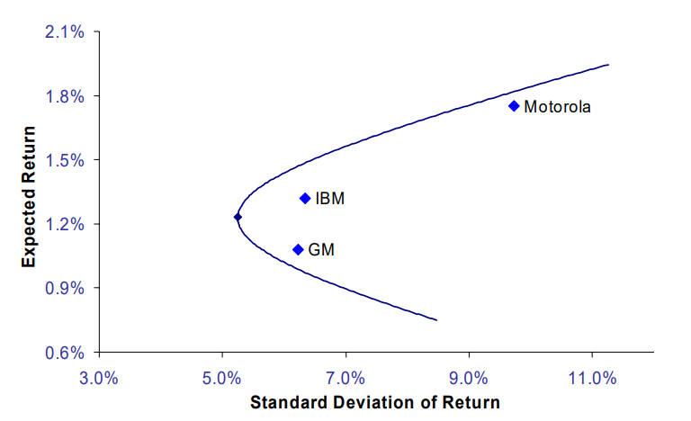

## 切线组合

一般正常人喜欢投资的证券应该都是：低风险，高回报，因此投资组合的选择都抛物线的上侧，即「有效边界`Efficient Frontier`」

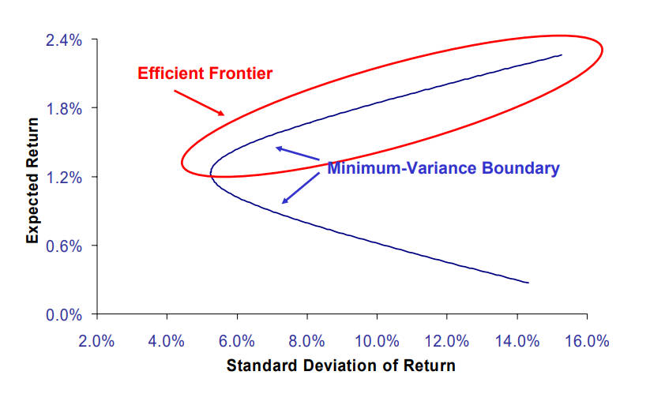

基于某一点来看，肯定也希望投资组合的最好比例应该尽量在该点的左上角区域内，这样投资组合才比该点更优秀

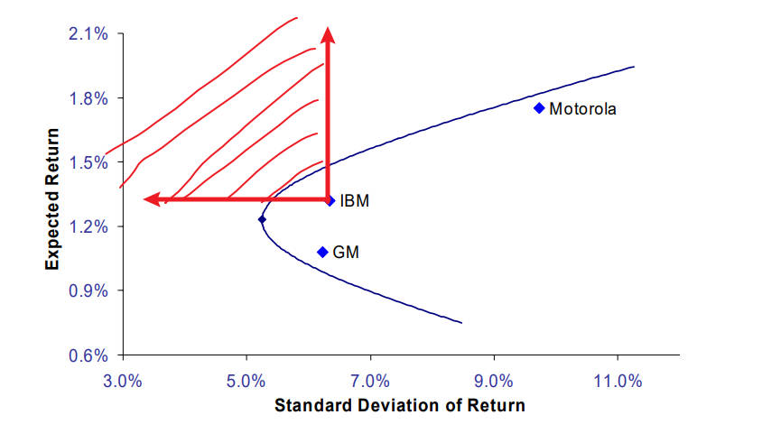

此外，任何一种证券和国债进行组合投资，其期望方差曲线都是直线

> [!tip]
> 综合以上三点，**国债和任意一种组合投资的最优组合方式应当是两条曲线的切线，投资组合内部最优的权值分配应当是切线点 `Tangency Portfolio`，也被称之为`Efficient Portfolio`**

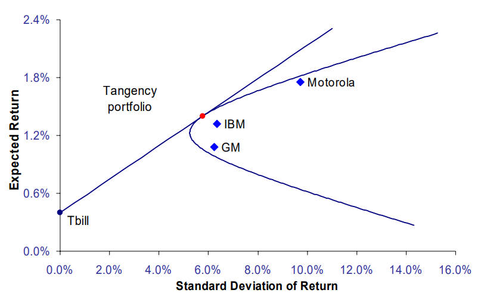

这条切线为资本市场线`Capital Market Line`；其斜率被称之为夏普比率`Sharpe Ratio`，用于衡量组合投资的好坏。

$$
\frac{\mathsf{E}[R_p] - r_f}{\sigma_p} 
$$

# 资本资产定价模型

## 市场投资组合

当想要投资证券组合形式为：国债 + 组合投资，那么组合投资的最优组合就是有效边界的切点。假设这样的投资组合是 M，那么所有想投资国债 + 组合投资的人，肯定都想要自己的投资组合是 M。又假设全世界的人都只投资「国债 + M」，那么全世界的证券总价值等于国债 + M，**因此 M 只能是全世界所有股票的投资总和，且每种股票的 $\omega_i$ 就等于该类股票价值占总股票价值的百分比，该投资组合就被称之为「市场投资组合 `Market Portfolio`」** 。基于市场投资组合的观点，诞生了 `Russell 2000` 与 `S&P 500` 类型的股票。

根据市场投资组合理论，切线上线所有国债 + 组合投资（投资组合是切点）的回报为：无风险收益和投资组合风险收益之和，其中投资组合风险收益是市场投资组合风险收益与系数的乘积

$$
\mathsf{E} [R_p] = R_f + \frac{\sigma_p}{\sigma_m} (\mathsf{E} [R_m] - R_f)
$$

- $\sigma_m$ 市场投资组合的均方差
- $\mathsf{E} [R_m]$ 市场投资组合的回报

**这个也是资本市场线`Capital Market Line`，只适用于切线上的计算** 。

## 证券市场线

对该模型进行修正，让其适用所有的**证券**

$$
\begin{aligned}
    \mathsf{E} [R_i] &= R_f + \beta_i (\mathsf{E} [R_m] - R_f) \\
    \beta_i &= \frac{\mathsf{Cov}[R_i,R_m]}{\mathsf{Var}[R_m]}
\end{aligned}
$$

- $\beta_i = 1$ : 最终收益同 $\mathsf{E} [R_m]$ 相等
- $\beta_i = 0$ : 最终只有无风险收益
- $\beta_i < 0$ : 除做空外，很难得到负数值的 $\beta_i$，唯一能接近负数的只有黄金股票

这条线是证券市场线`Security Market Line`, 且该模型就是「资本资产定价模型 `Capital Asset Pricing Model, CAPM`」

> [!note]
> **利用该模型，就能为净现值计算贴现率**

再将其拓展到所有的投资组合

$$
\begin{aligned}
    R_p &= \sum_{k=1}^n \omega_kR_k \\
    \mathsf{Cov} [R_p, R_m] &= \mathsf{Cov}[\sum_{k=1}^n \omega_kR_k, R_m ] \\
                            &= \sum_{k=1}^n \omega_k \mathsf{Cov} [R_k, R_m] \\
    \beta_p &= \frac{\mathsf{Cov}[R_p,R_m]}{\mathsf{Var} [R_m]} \\
            &= \frac{\sum_{k=1}^n \omega_k \mathsf{Cov} [R_k, R_m]}{\mathsf{Var} [R_m]}  \\
            &= \sum_{k=1}^n \omega_k \frac{\mathsf{Cov} [R_k, R_m]}{\mathsf{Var} [R_m]} \\
            &= \sum_{k=1}^n \omega_k \beta_k
\end{aligned}
$$

因此该模型对于**组合资产**仍然成立

$$
\mathsf{E} [R_i] = R_f + \beta_p (\mathsf{E} [R_m] - R_f)
$$

> [!tip]
> - $\sigma$ 作为风险评估标准只能适用于投资组合为 `Efficient Portfolio`
> - $\beta$ 则适用于所有的投资组合

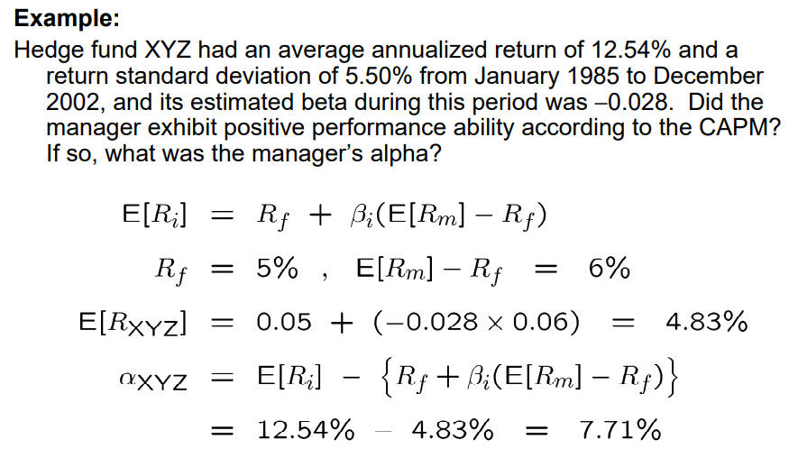

> [!note]
> $\beta$ 并没有估计所有的风险，只考虑了系统风险（不得不承担，且无法摆脱的部分）。因此上述案例的 $\alpha$ 会如此之大

## 回归分析

上文已经知道 $\beta$ 只衡量了系统风险，因此将 $\mathsf{E} [R_i]$ 还原为 $R_i$ 

$$
R_i = R_f + \beta_i (R_m - R_f) + \alpha_i + \epsilon
$$

- $\alpha_i$ 超额回报率，单个样本因骚操作产生的风险所支付的回报。
- $\epsilon$ 采样单个样本存在的误差、干扰，这部分噪音在统计分析时被相互抵消

上述公式还可以写为另外一种形式

$$
\begin{aligned}
    R_i &= \hat{\alpha}_i + \beta_i R_m  + \alpha_i + \epsilon  \\
    \hat{\alpha}_i &= R_f (1 - \beta_i)
\end{aligned}
$$

**根据这个单样本公式，就能对单只股票的采样值做回归分析，估算出该股票存在的 $\alpha_i$ 应该是多少。** 拟合公式为

$$
\begin{aligned}
     y &= R_m x + b  \\
其中: y &= R_i \\
     x &= \beta_i \\
     b &= \hat{\alpha}_i + \alpha
\end{aligned}
$$

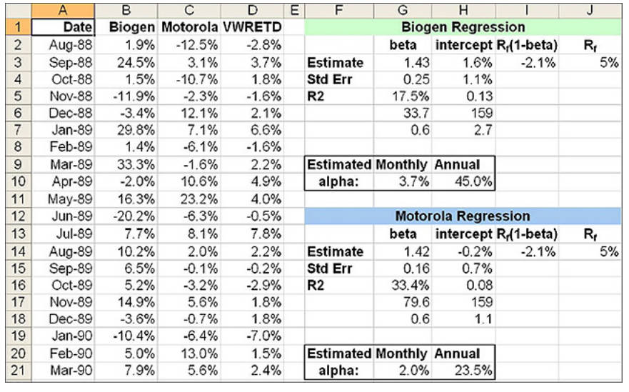

## 风险定义

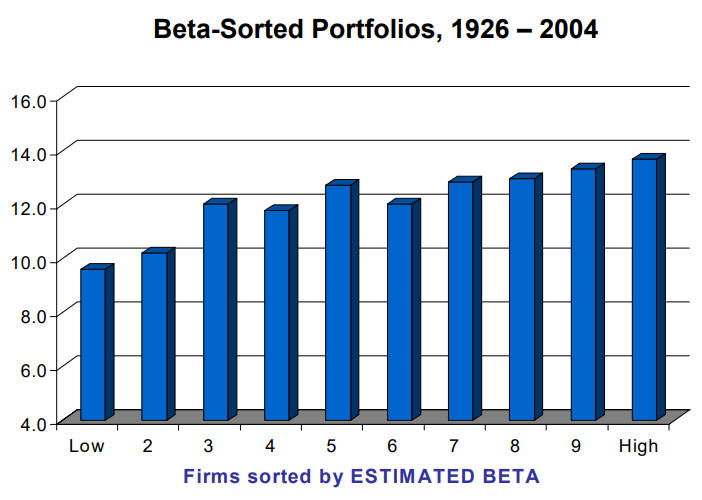

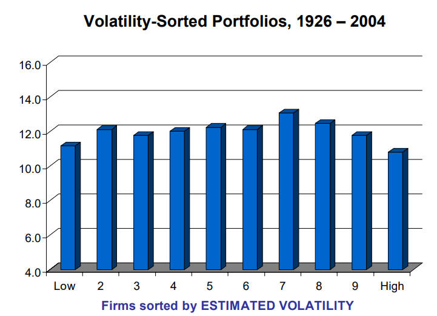

> [!note]
> 根据历史数据可以看出：越大的 $\sigma$ 值，不一定能获得较高的回报；$\beta$ 则与回报则呈现线性相关。**因此，通过 $\beta$ 来衡量风险更准确，但是 $\beta$ 并未考虑所有风险状况，$\beta$ 只是评估风险的近似值。**

