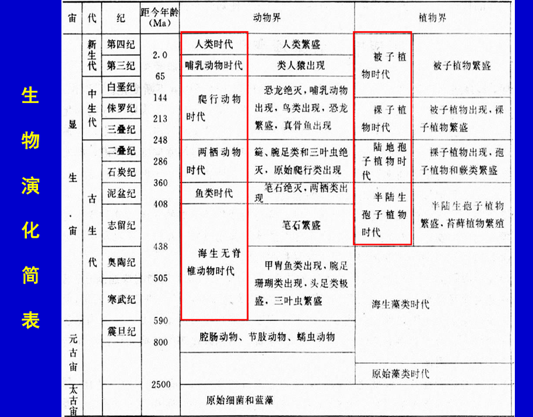
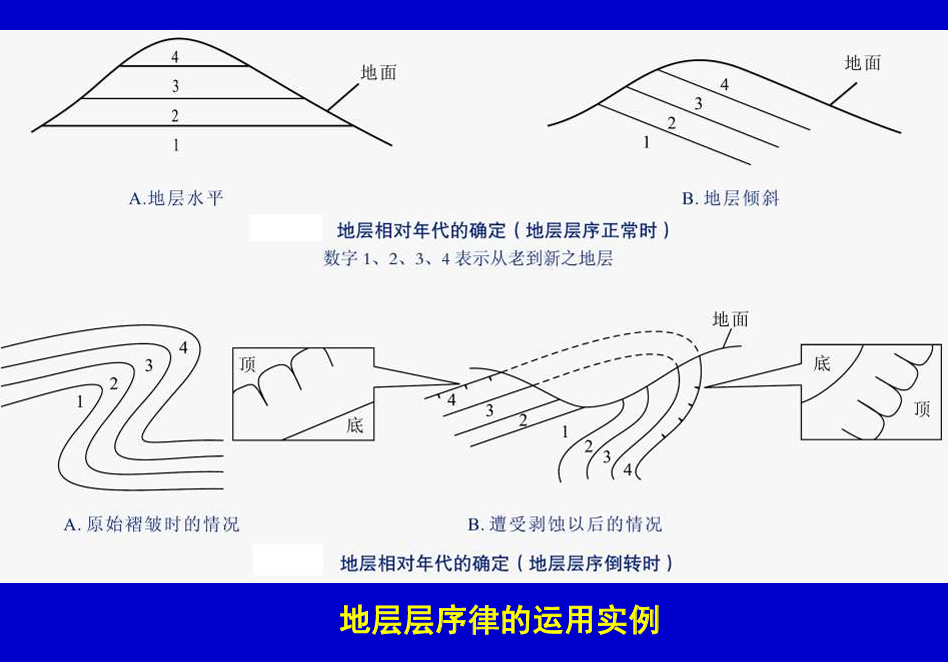
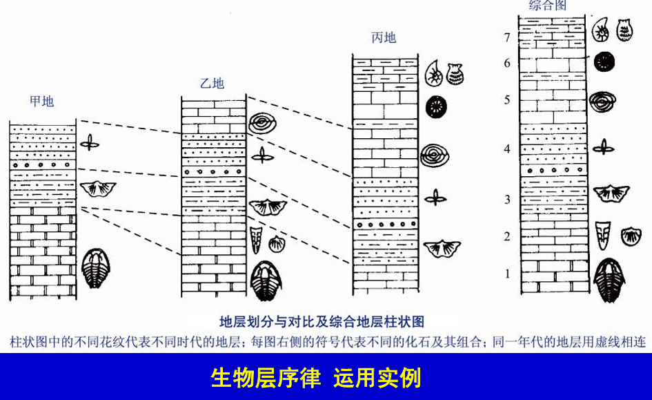
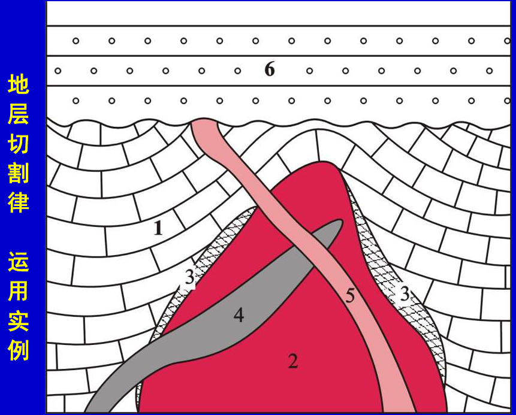

# 地质年代与地球演化

# 背景

地球年龄46亿年，原始地壳形成也有40亿年。在多期复杂的构造-岩浆作用下, 完整的地壳变得支离破碎。地质学家需要通过岩石与地层的上下顺序、新老关系、化石年代以及测年数据，确定岩石与地层形成时代，确定地质事件的发生时间。
- **相对年龄**: 按岩层形成的顺序确定地质体时代
- **绝对年龄**: 按元素衰变规律确定地质体形成时间

# 基本概念

- 岩层: 成层的岩石
- 地层: 一定时期内形成的岩层的总称，**具时间概念**
- 层序: 地层形成的先后关系
  1. 地层由下而上(下老上新)形成
  2. 原始产状是水平的
  3. 岩层形成后只经历过整体上下运动，岩层倾斜必须`<90°`
- 化石：地层中已经被石化的古生物遗体和遗迹。动物的骨骼、牙齿、甲壳、蛋等；植物的根、茎、叶及孢子花粉等
  - 标准化石: 演化快（灭绝得快）、数量多、分布广、特征明显，能可靠确定岩层时代的化石
  - 活化石: 从远古至今一直存活的生物。如银杏、珊瑚等。 
  - 假化石: 是指只出现在岩层表面或层面、形状酷像动植物的形迹，实际上是铁锰质风化痕迹的薄膜，以及人为造假

# 时间测量方法

## 三大定律

确定地层相对年代的三大定律
- 地层层序律: 仅适用于沉积岩，下老上新

  

- `Smith` 生物层序律
  1. 生物简单而原始，反映该地层较老；生物复杂而高级，反映该地层较新
  2. 同一地区, 相同时期地层化石类型和组合相同，不同时期则不同。  
  3. 生物演化规律是：低等→高等；简单→复杂；不可逆！
  
  

- 地层切割律: 被切割、穿插、包裹的老，反之则新

  

## 同位素测定

同位素法被用来测量地质体形成的距今的绝对时间。用于测定地质年代的放射性同位素必须具备三个条件
- 具适宜的半衰期
- 要有足够的含量: 现代技术可将该元素从岩石中分离并测定出来
- 子体同位素易于富集并能保存下来
常用的同位素有 `K-Ar, Rb-Sr, U-Pb, Sm-Nd, 39Ar/40Ar`。但目前科技水平，使用同位素法存在测量误差问题、子体同位素的丢失问题。**因此，对于地质时间测量，同位素法为辅，三大定律为主。**

# 地质年代表

- 四宙十代: 地质历史的系统编年，全球通用
  - 冥古宙
  - 太古宙
    - 始太古代
    - 古太古代
    - 中太古代
    - 新太古代
  - 元古宙
    - 古元古代
    - 中元古代
    - 新元古代
  - 显生宙
    - 古生代
    - 中生代
    - 新生代
- 地质年代单位: 宙-代-纪-世-期-时，国际通用
- 年代地层单位: 宇-界-系-统-阶-时间带，国际通用
- 岩石地层单位: 群-组-段-层，地方性地层单位