# 地球构造

# 地震

## 术语

- 地震: 地壳的快速颤动。由地球内部的不平衡运动所产生
  - 震源`A`: 引发地震、释放深部能量的源区 
  - 震中`C`：震源`A`在地表的垂直投影 
  - 震源深度`h`: 震源到震中的距离`AC` 
  - 震中距`Δ`: 地震台`B` (地震观测站) 到震中的水平距离`CB` 
  - 震源距`d`：震源到地震台的距离`AB`

    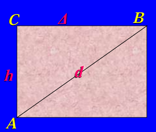

- 海啸：**海底地震**，海底突然破裂，引起海水剧烈升降，形成滔天巨浪的现象
- 等震线：地表破坏程度（烈度）相等的点的连线
- 地震烈度`intensity`：Mercall（意）根据**建筑物破坏程度**将其分成`12`个等级，即`12`度地震烈度
- 震级`magnitude`: 由**地震释放能量的大小**所决定，衡量地震绝对强度的级别。**震级高，地震烈度大，但地震烈度大，不一定震级高**

## 地震波

地震波：以弹性振动方式从震源发出并传播
- 纵波(P波): 为推进波，例如弹簧被压缩
  - 质点振动方向与波的传播方向一致
  - 在固、液、气相中传播
  - 传播速度最快
  - 引起地面上下振动，破坏性弱
- 横波(S波): 为剪切波，如抖绳
  - 质点振动方向与波的传播方向垂直
  - 只能在固体中传播
  - 速度较慢, 晚于纵波到达震中
  - 引起地面前后左右振动，破坏性较强
- 面波: 仅沿地表面或弹性分界面传播, 不能传入地下的震波。
  - 振幅大
  - 传播最慢
  - 破坏性最强

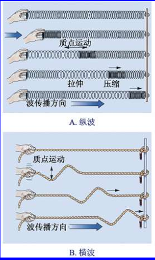

## 分类

按震源深度
- 浅源(0～70km)
- 中源(70～ 300km)
- 深源(300～ 700km): **超过 `700km` 就到内地幔，内地幔呈液相，因此没地震**

按成因划分
- 构造地震: 由构造作用产生的地震。此类地震占地震总数的`90%`
- 火山地震：与火山活动有关；局部规模
- 陷落地震：与溶洞崩塌有关；局部规模

## 球地震带

- 环太平洋地震带: 世界上80%浅源、90%中源、100%深源地震。 
- 地中海-印尼地震带：世界上15%的地震，主要是浅源、中源地震。 
- 洋中脊地震带：位于全球洋脊的轴部,全为浅源小地震。 
- 陆内地震带：板块碰撞影响带和陆内裂谷带
  - 多为浅源地震
  - 震级大、破坏性强

## 地震仪

现代地震仪依据惯性原理实现
- 拾震器: 接受振动
- 记录器: 记录震动

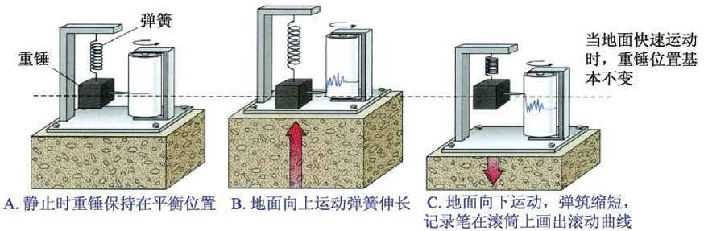

当一个地方发生地震，多个地震台的地震仪便会记录捕获到地震波的时间。由于 `P` 波速度快于 `S` 波，因此，通过地震台测量到的 `S-P` 时差，基于地震波走时曲线（由大量数据测量获取）便能得知震中距。有至少 `3` 个地震台的数据，便能锁定震中位置。

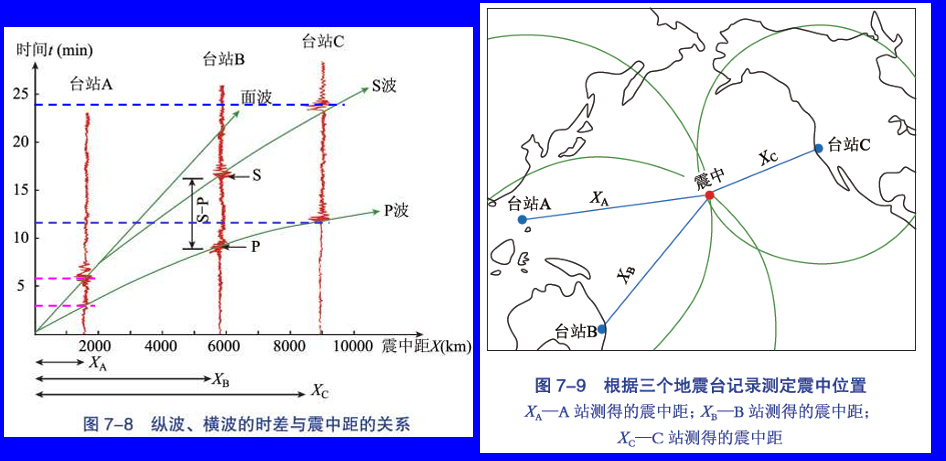
 

# 地球内部构造

## 分层界面

根据地震的 `P` 波与 `S` 波在介质中传播快慢不同的特性，研究者们绘制出了地球内部构造
- 康拉德面(Si-Al/Si-Mg界面):`～10km`深处
- **莫霍面**:`～33km`深处，**地壳与地幔的边界**，`P` 波开始减速
- 软流圈: 程岩浆液相；`S` 波无法通过，`P` 速度变慢
  - 顶面：洋`60km`、陆`150km`; 
  - 底界(`20°间断面`): 球面震中距`413km`
- 上下地幔界面: `660km`深处 
- **古登堡面**:`2900km`深处 ，**地幔与地核交界处**；外地核液相，`S` 波无法通过，`P` 速度变慢
- 莱曼面(固内核-液外核间过渡带): `4703～5154km`深处

> [!note]
> 岩石圈便是软流圈顶面与地表之间的固体部分

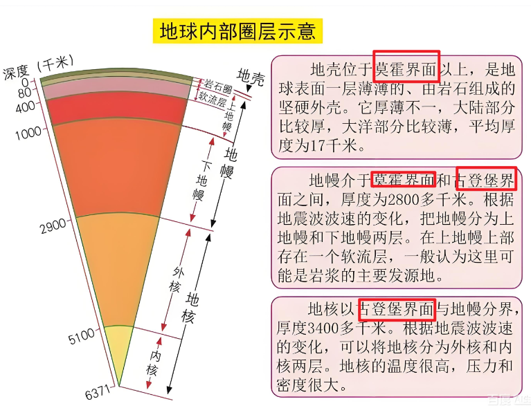

## 古登堡面

古登堡面：核幔交界，`2900km` 横波到达这一界面即告消失；纵波能通过，但通过后速度明显减慢。同时，纵波到达该界面还发生反射与折射，导致出现纵**波阴影带**`shadow zone`，即纵波在地表的一定区间不能被接收的地带。

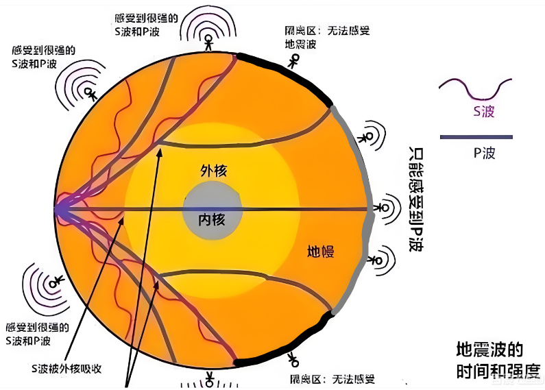

>[!note]
> 波阴影带现象是研究者们推测地球外核是液态的依据

# 岩石变形

## 地壳运动

地壳运动每时每刻都在发生，形成了地表上千姿百态的地貌景观。其原因是地球系统各层圈之间的相互作用
- 垂直运动：同一地点、不同时间, 升降交替。次要作用
- 水平运动：同一地点，有时挤压, 有时拉伸。主要作用

地壳运动又会产生构造形迹
- 褶皱: 岩石在外力作用下, 产生永久变形, 形成各种形态的弯曲
- 节理：岩石在外力作用下, 产生不同方向的破裂，只裂不移
- 破裂: 岩石在外力作用下, 产生不同方向的破裂，且移位

## 力学性质

岩石变形与岩石力学性质关系密切
- 弹性与塑性
  - 弹性: 受力变形,撤力回复原态的性质。如弹簧
  - 塑性: 撤力后不回复原态的性质。如页岩、蛭石
- 脆性与韧性
  - 脆性: `<5%`弹性变形便很快破裂的性质。多发生在上地壳。 
  - 韧性：破裂前可承受`>10%`塑性变形的性质。发生在中下地壳 
- 刚性与黏性
  - 刚性：岩石不易流动变形的性质
  - 黏性：岩石容易流动变形的性质

## 岩层产状

通过岩层产状三要素可确定岩石层的空间位置
- 走向：层面与假想水平面的交线方向
- 倾向：倾斜线在水平面上的投影
  - 倾斜线：层面上与走向垂直的线
- 倾角：层面与假想水平面的最大夹角

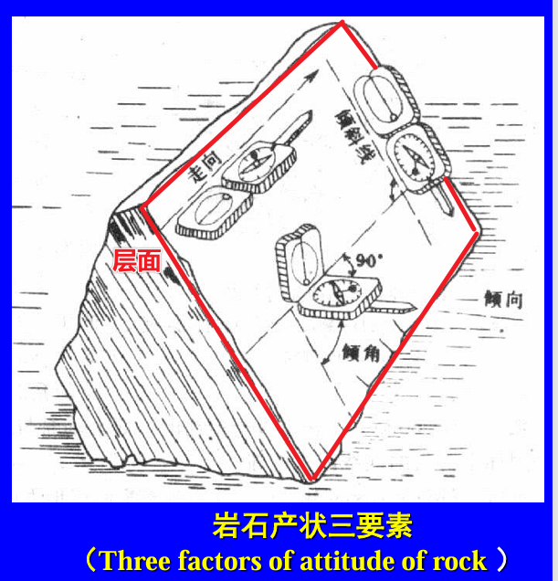

岩层描述
- 倾斜岩层：有走向、倾向、倾角
- 垂直岩层：无倾向，用走向描述
- 水平岩层: 走向、倾向、倾角均为零

# 褶皱

## 定义

褶皱：在应力作用下岩层发生各种形态的弯曲现象
- a.核(core)：褶皱的中心（分布最老或最新时代的地层）。 
- b.翼(limb)：褶皱的两个坡。 
- c.弧尖(crest): 褶皱横切面与枢纽的交线(横切面上最大转折点)。 
- cd.枢纽(hinge)：褶皱轴面与层面的交线。或沿单个褶皱走向，由一系列弧尖构成的连线。 
- e.轴面(axial plane)：褶皱两翼近似的对称面

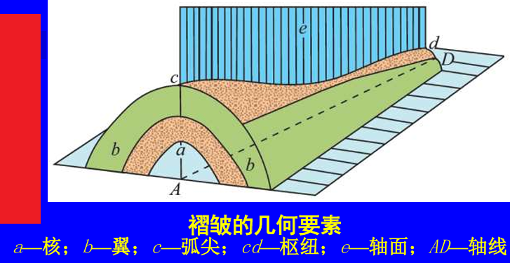

## 类型

- 根据轴面划分
  - 直立褶皱: 轴面直立，两翼倾斜，倾向相反，倾角相同; 
  - 倾斜褶皱: 轴面倾斜，两翼倾向相反，倾角不同; 
  - 倒转褶皱: 轴面倾斜，两翼倾向相同，一翼地层倒转; 
  - 平卧褶皱: 轴面近水平，两翼倾向相同，一翼地层倒转.

  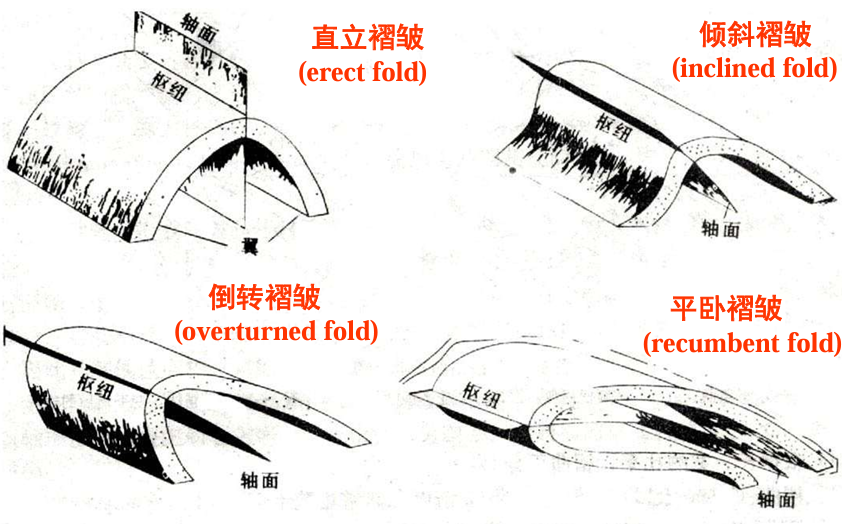

- 弧顶位置
  - 背斜: 弧尖最年轻、核最老，褶皱向上凸
  - 向斜: 弧尖最老、核最年轻，褶皱向下凹

  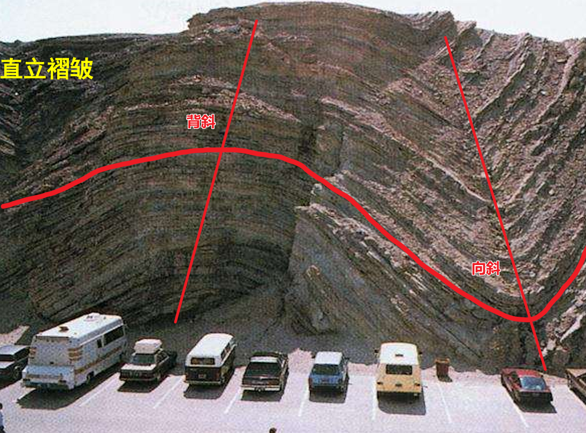

- 据剖面形态
  - 箱形褶皱 (box fold)：轴部开阔、两翼陡立 (呈 `| |` 形状) 
  - 扇形褶皱 (fan fold)：轴部开阔、两翼倒转 (呈 `\ /` 形状) 
  - 单斜 (monocline)：岩层向同一方向倾斜，可以是同斜倒转的褶皱。**本质上是褶皱的弧顶风化，留下的翼**

  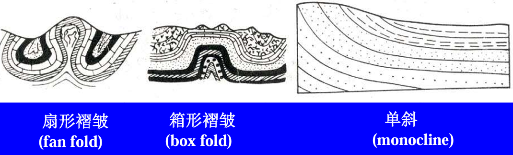

- 褶曲的长宽比例: 宽指的是高度
  - 线状褶皱 (linear fold): 长宽比 `> 10:1`
  - 短轴褶皱 (brachy fold): 长宽比 `3:1 ～ 10:1`
  - 穹盆褶皱 (dome-basin fold): 长宽比 `< 3:1` 

  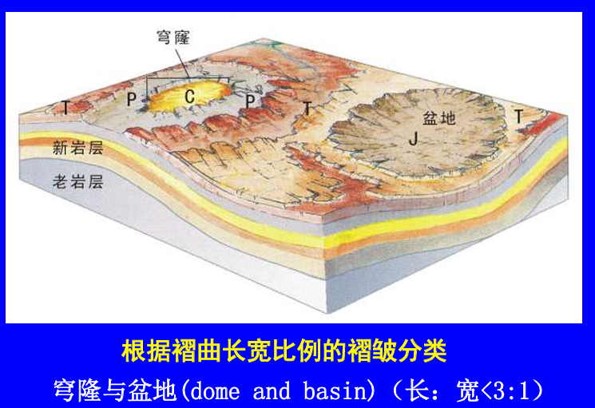

- 枢纽产状
  - 水平褶皱 (horizontal fold)：枢纽水平、层面露头线平行
  - 倾伏褶皱 (plunging)：枢纽倾伏、层面露头线呈弧状合围

  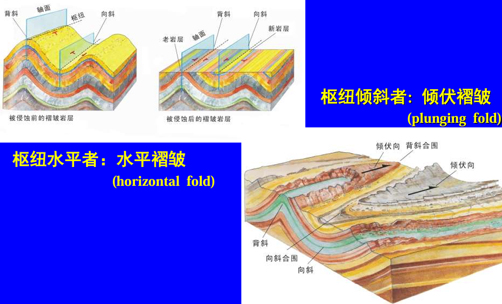

- 褶皱的构造组合类型
  - 隔档式(ejective fold)：背斜窄、向斜宽。 
  - 隔槽式(trough-like fold)：向斜窄、背斜宽。

# 断裂

## 定义

断裂：岩石中沿不同方向发生的破裂构造
- 断层面 (fault plane)：走向、倾向、倾角三要素。 
- 断层盘 (fault wall)：断层两侧的岩块
  - 根据所处位置
    - 上盘 (hanging wall）：在断层面上面
    - 下盘（foot wall）: 在断层面下面
  - 根据动向
    - 上升盘（upthrow)
    - 下降盘(downthrow)
  - 断面垂直
    - 东盘
    - 西盘
  - 断层线 (fault line)：断层面与地面的交线。 
  - 断层位移 (fault displacement)：总滑距、水平分量、倾向分量。

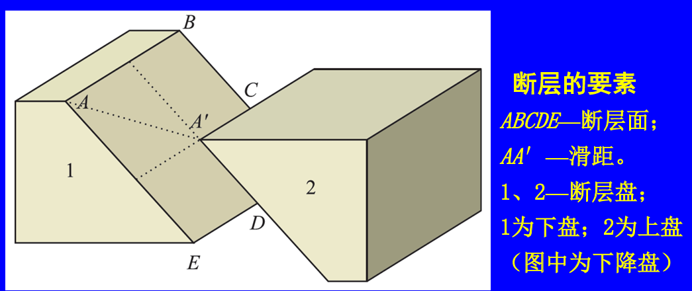

## 分类

根据两盘动向
- 正断层(normal fault):上盘下降; 
- 逆断层(reverse fault)(反断层):上盘上升; 
  - 倾角<25°的反断层称为逆掩断层（overthrust）； 
  - 倾角<45°的反断层形成的地质体称为推覆构造。 
- 走滑断层 (strike-slip): 两侧岩块水平滑动，断面垂直。

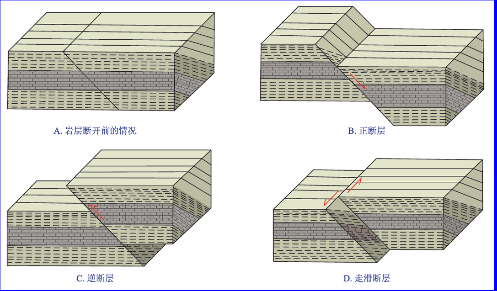

根据断层走向和地层走向关系
- 走向断层 (strike fault):纵断层，断层走向和地层走向平行
- 倾向断层 (dip fault) :横断层，断层走向和地层走向垂直
- 斜向断层 (oblique fault):斜断层，断层走向和地层走向斜交

多个断层组合
- 阶梯状 (stepped)：一系列走向平行的正断层。 
- 叠瓦状(imbricate)：一系列走向平行的逆断层。 
- 地垒 (horst)：两个下盘相邻的正断层，常为山岭。 
- 地堑 (graben) : 两个上盘相邻正为断层，常为谷地。

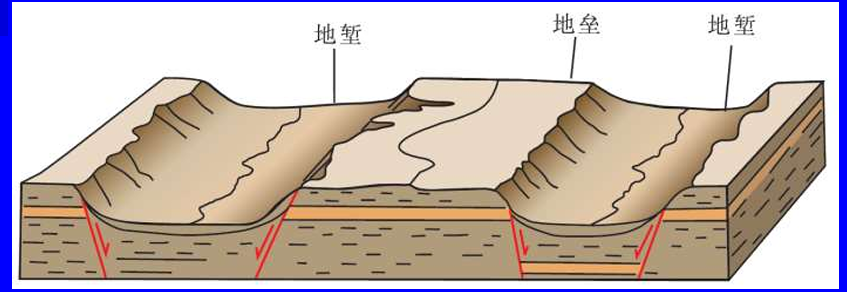

## 断层时代

断层形成的时代
- 在被切割的最新地层的时代之后
- 在覆盖其上的最老地层之前

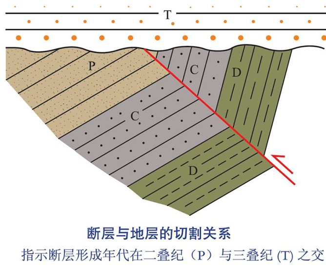

# 节理

节理：发生在岩块中的破裂面,其两侧无明显的位移
- 成因分类
  - 原生节理： 在形成岩石的过程中产生，如玄武岩冷凝收缩而生成的柱状节理。 
  - 构造节理（次生节理）：岩石成型后，内动力形成，张、剪、共轭节理

  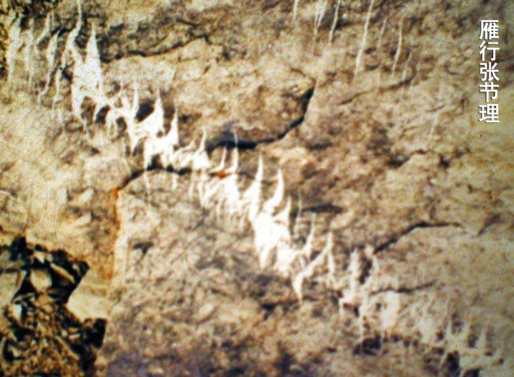

  - 非构造节理：岩石成型后，外动力形成，释重节理、塌陷节理
- 力学性质分类
  - 张节理(tension): 垂直张应力方向张裂形成。裂面粗糙, 裂缝宽。  
  - 剪节理(shear)：由剪切作用形成。平直光滑, 裂缝细小, 延伸稳定。 
  - 共轭节理：沿着共轭剪切面的方向会形成两组交叉的剪节理，又称之为 `X` 节理，材料力学上称为吕德线

  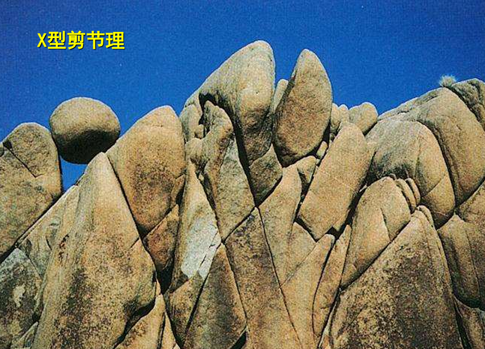

# 地层的接触关系

- 整合接触: 新老地层一层一层的堆积，且生物层序连续
- 平行不整合: 新老地层一层一层的堆积，但生物层序不连续，缺少某一时期的生物层

  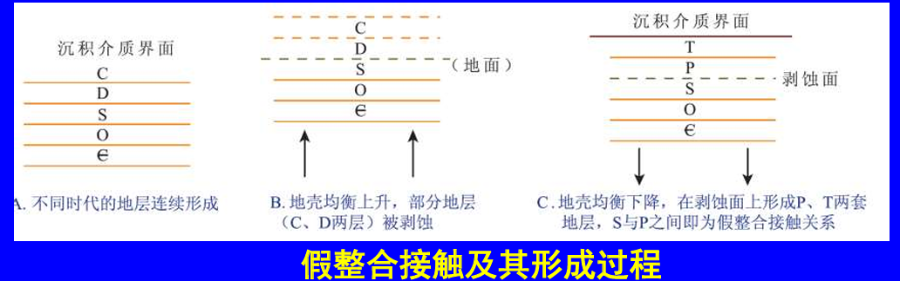

- 不整合接触: 新老地层角度相交，且生物层序不连续。**最有价值，表明该地区发生过明显地球构造运动**

  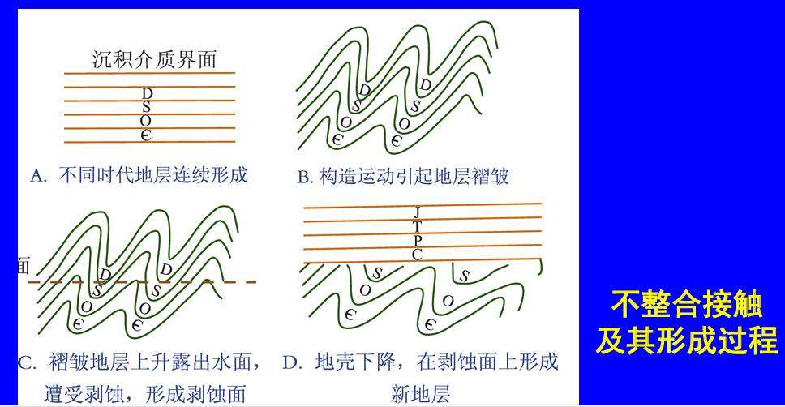

- 侵入接触: 火成岩与围岩的接触关系
- 沉积接触：火成岩遭风化剥蚀后，其上覆盖此火成砾岩层。如假花岗岩层
- 断层接触：两个地质体之间为断层