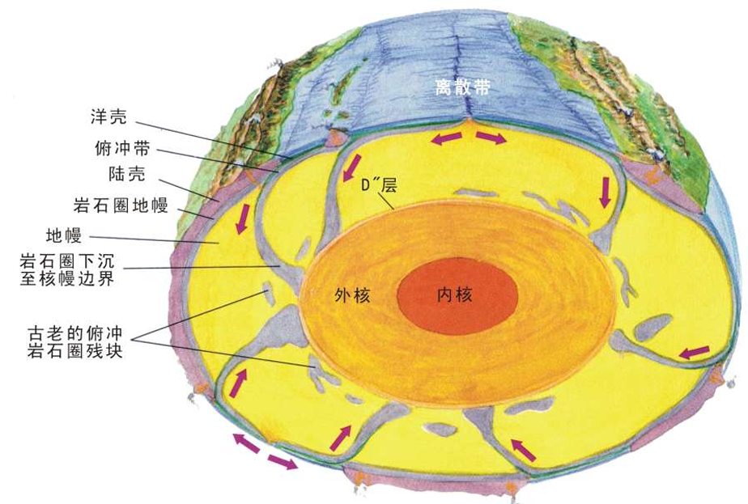

# 基本概念

# 地质学

**地质学**: 是研究地球的物质组成、结构、性质及其演化规律的科学。它涵盖了岩石学、矿物学、地层学、构造地质学等多个分支，旨在揭示地球的形成与发展过程。

# 研究对象

主要的研究的对象是**固定地球**
- 地球物质
- 物质形成时间
- 物质空间分布

# 研究内容

主要研究的内容有
- **地球的物质 (`egg`, `material`)**：
  - 元素-矿物-岩石-地壳
  - 五大类矿物、三大类岩石
  - 地层-岩体-矿质
- **地球的结构 (`texture`, 垂向)**：层圈状（大气、水、生
物、壳-幔-核）。 
- **地球的构造 (`structure`,平向)**：地球各层圈分布、运动变化、动力（地球系统、核-幔系统、洋-陆格局）
- **地质事件 (`event`)**：各层圈相互作用在地表的反映。如地震、火山、海啸、褶皱、断裂等。
- **生命和演化 (`life and evolution`)**  
- **地球的历史 (`Earth history`)** 

