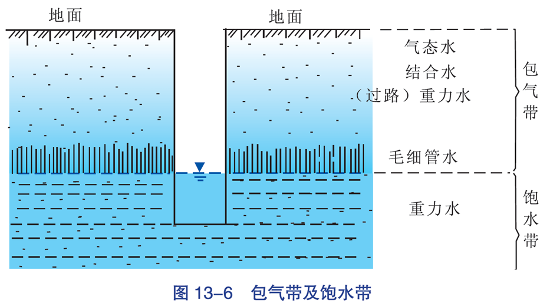
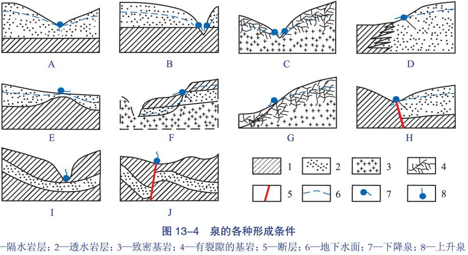
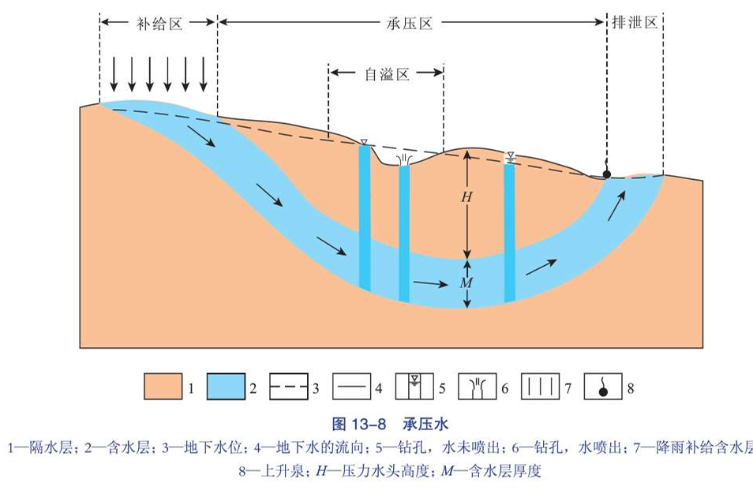
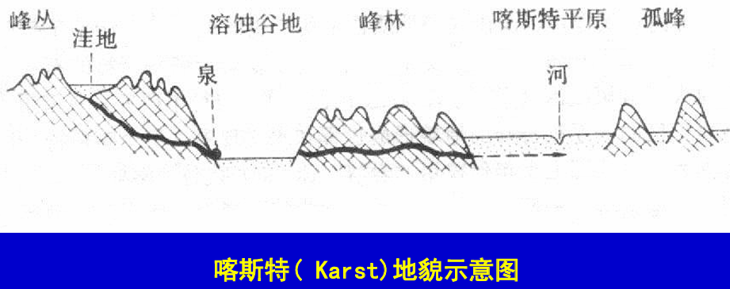

# 地下水

# 基本概念

- 地下水: 赋存在地表以下岩层空隙中的水
- 岩石空隙
  - 孔隙: 松散沉积物或沉积岩颗粒之间的空间
  - 裂隙: 岩石中的破裂
  - 洞穴: 可溶性岩石通过溶蚀形成的空洞
- 孔隙度：衡量岩石中孔隙的数量
  - 定义：孔隙体积/岩石总体积×100% ` η=Vn/V×100% `
  - 影响因素
    - 颗粒粗则孔隙度低：颗粒粗，整体的比表面积就小
    - 颗粒形态不规则则孔隙度低
    - 分选性差则孔隙度低
    - 胶结好则孔隙度低
  - 常见沉积物和岩石的孔隙度
    - 砾石 27
    - 粗砂 40
    - 细砂 42
    - 亚黏土 47
    - 黏土 50
    - 泥炭 80
- 岩石的透水性:  岩石的透水能力。取决于空隙大小与贯通程度，能否自由透水
  - 透水层：水能自由流通的岩层
  - 隔水层: 水不能自由流通的岩层,不透水
  - 含水层: 富含地下水的透水层
- 地下水面: 某地区内地下彼此连通连续的水面,为饱水带顶面
  - 地下水位: 地下水的出露高度。不同地方地下水位高度并不同，与地表起伏无关
  - 包气带: 地下水面以上的部分；岩层空隙中的气体与大气相通；水不饱和
  - 饱水带: 地下水面以下的部分；岩石空隙中充满了水

  

- 排泄：含水层失去水量
  - 井: 地下水的人工露头
  - 泉: 天然露头

    

  - 喷泉：向上升急喷的泉
  - 下降泉：向下喷的泉
- 补给: 含水层从外界获得水, 主要看来源大气降水、地表水

# 类型分类

根据埋藏条件分类
- 包气带水：地下水面以上的、空隙中气体与大气相通的、不饱和含水岩层中的水。可被植物吸收，但不能被人们取用。 
- 潜水：地面下第一个隔水层上的饱和水
  - 潜水层厚度: 潜水面至下伏隔水层顶板的距离 
  - 潜水埋藏深度: 潜水面至地表的距离 
  - 潜水面的特征：波状起伏、随季节而变化
- 承压水：位于二个隔水层中间、充满水的含水层。承受着一定的静水压力。形成环境主要为向斜盆地

根据含水层空隙性质划分的类型
- 孔隙水 pore water：赋存在岩石孔隙中的水。 
- 裂隙水 fissure: 裂隙发育、贯通性好者为层状裂隙水；裂隙稀疏、局部贯通者为脉状裂隙水。 
- 喀斯特水karst: 赋存在灰岩溶蚀空间中的水。

# 地下热水

- 地下热水分类
  - 低温20-40度
  - 中温40-60度
  - 高温60-100度
  - 过热>100度
- 温泉：出露地表的地下热水区
- 地下热水的成因：与断裂、岩体、水循环条件等有关

# 喀斯特 

- 岩溶`karst`：即喀斯特，，源自亚德里亚海边迪纳尔`Kars`高原，意为石头
- 喀斯特地貌：含二氧化碳的地下水对灰岩进行以化学溶蚀为主、机械冲刷为辅的地质作用称喀斯特作用
  - 落水洞
  - 干谷、盲谷
  - 溶沟、石牙
  - 峰丛、峰林、孤峰
  - 溶斗(漏斗): 深度较小的凹坑，可连地下河
  - 溶蚀谷地、天然桥: 地下暗河暴露地表,为溶蚀谷地
  - 溶洞: 石灰岩地区的地下溶蚀岩洞
  - 喀斯特洼地、喀斯特平原: 溶斗扩大形成洼地，进一步发展则成为喀斯特平原（地壳稳定、侧向溶蚀充分）

  

- 岩溶形成条件
  - 岩石：必须是可溶性岩石；纯的石灰岩更好。 
  - 气候：潮湿、降雨量大、常年气温高。 
  - 构造：断层、节理发育有利于岩溶的形成。 
  - 流水：溶蚀性强、流动性好，有利于岩溶的的形成。 
  - 环境：地质环境稳定,有利于岩溶的形成。

# 搬运作用

地下水在地下进行，其余与河流无异。会发生沉积作用
- 机械沉积
- 化学沉积：主要由于压力降低、水温降低、水分蒸发，导致CaCO3浓度增加而沉淀
沉积方式
- 孔隙式: 沉积产物像胶结块。 
- 裂隙式: 具梳状构造的方解石脉。 
- 岩溶式：发生在溶洞
  - 钟乳石: 同心环状的空心体
  - 石笋: 同心环状实心体
  - 石帘、石瀑布: 流水中CaCO3沉淀