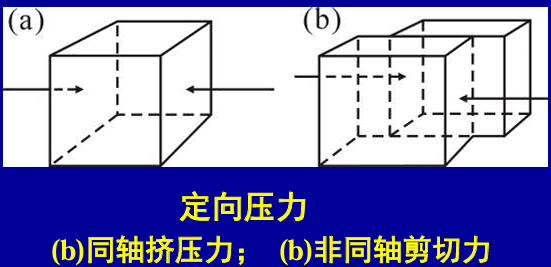
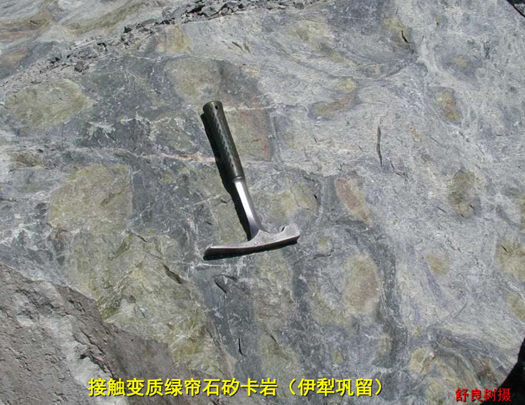
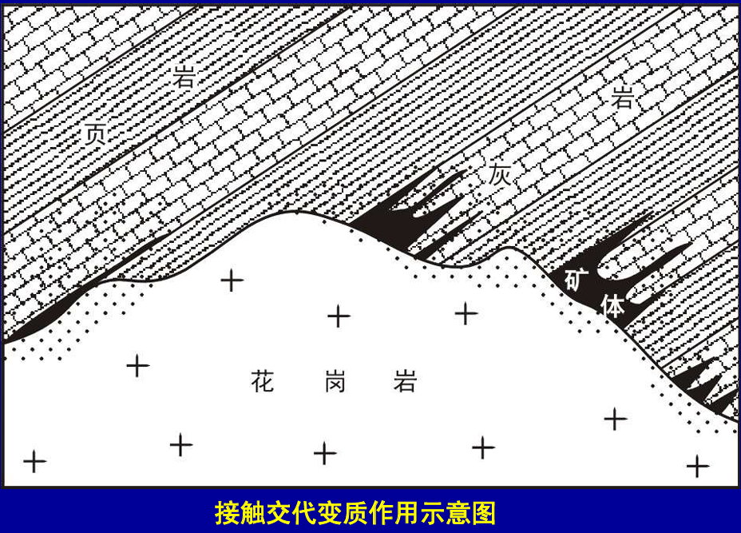
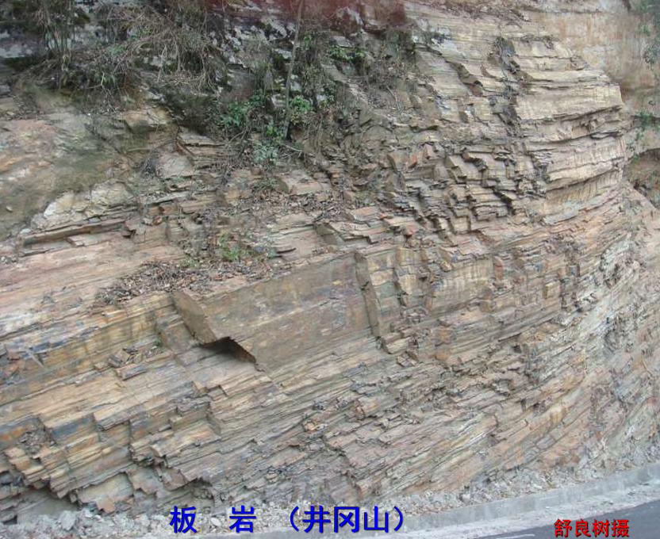
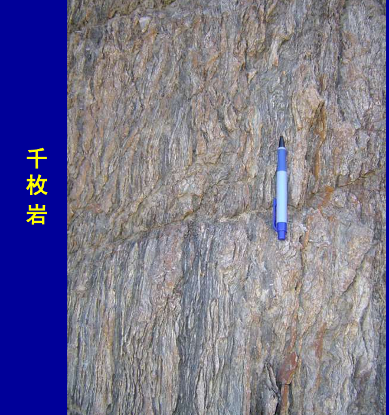
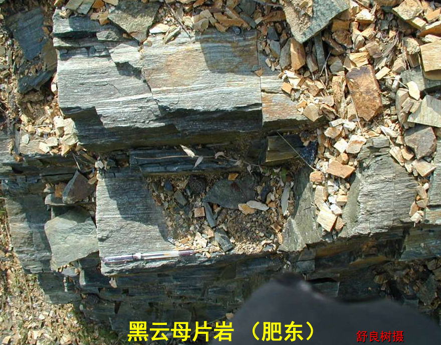
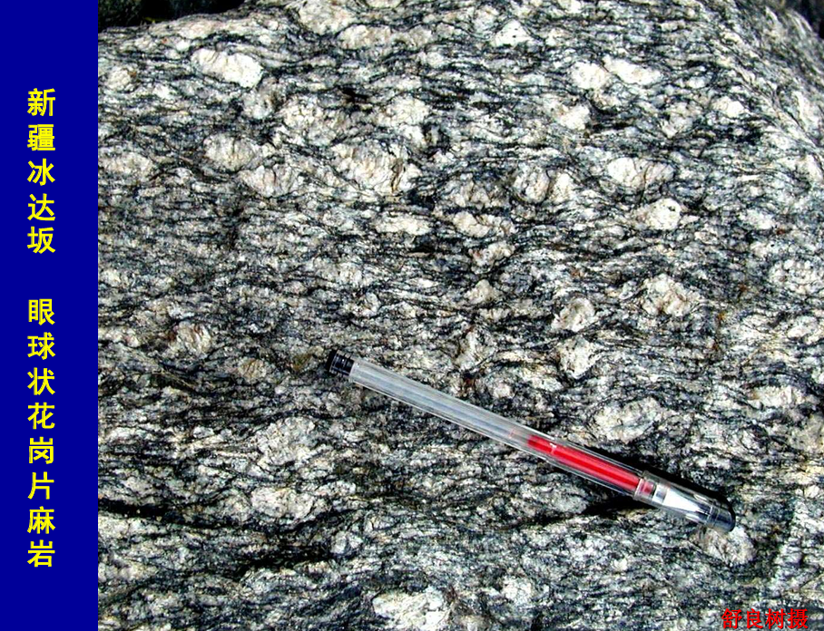
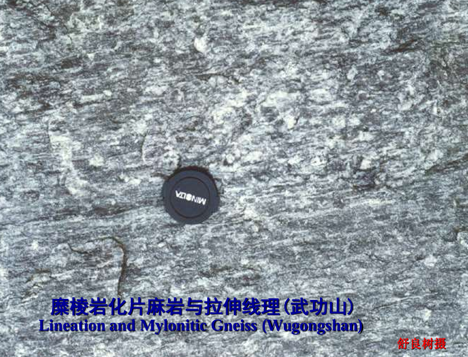
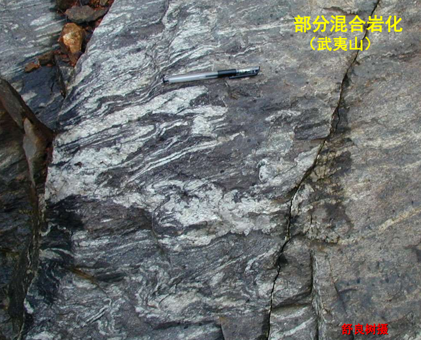

# 变质作用与变质岩

# 变质作用

**变质作用`Metamorphism`**:  由于温度（T）、压力（P）的改变和化学流体的作用，使岩石的矿物成分、化学成分、结构构造在**固态**状况下发生变化，形成新矿物新岩石的地质作用。
- 深度：一般发生在大于`10km`的地壳深部
- 变质三要素
  - 温度：地球内部的地热增温、岩浆热、构造摩擦热、放射热
    - 非晶体 → 结晶体
    - 结晶体 → 重结晶增大
    - 使一种矿物 → 另一种矿物 (物质与结构重组)
  - 压力：陨石撞击、地质构变化、重力
    - 类型
      - 静压力(垂向): 由上复岩石重量引起，随深度增加而增加
      - 流体压力
      - 定向压力：作用于岩石的侧向应力，分压、张、剪三种

        

    - 蓝片岩: 由蓝闪石、钠长石等构成。产在地壳上部，**为古俯冲-碰撞带的重要标志**
    - 超高压变质岩: 含柯石英、金刚石的榴辉岩。压力很大, 埋藏很深，**诞生于大陆深俯冲**
      - 柯石英由高压环境到低压地表，发生膨胀，会撑破寄宿的石榴石
      - 金刚石除了超高压环境下变质作用产生，还可以在岩浆作用产生
  - 流体：具化学活动性 (容易与其他物质发生反应) 的流体
    - 分布
      - 岩石粒间或裂隙中：`H2O` 
      - 矿物结构中：`H2O`、`CO2` 
      - 岩浆中：`K、Na、S、F、H2O、CO2、SiO2`等，主要来源
    - 变质流体: 深部岩石通过变质作用，发生流体物质的交换，即流体带来新物质与岩石发生置换反应，之后又带着置换物质流出
- **变质岩**: 由变质作用形成的岩石
  - 正变质岩：原岩为火成岩
  - 副变质岩: 原岩为沉积岩

# 变质岩

## 化学成分变化

- 温度压力作用
  - 形成新矿物
    - 高岭土(吸热) → 红柱石+石英+水（高岭土脱水）
    - 方解石+石英(吸热)→硅灰石（放射状）+CO2↑（脱碳酸）
  - 体积大、密度小的矿物变为体积小、密度大的矿物
    - 橄榄石 + 钙长石 → 石榴子石
- 重结晶作用: 小晶体在温度升高的情况下长成更大晶体的作用，**非变质作用特有，沉积作用也有**
  - 石灰岩`CaCO3` → 大理岩`CaCO3`
  - 石英砂岩(加温) → 石英岩
- 交代作用: 固态下，岩石中物质成分被带进带出的交换作用
  - 中酸性岩浆侵入冷的灰岩(粘土岩)时，其`SiO2`、`Al2O3` 等热流体就会进入灰岩, 并从灰岩中将`CaO`、`MgO`带出，于是在接触带形成**矽卡岩(含矿量极高)**
- 变质分异: 岩石成分重新组合，从原先的均匀构造变为不均匀条带构造的变质作用，**即晶体排列结构改变**
  - 粉砂岩 → 条带状变质岩：若砂岩含铁，便会构成条带状铁矿床 `BIF`

## 矿物的变化

变质岩的两大特征
- 片理
- 变质矿物
  - 特征变质矿物: 只能在变质作用过程中形成的矿物，如红柱石、蓝晶石、矽线石、十字石、堇青石、硅灰石等

## 结构

变质岩的结构主要关注是变斑晶与原矿物的关系

- 变晶结构: 通过重结晶、颗粒生长或新矿物成核生长，形成新的矿物晶体的结构
- 变余结构：残留有部分原岩特征的结构，为浅变质结构。如板岩特有的变余泥质结构、变余砂质结构
- 碎裂结构：由于动力变质作用使岩石发生机械破碎而生成的一类结构
- 交代结构：指变质作用过程中，通过化学交代作用（物质的带出和加入）形成的结构

## 构造

- 变成构造: 原岩构造(如层理)消失, 形成新的构造，如片理、片麻理等。随变质程度加深，会依次经历以下阶段
  - 斑点构造：虽然保留原来的层理，但出现变质斑点，**质变等级低**
  - 板状构造: 变质进一步加强
  - 片状构造: 片指的是云母等片状矿物
    - 石英与长石含量 `> 50%`
    - 长石 < 石英
  - 片麻状构造: 麻指的是石英、长石矿物
    - 石英与长石含量 `> 50%`
    - 长石 > 石英
  - 块状/麻粒构造，**质变等级高**
- 变余构造：变质岩中残留的原岩构造。如变余层状、气孔、条带构造等

## 类型

- 接触变质：火成岩侵入围岩而造成的变质作用，形成新的岩石
  - 接触热变质
    - 泥岩 → 斑点板岩
    - 泥岩 → 角岩(黑、硬)
    - 石灰岩 → 大理岩
  - 接触交代变质
    - 矽卡岩: 中酸性岩浆侵入冷的灰岩(粘土岩)

        

    - 变质矿物: 硅灰石、石榴石、角闪石等

    

- 区域变质作用: 在温度、压强、流体共同作用下, 区域范围内发生的变质作用。规模可达几万平方公里以上，**且高级变质岩不可能形成区域变质岩（无法达到这么大的规模）**
  - 特征矿物
    - 超高压、高温条件:  C→金刚石 
    - 高压、低温条件:  角闪石、钠长石→蓝闪石
    - 高温低压条件:  粘土矿物→红柱石 `Al2SiO5`
    - 高温中压条件: 粘土矿物→兰晶石`Al2SiO5`
    - 高温条件: 粘土矿物→矽线石`Al2SiO5`
  - 等化学系: 同一原岩，随温压条件变化形成各种类型变质岩，即斑点构造，板状构造，片状构，片麻状构造，块状/麻粒构造的变化
  - 代表性的区域变质岩
    - 低级变质的板岩：具有板状构造

    

    - 千枚岩: 具有千枚状构造，基本上已全部重结晶，有新生矿物绢云母、绿泥石

    

    - 中级变质的片岩: 具有变晶结构、片状构造，原岩矿物与结构构造完全重组

    

    - 高级变质的片麻岩

    

    - 麻粒岩

- 动力变质作用: 伴随构造活动而产生的韧性剪切变质-变形作用
  -  糜棱岩: 在剪切应力的作用下晶格位错

  

- 混合岩化作用: 温度升高，区域高级变质岩进一步变质，发生部分高温熔融（变成花岗岩浆）
  - 基体：基性的变质岩（黑色），熔点高，未被熔融
  - 脉体：被熔融成岩浆的部分重新形成的岩石
  - 种类
    - 肠状、条带状混合岩: 基体>脉体
    - 混合岩化花岗岩: 脉体>基体
    - 花岗岩：没有基体，全部由岩浆构成

  