# 矿物学

# 基本概念

## 地壳

地壳是由岩石组成的, 岩石是由矿物组成的, 矿物由元素组成。地壳上有数百种岩石，数千种矿物，近百种元素。
- **地壳**: `30 km` 厚
- **岩石**: 有几百种，常见三大类岩石约`20`种
- **矿物**: 有几千种，常见矿物约`50`种
- **元素**: 有近百种，其中`8`种元素占地壳总质量的`98.5%`，**构成地球的基本物质**

## 元素

地壳中最丰富的`8`种元素依次是氧、硅、铝、铁、钙、钠、钾、镁，这些元素占地壳总质量的`98.5%`。其中氧和硅是地壳中最丰富的两种元素，分别占地壳总质量的`46.6%`和`27.7%`。
- **同位素`isotope`**: 原子核中质子数相同，但中子数不同的原子称为同位素。例如碳`C`有两种稳定同位素`C-12`和`C-13` 和放射性同位素`C-14`
  - **放射同位素** : 主要用来测定火成岩石结晶的年龄
  - **稳定同位素** : 主要用来确定岩石的物质环境与来源

  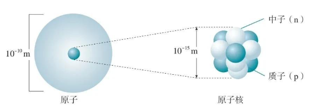

- **放射性**: 某些元素的原子核不稳定，会自发地发生变化，释放出辐射，这种现象称为放射性。例如铀`U`,`K`、`C`等元素都有放射性同位素。
  - **放射衰变**: 不稳定的原子核通过放射性衰变，转变为另一种稳定元素的原子核。例如铀 `U-238` 衰变为铅 `Pb-206`。
  - **半衰期 `half-life`**: 放射性同位素衰变到一半所需的时间称为半衰期，**可通过同位素半衰期测量时间**
    - `C-14 -> N-14`: 半衰期约`5730`年，考古学常用
    - `U-238 -> Pb-206`: 半衰期约`44.68`亿年，用于测定地球和岩石的年龄

## 克拉克值

**克拉克值 `Clark value`**: 克拉克采集了世界各地的样品`5159`个，求出了`0～16km`深度地壳内`50`种元素的平均含量，即克拉克值。**克拉克值是指某种元素在地壳中平均含量的数值**，通常以 `ppm` (克/吨) 或百分比表示，即「丰度`Abundance`」，对于地质学和矿产资源勘探具有重要意义。例如，铁的克拉克值约为 `5%` ，铜的克拉克值约为 `0.0068%` 。

> [!note]
> 克拉克值与克拉是两个单位，克拉用于衡量宝石的重量，`1` 克拉等于 `0.2` 克，而克拉克值是指元素在地壳中的平均含量。

# 矿物

## 概念

- **晶体 `crystal`** ：其内部的原子或离子在三维空间呈周期性平移重复排列的固体。**晶体是原子有规律排列的外观表象**
  - `晶体` : 具有几何多面体外形的物体
  - `晶粒` : 没有明显外形的晶体颗粒
- **非晶质体 `non-crystal`** : 内部原子或离子在三维空间不呈规律性重复排列的固体，如玻璃、橡胶等。**温度升高，非晶质体可向晶质体转化**,例如火山玻璃 → 玉髓
- **矿物`mineral`**: 由地质作用形成 (自然形成，而非人工)、在正常情况下呈结晶质的元素或无机化合物固体。矿物具有一定的化学成分和晶体结构，是构成岩石的基本单元。例如冰、石英、方解石等是矿物，而煤不是矿物，**但是钻石、石墨是矿物 (虽然由`C`元素构成，但是其晶体结构与有机物差别很大)**。
- **准矿物 `mineraloid`**: 在产出状态、成分和化学组成等方面均具有与矿物相同的特征，但不具有标准结晶构造的均匀固体。自然界很少，主要有蛋白石(`SiO2`胶凝体)、水铝英石、玛瑙(`SiO2`变胶体)

> [!note]
> 晶体与矿物的区别：**地质作用**。矿物是自然形成的晶体，而晶体可以是自然形成的也可以是人工合成的。

## 基本特征

矿物的基本特征
- 基本特征: 地质作用 (自然形成)、有序结构、无机、固体。 
- 绝大多数矿物都是晶体: `99%` 矿物分布于「地壳」中。准矿物很少 (常见的有蛋白石、玛瑙等)
- 矿物的化学成分基本稳定，但多含有杂质
- 矿物具有同质多象 `polymorphism` 和类质同象
  - **同质多象 `polymorphism`**: 由相同化学成分组成，但受温度、压力等因素影响，导致晶体结构不同的矿物。例如碳元素可形成钻石和石墨两种矿物
  - **类质同象 `isomorphism`**: 具有相似晶体结构但化学成分不同的矿物。例如方解石 `CaCO3` 和菱镁矿 `MgCO3` 都属于碳酸盐矿物，具有相似的晶体结构

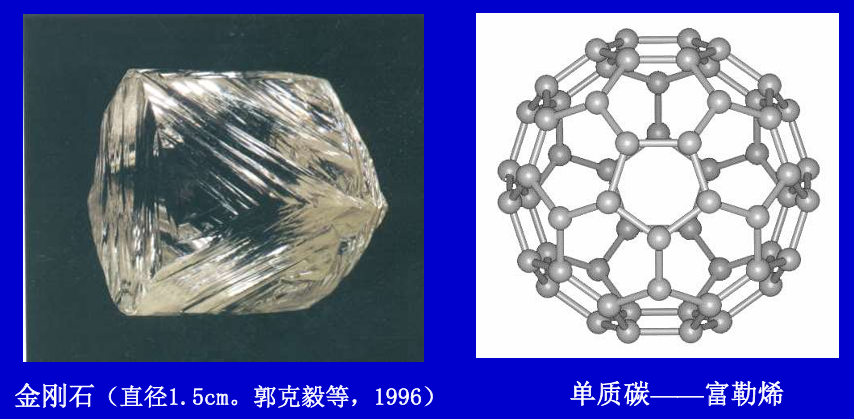

碳的同质多象
- **富勒烯 `C60`**: 富勒烯是一种由`60`个碳原子组成的分子，呈现出类似足球的球形结构，也被称之为「足球烯」。它是一种新型的碳同素异形体，具有独特的物理和化学性质。富勒烯在纳米技术、材料科学和医学等领域有广泛的应用前景。
- **石墨烯**: ：只有一个碳原子厚的单层石墨
  - **理论意义**：打破了二维晶体无法真实存在的理论预言
  - **应用意义**：世界上最强、最硬、最韧、最薄且导电、导热性能特好的材料

# 矿物分类

常见矿物通常可分为`5`种类型
- **自然元素矿物**: 由单个元素便能构成的矿物，种类少常见的有`Au`金、`Cu`自然铜、 `C`金刚石,石墨
- **简单分子化合物**
  - **氧化物**: `H2O`冰、`SiO2`石英、`Al2O3`刚玉 (蓝宝石、红宝石)
  - **硫化物**： `FeS2` 黄铁矿(愚人金)、`FeAsS`毒砂 
  - **氢氧化物**：`Mg(OH)2`水镁石
  - **卤化物 (氟化物、氯化物)** ：`CaF2`萤石 , `NaCl`石盐
  - **含氧盐矿物**
    - **硅酸盐矿物**: `KAlSi3O8`正长石、`NaAlSi3O8`斜长石、`CaAl2Si2O8`曹长石、`Mg2SiO4`橄榄石、`Ca2Mg5Si8O22(OH)2`透闪石
    - **碳酸盐矿物**: `CaCO3`方解石(石灰石)、`MgCO3`菱镁矿(白云石)
    - **硫酸盐矿物**: `CaSO4·H2O`石膏、`CaSO4`硬石膏
- **宝石**: 符合特定条件（色泽鲜艳、折光率高、透明度高、硬度高、化学性质稳定、自然界稀少）的矿物，**且自然界中含量少**，例如 `Al2O3`刚玉(红宝石、蓝宝石)、`Be3Al2Si6O18`绿柱石(祖母绿)、`C`金刚石(钻石)、`MgAl2O4`尖晶石、`CuAl6(PO4)4(OH)8·4H2O`孔雀石

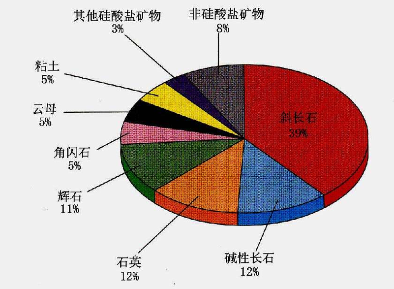

# 矿物鉴定

## 方法论

一般可根据形态、物理与化学性质等特征来识别和鉴定
- **看**：观察外形
- **刻**：检测硬度
- **掂**: 检查比重

## 外形

### 单晶体

**单晶体**: 有且仅有一种晶体类型构成，其外形表现为规则的几何多面体，具有明显的晶面、棱和顶点。单晶体具有以下几种生长方式
- **一向延伸**：呈针状柱状,如辉锑矿`Sb2S2`、电气石、石棉;
  
  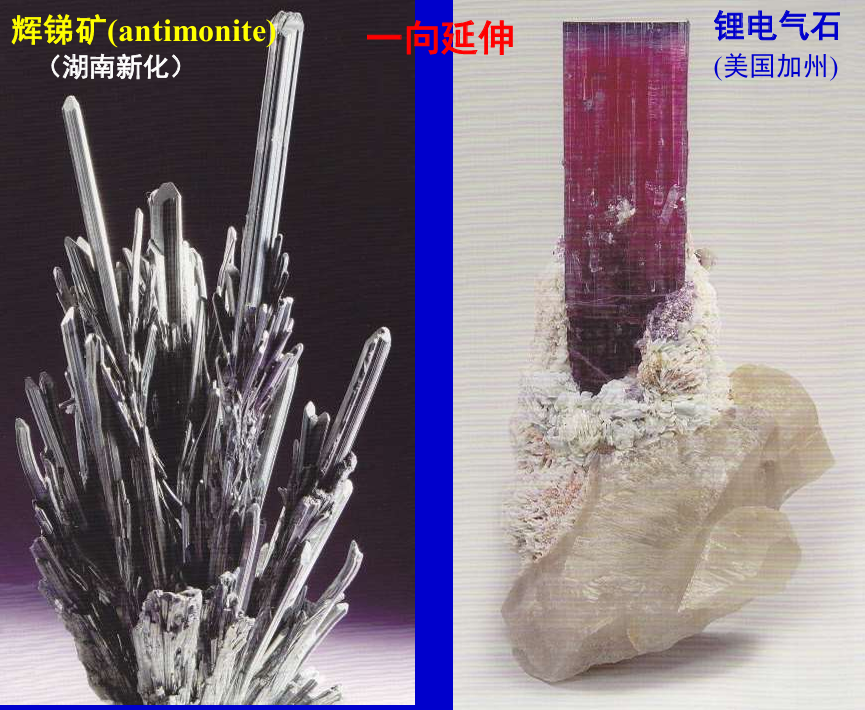

- **二向延伸**：呈板状、片状,如石墨、长石、云母;  

  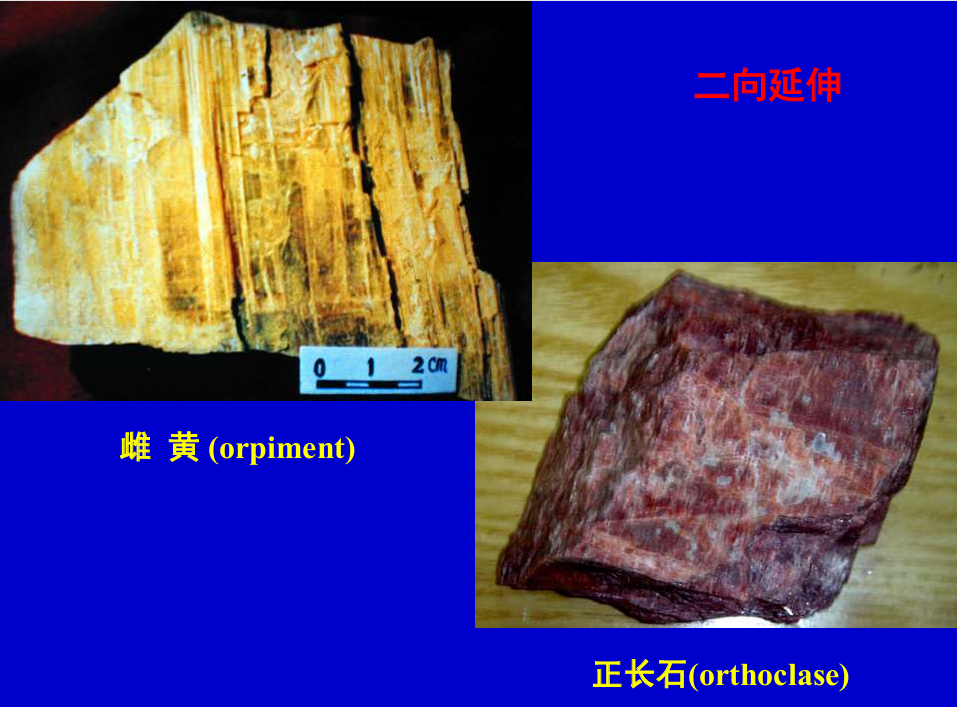

- **三向延伸**：呈菱面体、八面体、立方体、复合体, 如橄榄石、萤石、黄铁矿。

  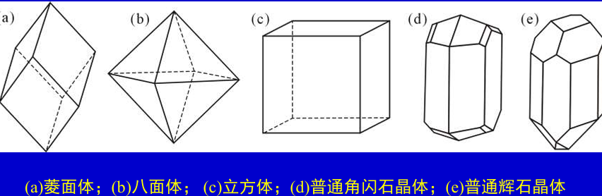

  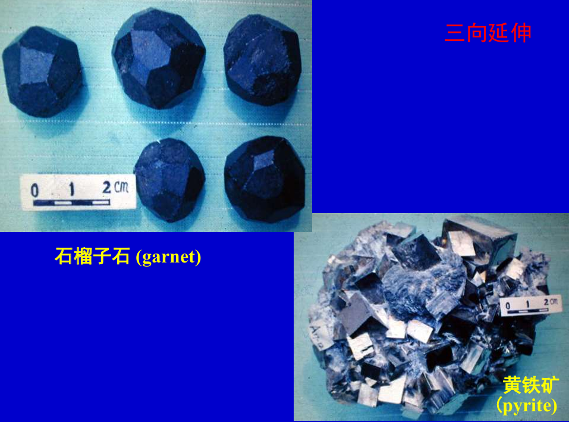

### 集合体

**集合体**: 由大量微小晶体聚集而成的矿物形态，通常没有明显的几何外形。集合体的形成方式多样，常见的有以下几种类型
- **一向延伸**：纤维状, 如石棉;

  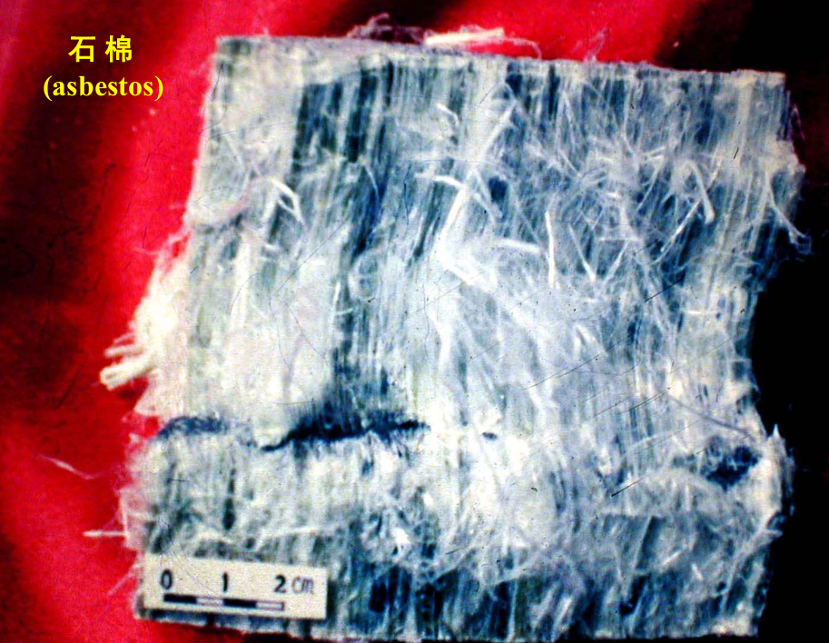

- **二向延伸**：鳞片状, 如云母;  

  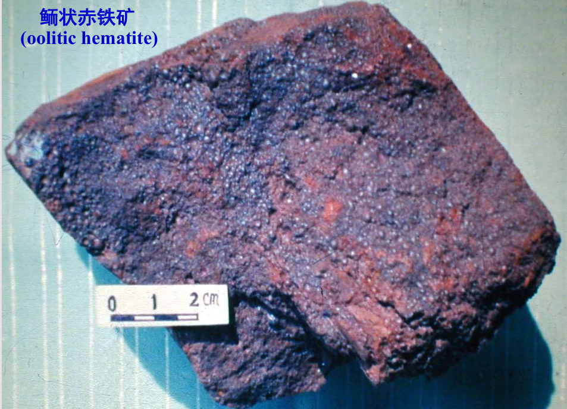

- **三向延伸**：粒状, 如橄榄石；块状，如石榴石、萤石。

  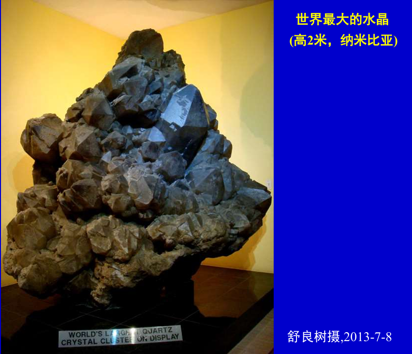

- **特殊集合体**: 集合体原有的延伸方向改变，形成特殊的外形

  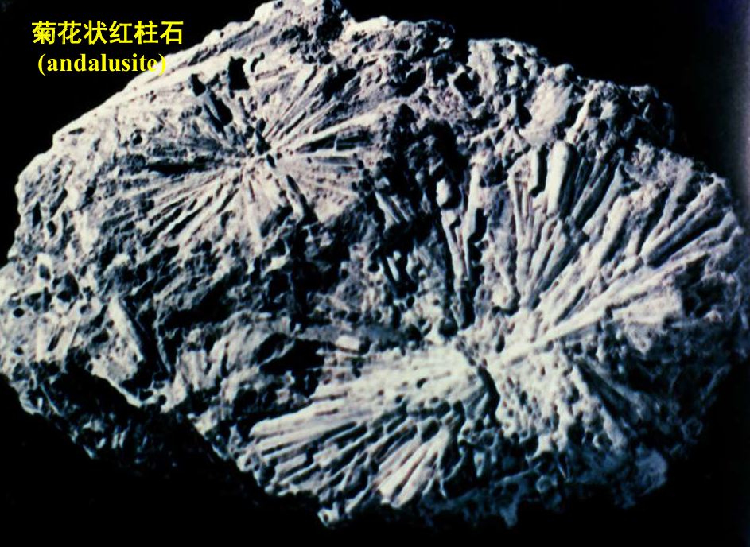

## 光学性质

- **透明度**: 厚`0.03mm`的矿物薄片能被光线透过者,称透明矿物。不能透过者,称不透明矿物。**所有金属矿物都是不透明矿物**，如黄铁矿、闪锌矿。
- **光泽**: 矿物的反光能力
  - **金属光泽**: 具有金属光泽的矿物，如黄铁矿、辉铜矿
  - **非金属光泽**: 玻璃光泽(长石)、油脂光泽(石英断口)、丝绢光泽(绢云母、白云母)、土状光泽(高岭石) 等
- **颜色与条痕色**:  红、黄、蓝、黑、绿、紫、白等
  - 自色`diochromatic`: 被化学成分和内部结构所决定的矿物本色。如方铅矿的铅灰色。 
  - 他色`allochromatic`: 混入杂质后的矿物颜色。如石英(无色)、紫晶(Fe多)、蔷薇石英(含Cr)、烟水晶(含Mn)。 
  - 假色`pseudochromatic color`: 表面氧化或吸附杂物后的颜色。如黄铁矿的褐色。 
  - 条痕色: 矿物粉末的颜色。低于「瓷板」硬度`5 ~ 6`的矿物（主要是金属矿物），才有条痕色。例如紫红色的赤铁矿呈樱红色, 黄铜色的黄铜矿呈墨绿色。**透明矿物的硬度要高于瓷板，因此无法通过该方法鉴定。**

## 力学性质 

力学性质`mechanical`: 矿物在外力下的表现
- **硬度 `hardness`**: 矿物抵抗外力划痕的能力。常用莫氏硬度`Mohs hardness`来表示，分为`10`个等级。常见矿物的硬度如下
  - 滑石 `1`, 石膏 `2`, 方解石 `3`, 萤石 `4`, 磷灰石 `5`, 正长石 `6`, 石英 `7`, 黄玉 `8`, 刚玉 `9`, 金刚石 `10`
  - 指甲`2～2.5`,小刀`5～5.5`,玻璃`6`
- **解理 `cleavage`**: 在外力击打下 (直接来一锤子)，矿物沿着质点结合力最弱网面定向开裂的现象。**解离不一定能肉眼可见，需要放大镜辅助**
  - 极完全解离：沿着特定方向完全裂开
  - 完全解理: 沿着特定方向破裂
  - 无解理: 不裂开

  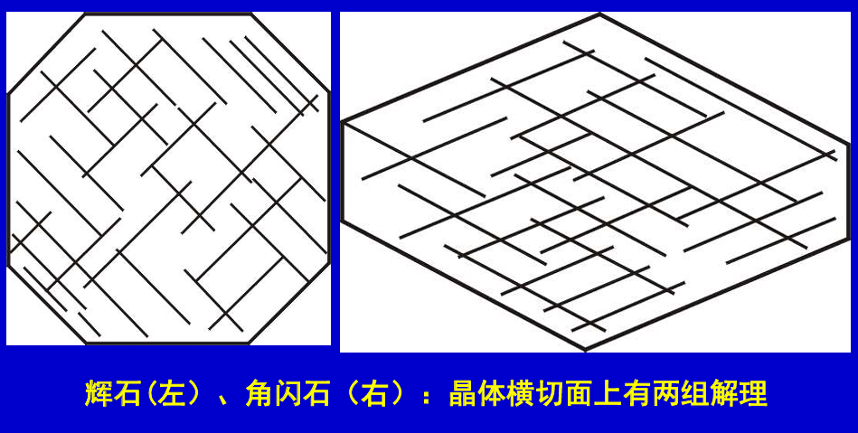

- **断口 `fracture`**: 外力击打下矿物呈不规则的开裂构造
  - 贝壳状断口: 石英
  - 参差状断口: 黄铁矿、石膏
  - 锯齿状断口

  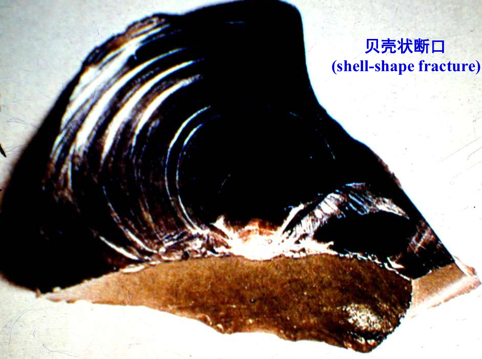

- **弹性**: 在弹性极限内，受力后能恢复原状的，如云母
- **挠性**: 受力后不能恢复原状的,又称范性。
- **延展性**: 可用外力任意改变其形状的。
  - **延**:一维
  - **展**:二维(金)

## 其他物理性质

- 相对密度 `specific gravity`: 矿物质量与同体积水的质量比，例如方解石`2.7`, 黑钨矿`7.5`, 金`19.3`
  - 轻: `<2.5`;
  - 中: `2.5～4`; 
  - 重: `>4` 
- 磁性 `magnetism`: 本身有磁性，能被磁铁吸引。如磁铁矿。 
- 双折射: 不同方向折射率不一，产生光程差，呈双影。例如冰洲石
- 导电性: 石墨
- 润滑性: 滑石
- 发光性: 外光照射后能发光
  - **荧光**:  切断光源后，发光消失； 
    - 白钨矿和萤石：紫外光下，发浅蓝荧光；
    - 金刚石：X射线下，发天蓝荧光。 
  - **磷光**: 切断光源后，仍发光片刻。 
- 化学性

# 环境气候示踪

- 石膏、石盐: 该石头产生的环境干旱炎热，且在地表
- 方解石：该石头产生于海洋
- 蓝闪石、硬玉：该石头产生于高压低温的环境，当时发生了大陆板块运动
- 金刚石：该石头产生于地幔深处，高温高压环境，产生环境可能发生了大陆深俯冲

