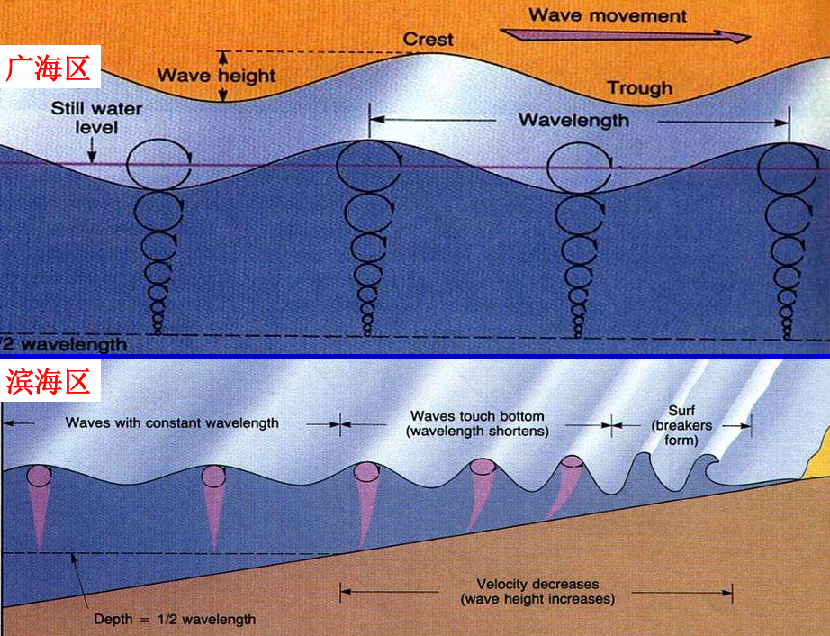
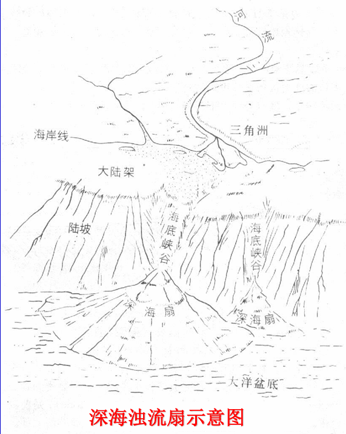
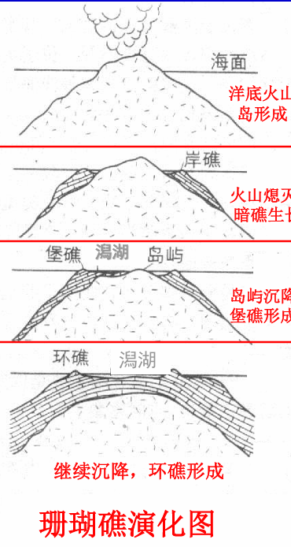

# 海洋

# 概念
- 海与洋的区别
  - 海的基底多为陆壳(日本海与南海除外);  
  - 海位于陆缘，面积小，水深平均`200m`(日本海与南海除外); 
  - 海形成早新(<50Ma至今)
  - 海含盐度 `2.72%`，洋含盐度 `3.5%`
- 面积：海洋表面积占`71%`
- 深度:  平均海深3800m
  - 浅海＜200m : 富集海洋生物
  - 半深海200～2000m
  - 深海＞2000m :  深海区缺`O2`富`CO2`
- 物理性质
  - 密度 `1.02～1.03 g/cm3`
  - 压力: 每下降`10 m`增加一个大气压
  - 温度: 海底2～3 ℃
  - 含盐量：`3.3% ~ 3.8%`
- 海洋生物: 主要集中在浅海
  - 底栖类：贝类
  - 游泳类：鱼类
  - 浮游类: 藻类

# 海水运动

## 波浪

### 概念

- 起因：大气压变化、风摩擦海水、月球引力、海底地震
- 四要素
  - 波长(wave length)： 最大800m
  - 波高(wave high)：波峰(crest)至波谷(trough)间的垂距；一般波高为1～4m至15 ～30m； 
  - 波的周期(wave period)：相邻两波峰经过同一点间隔的时间； 
  - 波速(wave velocity)：波形在单位时间内前进的距离。
- 浪基面(wave base): 水深 1/2 波长位置(波浪运动停止面)，波浪向下传导停止面
- 广海区: 水深＞1/2波长，在无风情况下，波浪只上下起伏，不前进
- 滨海区：水深＜1/2波长，波浪的波长变小，波高加大，波峰变尖，然后拍向岸边

### 地质作用

- 浪蚀(wave erosion): 岸边岩石被巨浪侵蚀，节节朝陆退缩
- 海岬: 岸边抵抗力强的岩石保持原地
- 海湾：岸边抵抗力弱的岩石向内陆凹陷
- 海蚀沟谷：断裂带
- 海蚀洞穴：激浪和石块对陡崖的冲击形成
- 波切台：洞穴变成凹槽，凹槽上的陡崖崩塌，且凹槽平底在水面上
- 波筑台：凹槽平底在水面下
- 海蚀柱：波切台/波筑台，在当陆地后，伸入海中的岩石

## 潮汐

- 潮汐(tide)：月球引力作用下造成的海平面周期性升降现象
- 潮汐形成的四个条件
  - 向海张开的漏斗状河口
  - 狭窄的河道
  - 河口处有水下砂堤（抬升浪高）
  - 平行行进潮流的强风。

## 洋流

- 洋流: 定向流动的广海海水，洋流流速：0.5～1.5m/s
- 浊流: 海底泥石流，发生在大陆架斜坡上的高密度(1.5～ 2.0g/cm3)、可形成**海底峡谷**
  - 地震产生的海底滑坡
  - 干冰气爆产生巨大冲击波

# 海底沉积

- 海底沉积物来源
  - 海底火山物质(volcanic material) 
  - 海洋生物物质(biologic material)  
  - 陆缘物质(terrigenous material) 
  - 被溶滤的海底岩石(solved submarine-rocks)：海水沿岩石裂隙下渗并被加温→热水溶解-淋滤途经的物质→溶滤物质上升，以热泉的方式溢出海底。 
  - 宇宙物质(universal  material) 
- 滨海沉积
  - 外滨(潮水下限带)
  - 前滨(潮间带)
  - 后滨带(潮水上限带)
- 浅海沉积
  - 碎屑沉积：砂岩,细砂岩,粉砂岩
  - 化学沉积：Al→Fe→Mn沉积(依次由陆向海沉积)→碳酸钙沉积 (很浅水体者具鲕状结构;干燥条件下则有白云岩沉积)→磷酸钙沉积(结核)
  - 生物化学沉积
    - 生物礁
      - 岸礁(fringing reef): 靠近大陆边缘的生物礁
      - 堡礁(barrier reef)：与海岸平行，其间有浅水泻湖 (靠近岸边的海被隔离所形成的湖) 相隔
      - 环礁(atoll reef)：绕着泻湖分布的环形珊瑚礁群

    

- 半深海沉积: 水深 `200～2000m`，还原环境，生物较少，含火山物质
- 深海沉积: 水深 `>2000m`
  - 软泥 (ooze)：来自陆地的风化产物
  - 金属泥 (metal clay)：洋脊中富含金属元素的泥状沉积物
  - 锰结核：胶体凝聚而成；核心为生物屑、岩屑；Mn成皮壳状、同心圈状；直径可达8cm；并可吸附其他金属元素。
  - 浊流沉积岩：称浊积岩(turbidite)。具有一个完整的 A-B-C-D-E 单元浊流层序，称**鲍玛序列**
