# 板块构造

# 发展历史

## 大陆漂移

大陆漂移理论最早由德国气象学家阿尔弗雷德·韦格纳（Alfred Wegener）于1912年提出。他观察到各大洲的海岸线形状相似，尤其是南美洲和非洲的海岸线，仿佛可以拼接在一起。此外，韦格纳还发现了不同大陆上相似的化石和地质结构，这些证据支持了大陆曾经连接在一起的观点。尽管韦格纳的理论在当时并未被广泛接受，但它为后来的板块构造理论奠定了基础。

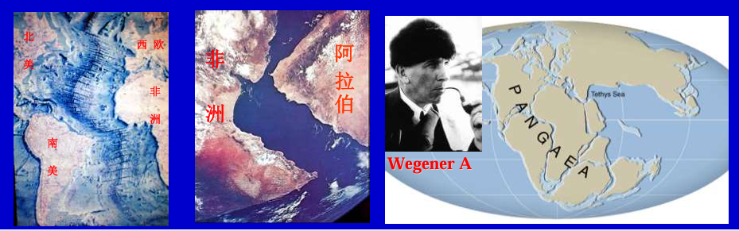

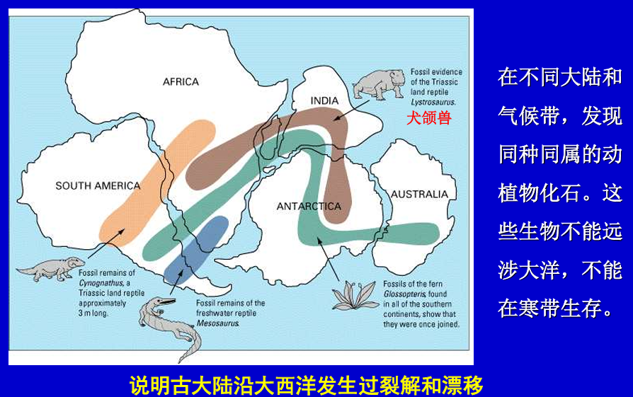

奥地利学者休斯 (Suess E) 赞同此认识，并提出2亿年并对古大陆进行命名
- 潘吉亚(Pangea)超大陆
- 特提斯 (Tethys)泛大洋

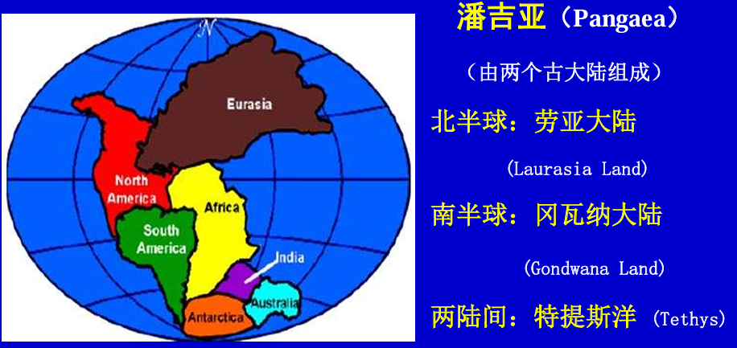

魏格纳于1912年出版专著《海陆起源》，提出「大陆漂移说」，但存在致命缺陷：**陆壳在洋壳上漂移，即花岗岩层在玄武岩层上移动，实验证明根本不可行。** 因此，1928年霍尔姆斯提出「地幔对流说」进行修正：**岩石圈是在软流层上进行移动**

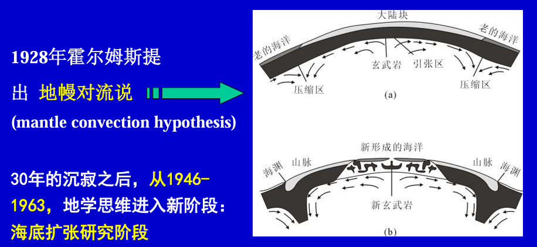

## 海底扩张

二战结束后世界进行了大量的洋底调查
- 洋中脊: 地壳新生带，热流值极高，物质炽热呈膨胀态，重力值小
- 海沟: 地壳消亡带，热流值极低，洋壳冷呈致密态，重力值高
- 洋脊地震带: 地震频繁，震级低，震源浅，有地层构造运动
- 洋底沉积物: 在洋中脊很薄，或无，向两侧对称式逐渐增厚

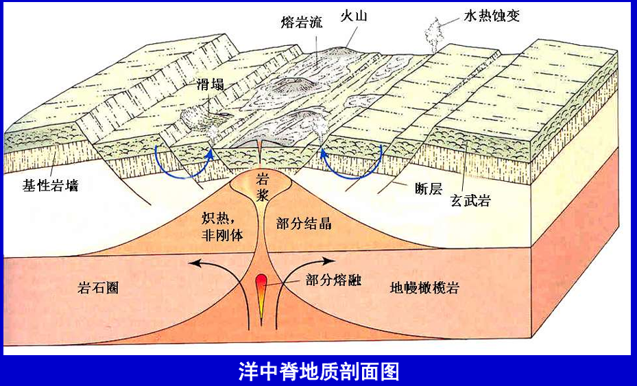

迪茨提出了「海底扩张说」: **刚性的大洋岩石圈块体驼在软流圈之上运动**
1. 在地幔物质的热对流驱动力下，炽热的地幔岩浆在洋脊不断上涌，促使洋脊朝两侧运移和冷凝，致使大洋底不断扩张
2. 老的洋底随对流圈在海沟处下沉潜没，构成一个对流圈
3. 这种生亡过程持续不断，因而洋底不断更新 (2~4亿年/次)

随后一系列发现精准证实海底扩张说的正确性
- **海底磁异常条带**：在洋脊两侧，海底岩石的正、负磁异常条带对称分布。洋中脊喷出的高温玄武岩浆冷却到居里点（650℃）时，将会被磁化，当时的磁场方向会被记录在岩石中。因地磁南北极多次转向，导致海底岩石中的正、负向磁异常条带反复出现。

    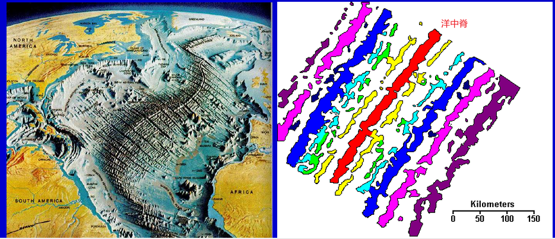

- **三位一体洋壳剖面**: 被称之为「蛇绿岩套」，是海洋的重要标志，始见于大西洋洋中脊北段的冰岛
  - 上部，沉积单元：枕状熔岩 + 海底沉积岩(浊积岩、灰岩、硅质岩) + 基质
  - 中部，玄武岩浆堆晶单元：(单辉橄榄岩)+堆晶辉长岩（下粗上细）+基性岩墙
  - 下部，枯竭的上地幔单元：纯橄榄岩、斜辉橄榄岩

    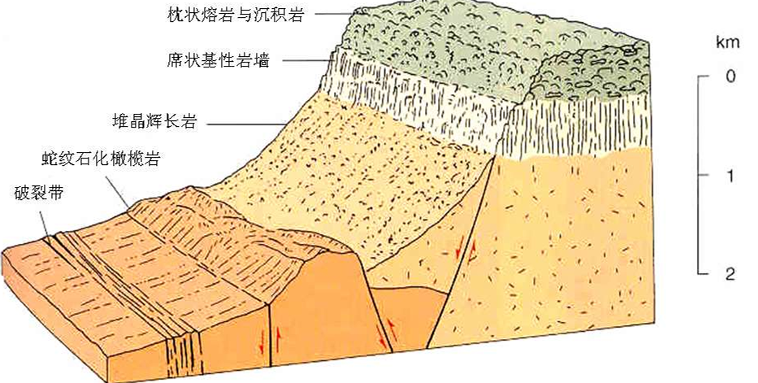

- **深海钻探**

    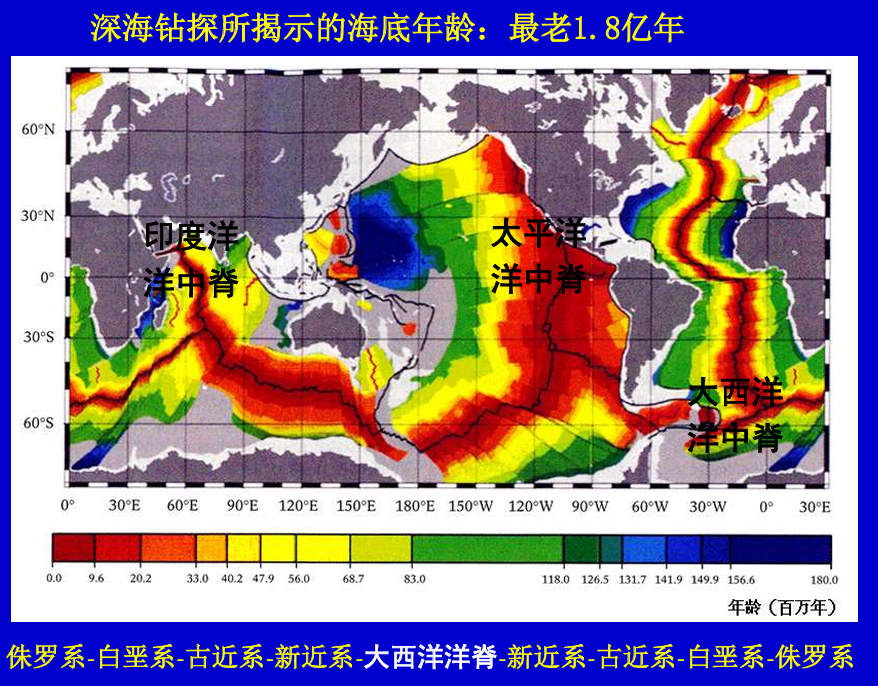

- **海底平顶山**: 地幔热点位置不动，而大洋板块在移动，海山不断新生和位移
  - 地幔热点喷出岩浆形成火山
  - 大洋板块带着火山移动，地幔热点喷出岩浆形成新的火山
  - 旧火山山顶被海浪削平，形成平顶山

    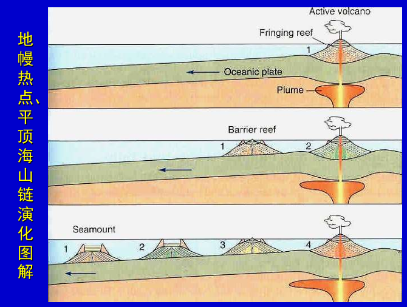

## 海底转换断层

在海底扩张学说的影响下，一部分学者认为大洋板块就是以洋中脊为对称轴的一块钢板，非常稳定，然后该假设与自然现象不一致。**威尔逊发现海底转换断层，终结了这一假设**
- **定义**：发生在洋底、与洋脊错位有关的一种特殊海底剪切断层
- **特点**
  - 断面近直立，相邻块体平移只发生在两个转换点`b,c`之间 
    - `bc` 面之上洋脊向右扩张
    - `bc` 面只下洋脊向左扩张
  - 断层两侧洋脊的运动方向相同，剪切消失
  - 转换点`b,c`间动向与洋脊被错动向正好相反

    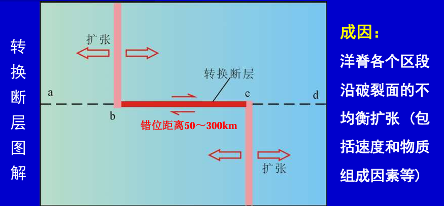

    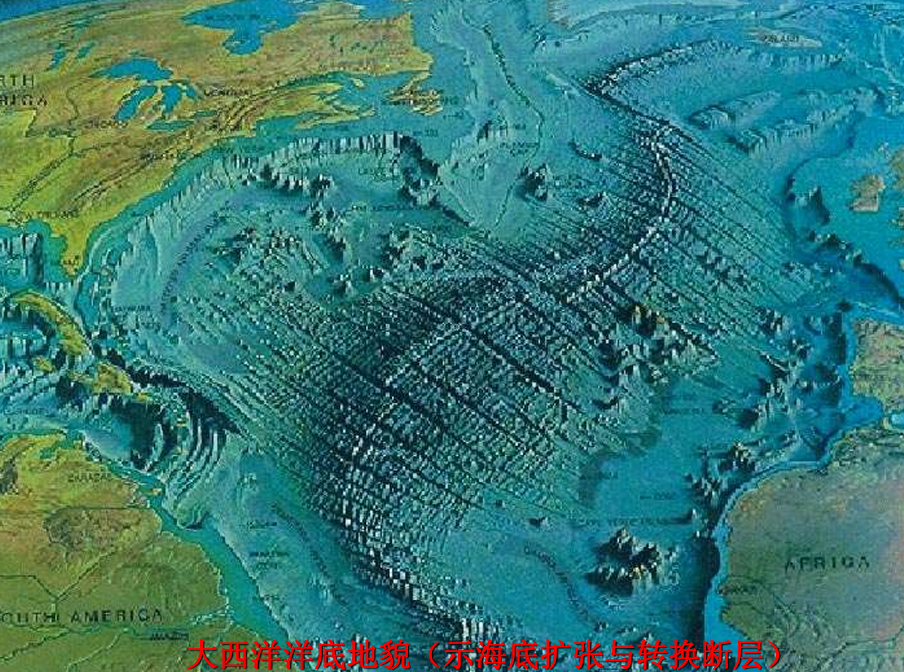

## 板块学说

经过一系列发展，在三大理论支柱上建立了板块学说
1. 海底扩张：对称分布的海底磁异常条带
2. 大洋并非铁板一块：转换断层
3. 地幔对流说: 驱动岩石圈钢体绕球面旋转运动，**目前仍然是假说理论，未被证实**

板块构造的理论精髓为板块演化旋回 `Wilson Cycle`

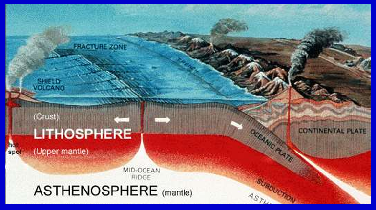

# 板块构造

## 板块

板块构造理论中认为岩石圈存在两大类板块
- 大陆板块: 玄武岩层、玄武岩层、上地幔上部（莫霍界面与软流圈上表面之间）
- 大洋板块：玄武岩层、上地幔上部（莫霍界面与软流圈上表面之间）

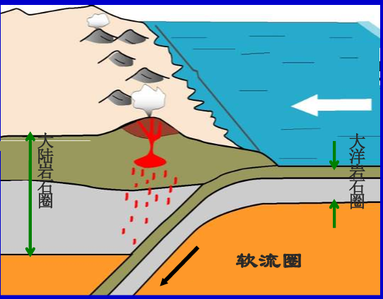

板块与板块间又存在三类边界
- 离散边界
  - 海洋：洋中脊
  - 陆地：大陆裂谷
- 剪切边界: 转换断层 
- 聚敛边界
  - 俯冲带：为全球地震带与火山带；常发育高压低温变质带
  - 陆-陆碰撞带：印度与欧亚两个大陆沿雅鲁藏布江断裂碰撞，形成的青藏高原

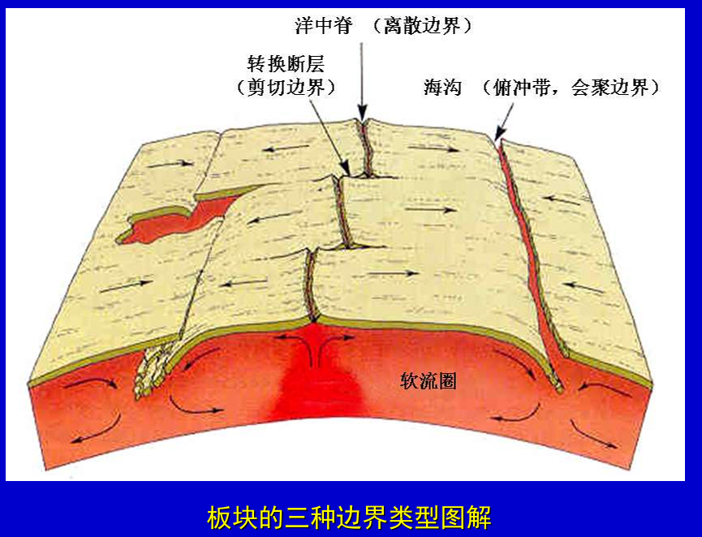

## 分类

全球板块划分六大板块

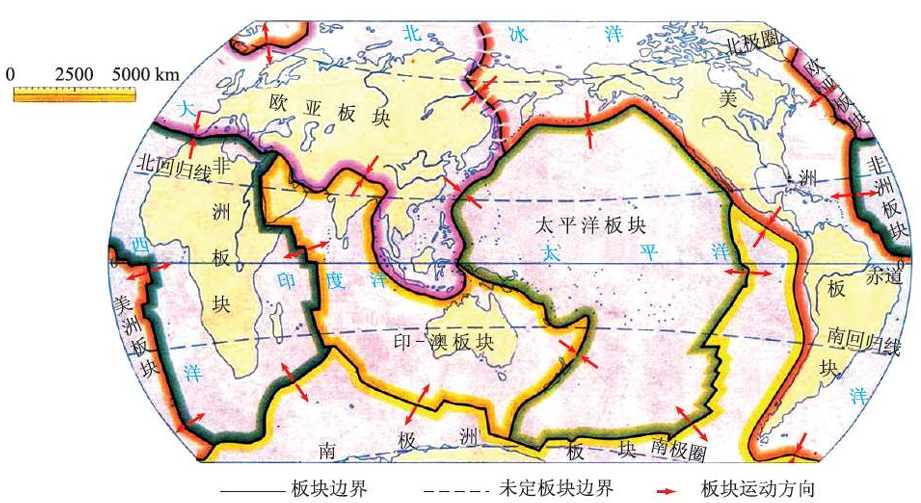

## 大陆边缘

大陆边缘有两类
- 活动大陆边缘
  - 西太平洋型: 沟、弧、盆复合体系, 海沟附近还有对变质带

    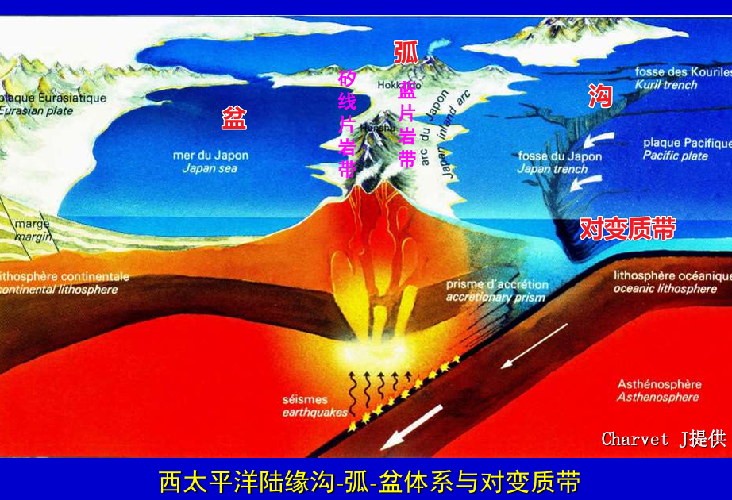

  - 东太平洋型：沟、弧复合体系

    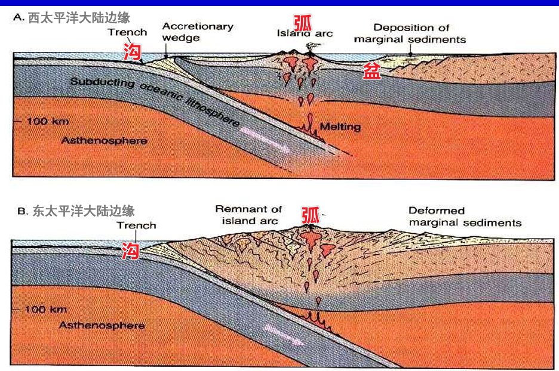

- 被动大陆边缘：没有海沟、没有火山与地震活动的大陆边缘

    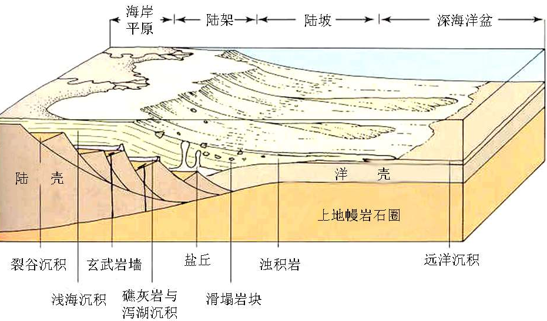

## 威尔逊旋回

威尔逊旋回: 解释了**大洋演化**的六大阶段
- 胚胎期：裂谷；双峰火山岩；东非裂谷
- 幼年期：狭海；双峰火山岩；红海 
- 成年期：洋脊及洋盆；拉斑及碱性玄武岩，陆架沉积；大西洋
- 衰退期：沟—弧系；安山岩-闪长岩，岛弧浊积岩；太平洋
- 终结期：大洋闭合碰撞造山；混杂岩,S型花岗岩,蒸发岩;地中海
- 遗痕期：造山后山前红色磨拉石堆积，碱性岩浆岩；喜马拉雅山

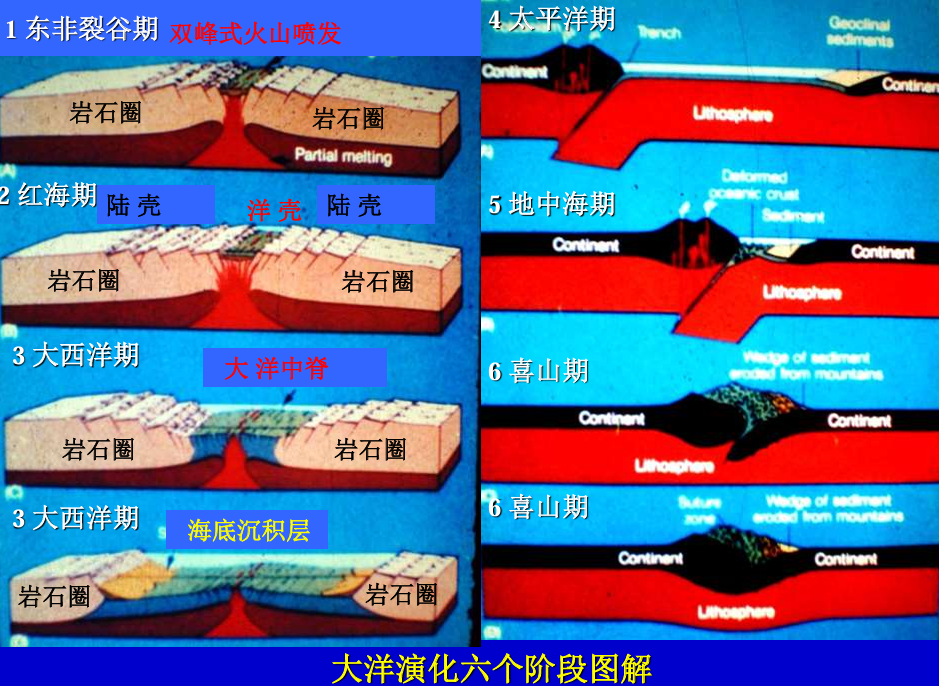

## 大陆动力学

威尔逊旋回能完美解释大洋岩石圈，但并不完全适用于大陆岩石圈。大洋岩石圈与大陆岩石圈存在很大差别，因此，**针对大陆岩石圈提出了新的研究方向：大陆动力学，但目前并未有系统研究成果，属于前沿方向。**
