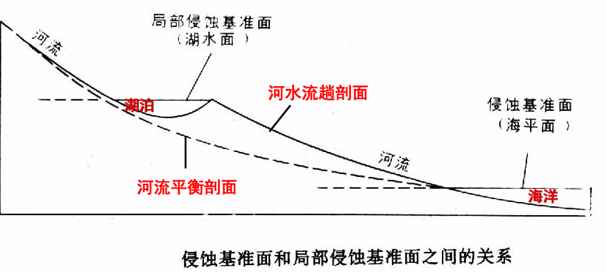
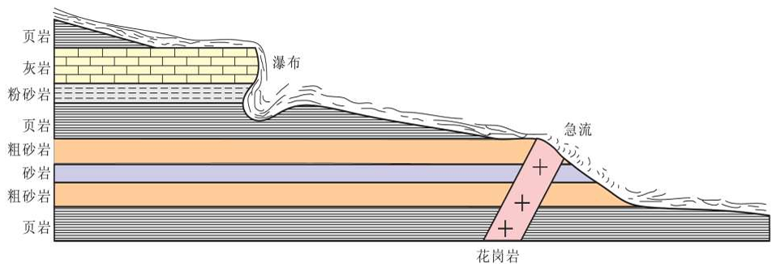
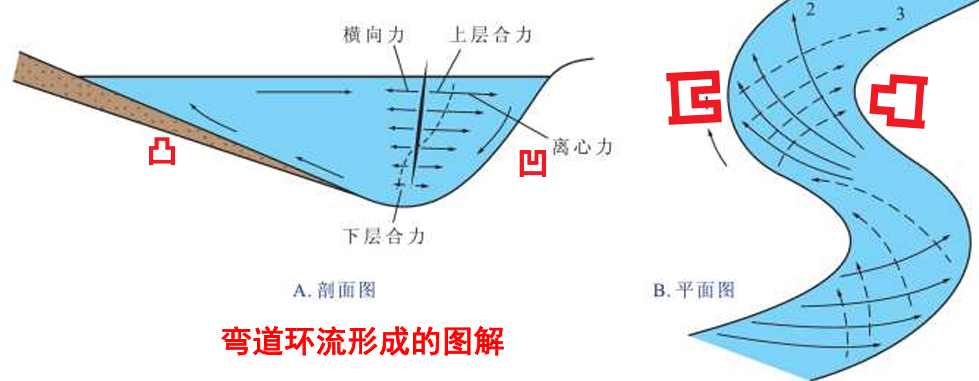
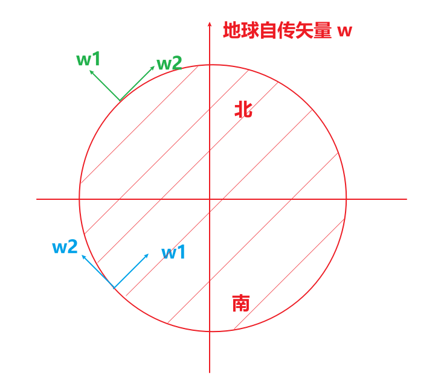
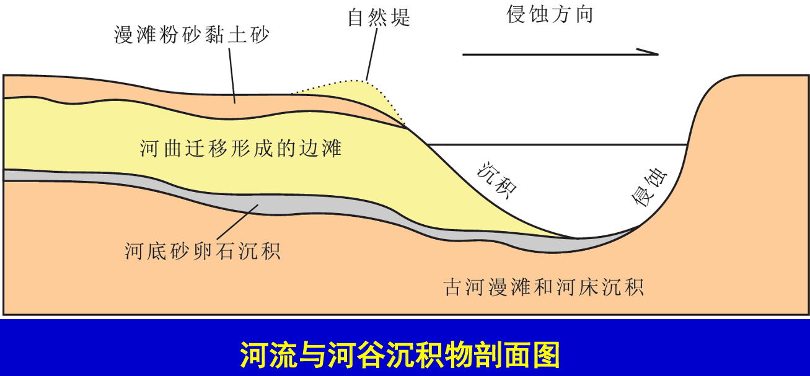
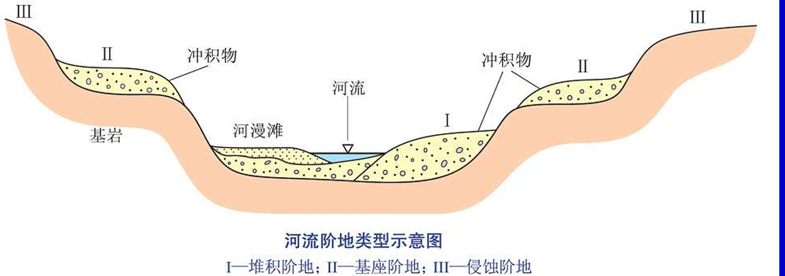

# 河流作用

# 概述

## 术语

- 河流形成过程: 片流 (sheet flow) → 洪流 (flood current）→ 河流（river) 
 - 片流: 降水沿地表斜坡自然流动、无固定方向的流水。 
 - 洪流: 沿地表沟槽季节性、快速、短期、定向流动的水体。从源头朝下方侵蚀, 使河沟加深-拓宽-伸长。无雨则干涸。 
  - 洪积物 (diluvium)：洪流将山上的碎屑物带到山底堆积而成
  - 洪积扇(diluvial fan)：扇形，沟口粒粗、开阔带粒细。若干洪积扇连成一片则成洪积平原(diluvial plain) ，如包头洪积平原。
 - 河流: 地表上具经常性流水的线形凹地。 
- 水系 ： 主流+支流。所有支流都汇入主河流
- 流域：水系分布区。如长江流域、黄河流域等
- 分水岭：水系与水系之间的高地

## 动力

$$
    E = \frac{1}{2} Q V^2
$$

- 动能 $E$ : 动能大，搬运力大
  - 搬运力 > 搬运量，则河流侵蚀
  - 搬运力 < 搬运量，则河流沉积
- 流速 $V$ : 受到坡度、滚石大小、河床宽度影响
- 流量 $Q$ : 受到流速、河床宽度、深度影响

# 侵蚀作用 

## 概念

河流的侵蚀作用有三类
- 磨蚀: 对水体的中岩石打磨
- 冲蚀: 水流的冲击
- 溶蚀: 河水与岸边岩石发生交代作用

侵蚀作用三方向
- 下蚀: 对河底的侵蚀
- 旁蚀: 对岸边的侵蚀
- 溯源侵蚀: 对上游的侵蚀

## 下蚀

下蚀 (bottom erosion): 河流对河床的垂向侵蚀。它使河床加深、河床与两岸的高差加大。 
- 侵蚀基准面: 即海平面。为入海河流下蚀的最大深度面。**到海/湖平面后，下蚀停止**
- 局部侵蚀基准面: 即湖面。为入湖河流的侵蚀基准面。 
- 河流的纵剖面:从源头到河口,河流纵剖面呈起伏、下凹、线状展布。对长江而言，宜昌以上为侵蚀区,以下为沉积区。 
- 河流均夷化(graded): 削去河道中突出部位、填平凹坑的作用。 
- 河流的平衡剖面：均夷化后呈平滑曲线的河流纵剖面。 

自然现象
- 急流 (torrent)：河床坡度大，导致河水湍急的河流。 
- 瀑布 (waterfall)：发生在断崖、悬谷的突然、垂直下降的河流。 
- 瀑布后退：因水位落差大、动能大, 使下部岩石掏空, 上部岩石崩塌，瀑布朝河流上游移位的现象。**黄河壶口瀑布，每年后退`5cm`**

## 旁蚀/侧蚀

旁蚀(侧蚀)(lateral erosion): 河流对河床两侧及谷坡的侧向侵蚀。其结果是使河床和谷底加宽
- 弯道离心力：因惯性影响，流水在河弯部位会产生离心力。作用于河流凹岸，会使凹岸水位涨高、凸岸水位降低，导致凹岸水向凸岸流动、凸岸底流向凹岸流动。组成单向弯道环流，且造成**凹岸侵蚀、凸岸堆积**现象

    

- 科里奥利力: 由于惯性作用，物体相对非惯性系会存在的一个力 $F_c = -2m(\omega \times v_r)$
  - 北半球，科氏力作用于河流前进方向的右岸，**地球自转矢量 $\omega$ 在北半球地表的垂直分量 $\omega_1$ 向上**
  - 南半球，科氏力作用于河流前进方向的左岸，**地球自转矢量 $\omega$ 在南半球地表的垂直分量 $\omega_1$ 向下**

    

自然现象
- 截弯取直: 洪水期间，弯曲河流被连通
- 牛轭湖/月牙湖: 弯曲河流被连通后，废弃的河道便能形成湖，**修别墅、打造风景区**

## 溯源侵蚀

溯源侵蚀 (retrogressive erosion): 由下切侵蚀引起的一种使河流朝源头加长的侵蚀作用。
- 常发生在沟头处
- 溯蚀、下蚀总是相伴而生，下蚀必导致溯蚀
- 能把沟头上方许多支流连成一片,使河流变大、变长

自然现象
- 两侧河流的溯源侵蚀会使分水岭变窄，高度降低
- 河流袭夺: 因溯源侵蚀，一河流将另一河流的水截夺过来的现象
 
# 搬运作用

三种搬运方式

- 拖运(底运): 物质粗大者在河床底部被滚动、跳跃搬运。流速变小时发生沉积。 
- 悬运:物质较细者,呈悬浮状态被搬运。黄河最典型。 
- 溶运:物质极细者,呈溶液状态被搬运。如Ca,Mg,碳酸盐等。

# 沉积作用

河流沉积物称冲积物有五点特征
- 分选性好 长时间稳定的河流水动力，可使各种粒级的物质充分分开 
- 磨圆度好 长距离搬运与磨蚀，使岩石碎屑变得很圆滑。 
- 成层性好 夏季洪水期，色淡，物质丰富，颗粒粗；冬季枯水期，色深，物质匮乏，颗粒细。 
- 韵律性好 形成递变层理。由下到上：河床相(粗)、漫滩相(中)、牛轭湖相(细)。 
- 河流原生构造发育 冲刷痕、波痕、交错层（单向、往返流向）、前积层(foreset bed)等。

沉积作用产物
- 边滩（点沙坝）: 凸岸的堆积体，洪水期淹没。
- 心滩: 在河中的堆积体，洪水期淹没。
- 江心洲：心滩扩大版，一般汛期不会淹没。如南京八卦洲、湘江橘子洲
- 河漫滩: 上部为河漫滩泥质粉沙质沉积，下部为河床砂砾沉积。洪水期淹没
- 自然堤：洪水溢出河岸,流速骤降,大量泥沙沉积,形成自然堤。成为阻挡洪水的天然屏障。
- 冲积平原: 河漫滩连片扩大，形成冲积平原
- 三角洲: 在河口处形成
 - 有充足的沉积物来源； 
 - 河口处坡度较小,易于沉积(日本东部不能形成)； 
 - 水动力较小，沉积物易于保存。

# 河流演化

## 均夷化

- 均夷化 ：河流削去河底的突起、填平凹地，达到平衡的过程。 
- 去均夷化：陆地上升，海平面下降,平衡被破坏，河流重新下蚀，此过程称为去均夷化。可形成深切基岩的河曲与河流阶地。  
- 三级河流阶地  (terrace)  
  - 堆积阶地(accumulation): 近河床,全部由沉积物组成； 
  - 基座阶地(basement): 斜坡上基岩裸露,阶地面上零星沉积； 
  - 侵蚀阶地(erosion): 远离河床,全由基岩组成的平台

## 准平原

- 准平原化(peneplaining): 使高山变成平原的地质作用。为河流老年期的标志。 
- 夷平面(planation surface):当后期地壳抬升时, 河流再下蚀,发生去均夷化，早先形成的平地被破坏成一系列沟-山地貌。若其相邻的平坦山顶均位于同一高度,则可代表当时准平原的表面,称作夷平面。夷平面越高，形成时代越老。

## 三期演化

- 幼年期地貌(V形河谷)：以下蚀为主,形成高山峡谷(Gorge)，例如长江上游云南金沙江虎跳峡
- 壮年期地貌（U形和碟形河谷）：以旁蚀为主，形成宽阔的河谷和低山丘陵
- 老年期地貌（准平原）：地表微弱起伏,存在少数孤立残山。如淮北准平原。 

# 湖泊

## 概述

- 湖泊的称谓
  - 湖:太湖、塞里木湖；
  - 海:中南海;哈萨克斯坦里海； 
  - 潭:台湾日月潭；        
  - 池:云南滇池,天山天池； 
  - 泊:梁山泊、罗布泊；
  - 九:宜兴西九； 
  - 错:藏西北班公错；      
  - 大淖:苏北(汪曾琪:大淖纪事) 
- 湖水来源：大气降水、地面流水、地下水. 
- 湖水排泄：蒸发、泻水、渗漏。 
  - 有出口:泄水湖(sluicing lake)；
  - 无出口:不泄水湖(basinal lake)； 
- 化学成分 
  - 淡水湖: 含盐量 `< 0.3%`
  - 微咸湖: 含盐量 `0.3 ~ 1%`
  - 咸水湖: 含盐量 `1% ~ 2.47%`
  - 盐湖: 含盐量 `> 2.47%`
- 湖泊的成因
  - 构造湖: 地质构造运动产生
  - 火山口湖
  - 河成湖
  - 冰川湖
  - 海成湖
  - 溶蚀湖、陷落湖
  - 风蚀湖
  - 堰塞湖：河谷被堵塞而形成的湖
  - 人工湖：水库
  - 冰盖湖: 分布在南极大陆冰川巨大冰盖之下巨大的液态水体
- 湖水运动
  - 机械动力：湖浪、湖流、潮汐
  - 化学动力：对流形成湖底的还原环境，使某些物质入湖后沉积，有利生物繁殖

## 湖泊沉积

- 机械沉积: 粗的在湖岸沉积,细的在湖心沉积，可形成砂坝、三角洲
- 化学沉积
  - 潮湿气候区：湖水中K、Na早已流失；常见有易溶的Ca和难溶的Mg、Fe、Al、Si形成Fe矿、Mn矿、Al矿、湖铁矿（即褐铁矿）
  - 干旱气候区: 方解石+白云石(咸湖碳酸盐沉积)→石膏+芒硝 (苦湖硫酸盐沉积)→石盐+钾盐（盐湖氯化物沉积, 盐度>25‰, 含K、Mg、B矿）→盐矿（盐湖干枯，盐层埋藏）
- 生物沉积: 生物尸体→干酪根→`60℃～120℃`变为石油→`200℃`变为天然气

## 演化过程

- 潮湿气候影响区湖泊演化 
  - 早期，湖滨很少沉积； 
  - 中期，三角洲发育，湖滨开始形成沼泽； 
  - 晚期，三角洲扩大形成连续的湖滨沼泽，最后淤塞埋藏。
- 干旱区气候影响区湖泊演化
  - 淡水湖阶段(碎屑沉积)
  - 咸湖(碳酸盐沉积)
  - 苦湖阶段(硫酸盐沉积)
  - 盐湖阶段(氯化物沉积)
  - 干枯埋藏(盐矿)
- 湖岩分带: 从湖缘向湖心，从下向上具明显的水平与垂直分带性
  - 湖浅而小者: 砾岩→粗砂岩→砂岩→细砂岩→粉砂岩→粘土岩。
  - 湖深而大者: 砾岩-粗砂岩-砂岩-细砂岩-粉砂岩-泥页岩→灰岩-石膏-盐岩
- 沼泽: 湖的晚期

