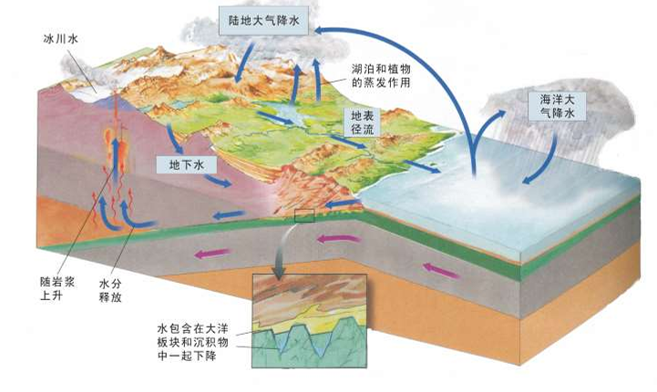
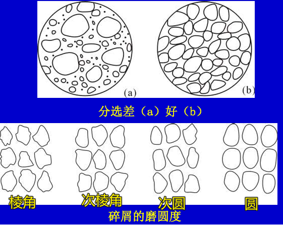
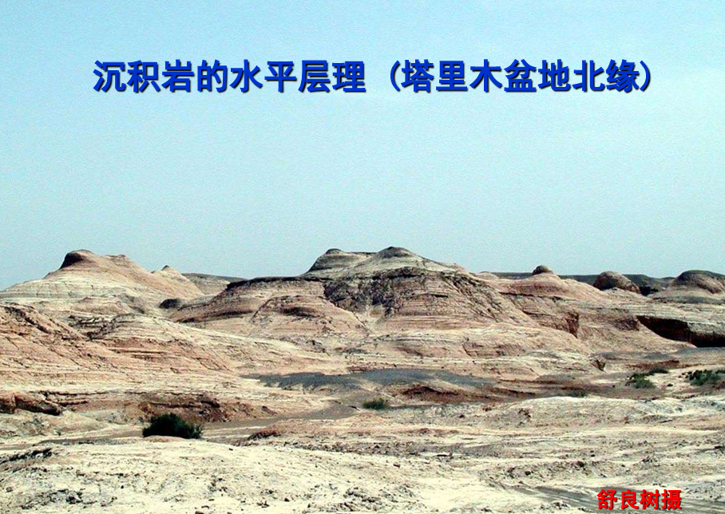
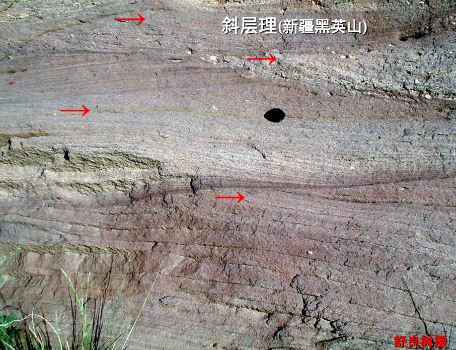
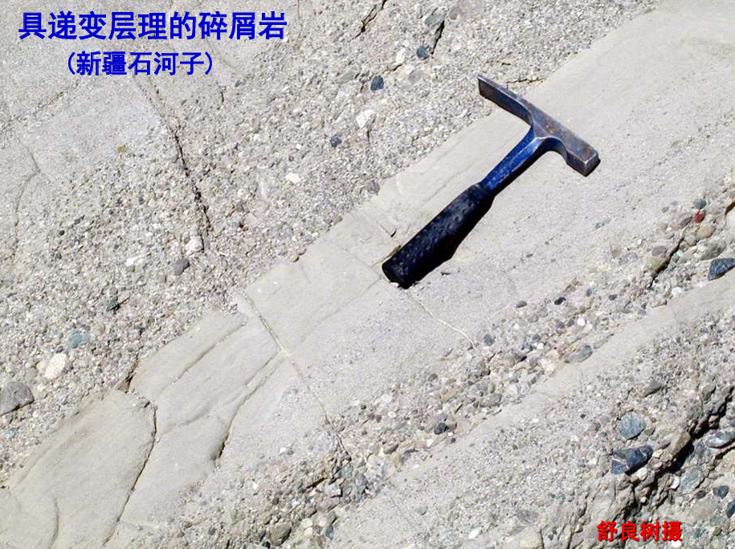
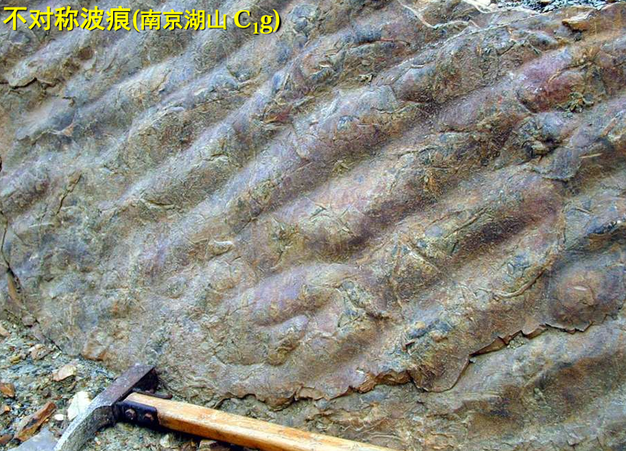
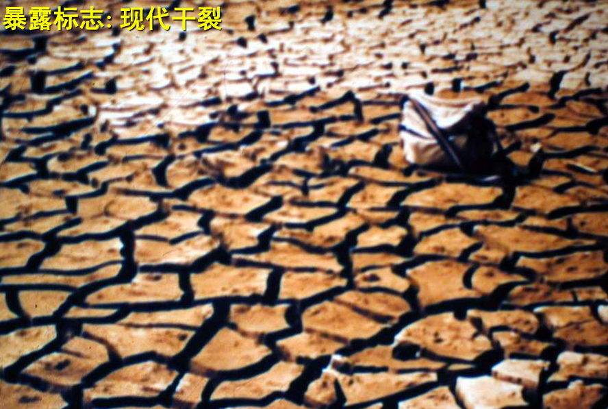
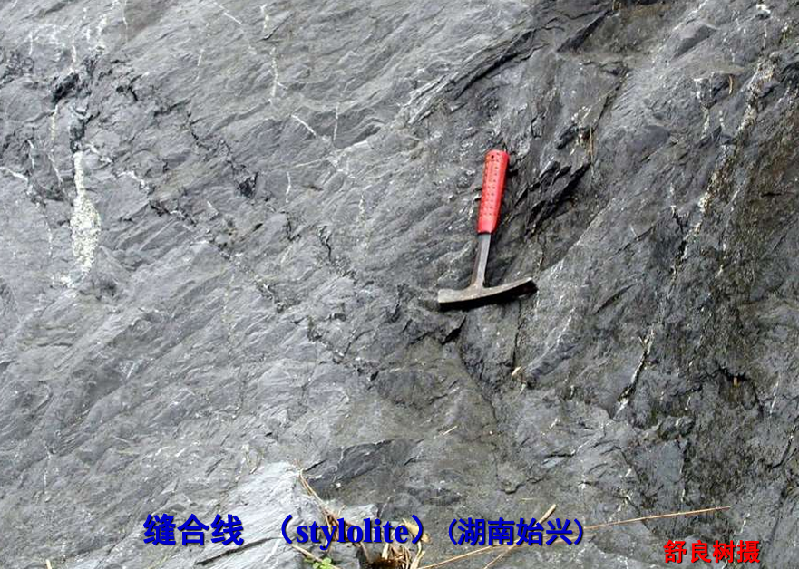
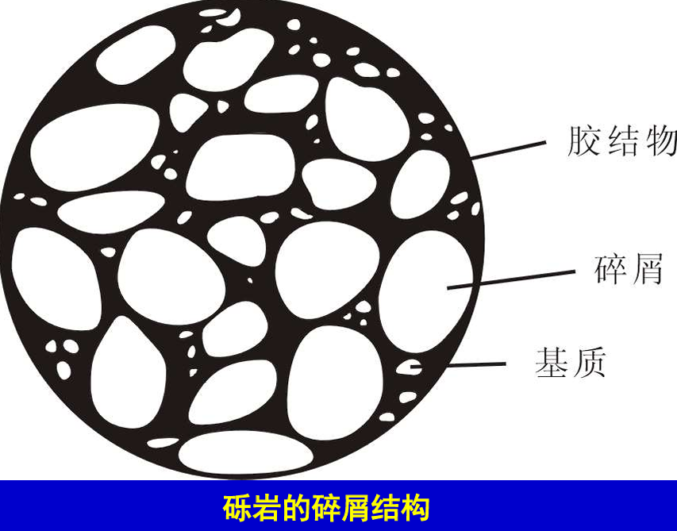
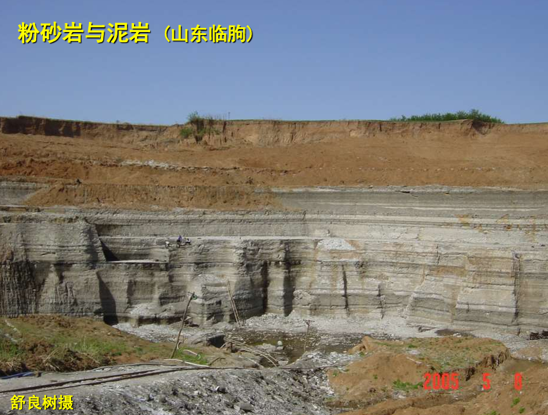

# 外动力作用与沉积岩

# 地球动力学

地球动力学(geodynamics)：塑造大自然和地球形貌的作用力
- 内动力(internal force): 岩浆、层圈摩擦与化学作用、放射能等
  - 产物：火山岩、侵入岩、各种岩浆矿产
  - 作用：找矿、了解地质体成因
- 外动力(external force): 太阳辐射热能、地球转动能、日月引力能、重力能等引起的力, 如科氏力、弯道离心、水流冲击、潮汐力、风、浪等
  - 作用场所：大气圈（风沙）、水圈（海洋、河流、冰川、湖泊、地下水）、生物圈、地壳表面（滑坡、泥石流）
  - 类型与过程
    1. 风化作用: 地表岩石在大气、水、生物作用下发生的机械破碎作用或化学分解作用，变成碎片
    2. 剥蚀作用: 由于风、水作用将风化产物从原地剥离搬运走
    3. 搬运作用
    4. 沉积作用
    5. 固结作用: 压固、胶结、重结晶、新矿物生长, 形成新的岩石
  - 产物：四类沉积岩、各种沉积矿产(煤、油气、铁、砂矿等)
  - 作用：找矿、了解地球演化史

# 沉积环境

与外动力作用有关的物质层圈
- **大气圈**: 对流层 → 平流层 → 中间层 → 热层 → 外层
  - **对流层**: 离地面`10~15km`，气温随高度升高而降低，风化作用主要发生在此层
  - **平流层**: 离地面`15~50km`，气温随高度升高而升高，臭氧层位于此层
- **水圈**: 河流、湖泊、海洋、地下水和岩石裂隙水，**所有组成部分都是连续的**

    

- **生物圈**: 地球上所有生物及其生存环境的
- **岩石圈**: 地壳和上地幔的最外层，厚度 `5~70km`，是沉积作用的主要场所

因此，沉积岩的沉积环境主要有
- 河流 
- 冰川 
- 地下水体 
- 海洋 
- 湖泊 
- 沙漠

# 沉积岩

## 特性

- **物质来源**：母岩风化物、生物骨骸、火山物质、宇宙物质
- **重要特性**: 层理、含化石
- **搬运**:
  - **底运**: 大颗粒物质沿地表滚动、跳跃前进
    - **砾岩**: 粒径`>2mm`
    - **砂岩**: 粒径`0.1mm～2mm`
  - **悬运**: 细颗粒物质悬浮在水流或气流中搬运
    - **粉砂岩**: 粒径`0.01mm～0.1mm`
  - **溶解运移**: 可溶性物质以离子形式溶解在水中搬运
    - **粘土岩/灰岩**: 粒径`<0.01mm`
- **固结作用**
  - 压实: 沉积物在上覆物质压力下，颗粒间隙减小
  - 胶结: 可溶性物质沉淀填充颗粒间隙，起粘合作用
  - 重结晶: 矿物颗粒重新结晶，形成新的矿物
  - 新矿物生长: 形成新的矿物，如方解石、大理岩

    

> [!note]
> 火山碎屑岩虽由火山作用形成，但其沉积过程与沉积岩相似，故归类为沉积岩。

## 结构

沉积岩的结构 
- 颗粒大小
  - 砾`>2mm`
  - 砂`2～0.1mm`
  - 粉砂`0.1～ 0.01mm`
  - 泥`0.01mm`
- 碎屑结构: 岩石中的颗粒是机械沉积的碎屑物
- 非碎屑结构: 岩石的颗粒由化学沉积作用形成，为化学岩、生物化学岩所特有
  - 晶质结构:全由近等大的沉积晶体（如方解石）组成。灰岩特有。 
  - 生物结构:由丰富的生物碎屑组成。生物屑灰岩特有
- 分选性: 碎屑大小的均匀程度，**距离原地越近，分选性越差**
- 圆度: 颗粒棱角的磨圆程度，**距离原地越近，圆度越差**

## 构造

沉积岩在形成过程中产生的构造, 是各组成部分的空间分布与排列方式
- **层理**: 若颗粒粗细和硬度不同，或气候发生变化，沉积辉会出现分层
  - **平行层理**: 不同沉积层顶与底面平行，表明沉积岩是在安静的水体中形成

  

  - **交错层理**: 不同沉积层顶与底面不平行，沉积岩形成过程中水流发生了变化

  

  - **递变层理**: 同一层内，碎屑粒级由下而上逐渐变小，水体发生了由强(颗粒相对小)到弱(颗粒相对大)或由弱到强的周期变化

  

- **波痕**: 波浪弯曲的层面，反映沉积环境动荡
  - 水介质定向运动形成不对称波痕: 可确定流向(从缓坡向陡坡)
  - 水介质往复运动形成对称波痕: 可确定地层顶底(尖头朝顶)

  

- **泥裂**

  

- **缝合线**: ：由于压溶作用，含二氧化碳的流体沿层面循环时，溶解二侧物质扩大界面。确定地层产状

  

- 结核
- 鲕状构造
- 冲刷痕、槽模
- 假晶: 残留的矿物外形，反映干旱环境
- 虫迹：动物运动留下的足迹

## 类型

- 碎屑岩
  - 砾岩
    - 粗碎屑 : 主体成分
    - 填隙物(基质): 填充在粗碎屑间隙中的细颗粒物质
    - 胶结物 : `Si`, `Fe`, `Ca`, 泥等
    
    

  - 砂岩
  - 粉砂岩
  - 泥岩

  

- 化学岩
  - 硅质岩: 生物骨骼堆积,如硅藻土; 火山作用使`SiO2`凝聚
    - 结晶: 水晶（透明）、紫水晶（`Fe`多）、蔷薇水晶（`Fe`少）、烟水晶（`Mn`）
    - 隐晶：玉髓、玛瑙、蛋白石、碧玉
  - 石灰岩: 由化学作用成因的方解石`CaCO3`颗粒集合而成，很致密
  - 白云岩: 由马鞍状白云石晶体 `MgCa[CO3]2` 组成，粗糙含泥质
- 生物化学岩: 只有硅藻岩、放射虫岩，分布较少
- 粘土岩: 早先划归碎屑岩类，经远距离搬运沉积而成。**具有较好的可塑性、吸水性、吸附性、烧结性、耐火性，是如今重要原材料**
  - 泥岩: 固结无层理者
  - 页岩: 成层性好
