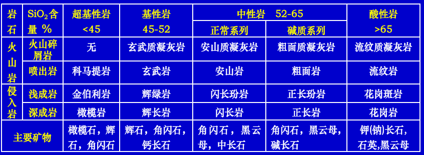
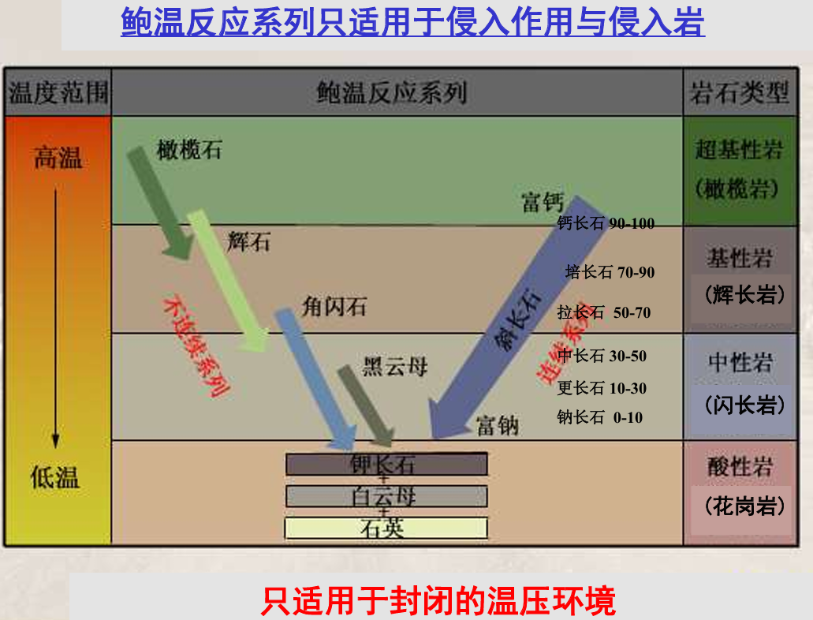
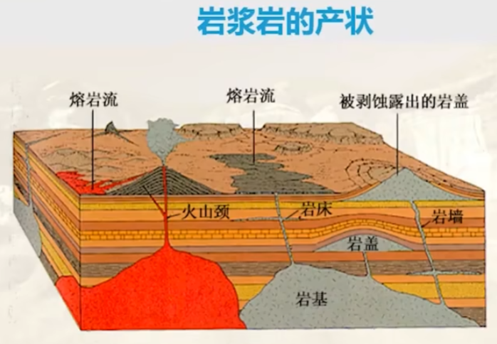
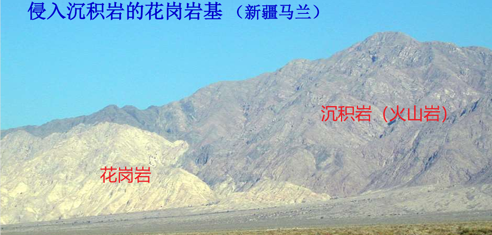
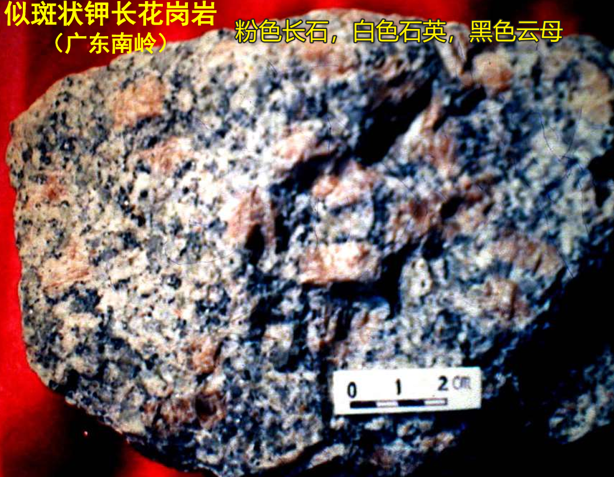
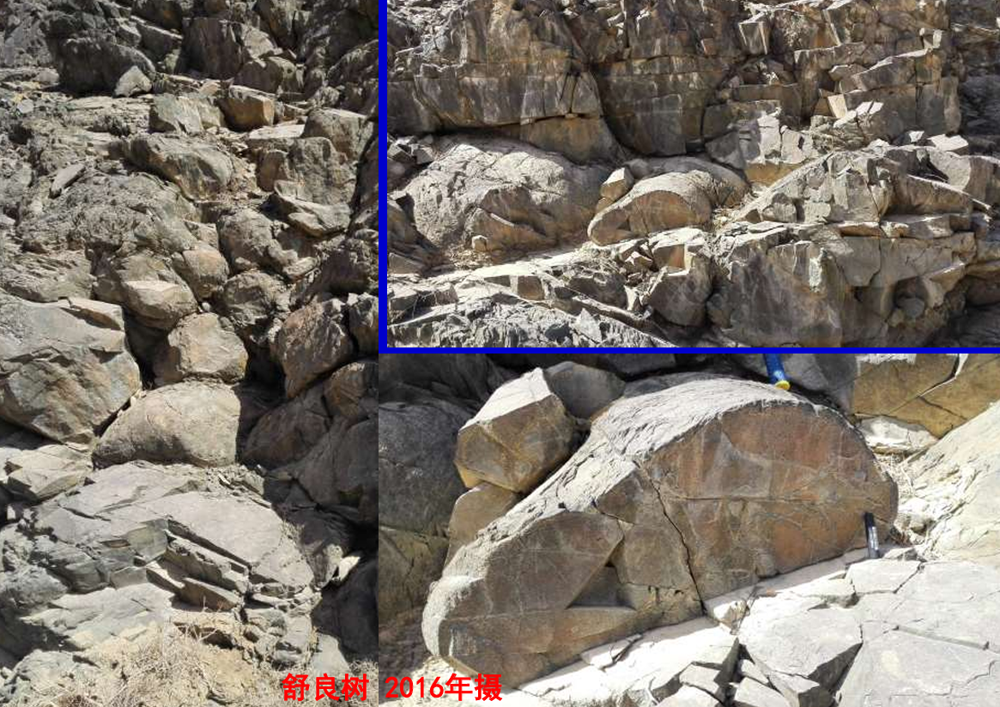

# 火山

# 火成岩

## 概念

- **岩浆**: 地球内部高温熔融的岩石物质，主要成分是硅酸盐矿物熔体，含有少量气体和固体颗粒。
  - 成分: 硅酸盐,含有1%～8%挥发物质（水、F、Cl、H2S、CO2等）
  - 温度: `600℃～1400℃`
  - 压力: `1.0GPa`
  - 源区: 地表之下`50～200 km`
  - 种类
    - **玄武岩浆**: 贫`SiO₂`，来自地幔，上地幔橄榄岩部分熔融
    - **花岗岩浆**: 富`SiO₂`，来自地壳，主要为大陆地壳岩石（如沉积岩、变质岩）部分熔融
- **岩浆作用`magmatism`**: 岩浆发育、运动、固结成火成岩的作用。
  - **火山作用`volcanism`**：岩浆喷出地表的过程
  - **侵入作用`intrusion`**：岩浆在地下深处冷凝结晶固结的过程。高温高压下,活动能量大,能沿地壳薄弱带向低压的地表上涌
- **火成岩**: 岩浆由于岩浆作用形成的岩石，也称之为**岩浆岩**，是三大类岩石的主体，占地壳岩石体积的`2/3`。
  - **火山岩`volcanism rock`**: 由于火山作用，岩浆喷出地表冷凝形成的岩石
    - **火山碎屑岩**：火山通道周围的岩石掉进岩浆（即被岩浆侵入的岩石,围岩），一块喷发到空中，炸碎后堆积冷凝固结的岩石，即岩浆把这些岩石碎块包裹起来形成了新的岩石。早期火山作用形成
    - **喷出岩/熔岩**: 岩浆流出地表，冷凝形成的岩石。晚期火山作用形成
  - **侵入岩`intrusive rock`**: 岩浆在向上运动的侵入地面过程中逐渐冷凝结晶形成的岩石，根据深度可分为
    - 深成侵入岩/深成岩 `hypogene`: `>10km` 深处形成 
    - 中深成侵入岩/中深成岩 `meso-hypogene`: `3-10km` 深处形成 
    - 浅成侵入岩/浅成岩 `hypabyssal`: `<3km` 深处形成。 
    - 超浅成侵入岩/次火山岩 `sub-volcanic`:`≤1.5 km` 深处形成
- 火成岩根据 `SiO2` 含量分类
  - **超基性岩**: `SiO2 < 45%`，如科马提岩

      

  - **基性岩**: `45% ≤ SiO2 < 52%`，如玄武岩

      

  - **中性岩**: `52% ≤ SiO2 < 63%`，如安山岩，**鉴定板块俯冲**

      

  - **酸性岩**: `SiO2 ≥ 63%`，如流纹岩
  
      

## 多样性

导致火成岩多样性的因素有
- **同化作用与混染作用**
  - **同化**：围岩体积小于岩浆，被岩浆吞噬，融入岩浆中
  - **混染**：围岩体积大于岩浆，围岩物质明显改变岩浆成分
    - **捕虏体**: 岩浆上升时，围岩落入岩浆边缘，未被完全熔融的围岩碎块
    - **顶垂体**: 围岩远大于岩浆，被上升的岩浆顶高，且未被融化
- **岩浆混合作用**: 玄武岩浆源自地幔软流圈，它向上注入到地壳的花岗岩浆时，会形成壳幔物质混合的岩浆岩，**本质为基性的玄武岩浆与酸性的花岗岩浆化学反应**
- **拆沉作用**：岩石圈的温度恒低于软流圈温度，岩石圈物质不断下沉时矿物会脱水，导致密度不断增大。当密度大于软流圈密度时，岩石圈下部发生断裂，且掉入软流圈中，软流圈物质上涌形成新的岩浆
- **结晶分异作用**: 岩浆在冷凝过程上，熔点高、密度大的矿物先结晶，矿物结晶导致岩浆成分不断改变，出现垂向分带现象。

# 火山作用与火山岩

## 火山通道

- **火山通道**：岩浆流出的地方
- **次火山岩**: 岩浆沿通道上涌,在近地面冷凝，即在火山颈除形成的岩石
- **泥火山**：高压也可把地下泥砂和水喷发出来
- **复式火山锥**: 多次喷发产物。火山碎屑岩与熔岩互层产出

    

## 火山喷发物

火山喷发物构成物有
- **岩浆**：熔融态的硅酸盐物质
- **固体**: 火山碎屑岩中由岩浆包裹的地表岩石碎屑，根据固体颗粒大小，可对「火山碎屑岩」进行分类
  - 固体`<2mm` 是火山灰，构成凝灰岩
  - 固体`2mm～50mm` 是火山砾，构成火山角砾岩（火山灰胶结）
  - 固体`>50mm`是火山块，构成火山集块岩（火山灰胶结）
    - 火山弹：呈纺锤状
    - 浮岩: 气体快速逃逸飞行冷凝呈多孔火山渣
- **气体**: 水汽、二氧化碳、卤化物、硫化物

## 火山喷发

火山喷发条件
- 地壳活动: 地壳活动打破岩浆平衡，产生断裂，岩浆顺其上涌喷发
- 岩浆粘度：粘度低的岩浆易喷发 `[SiO4]4- / [AlSi3O8]-  +  K，Na，Ca，Mg，Fe`
  - 低粘度岩浆: 硅含量低，温度高，容易流动，喷发能量低，岩浆多为溢流
  - 高粘度岩浆: 硅含量高，温度低，不易流动，喷发能量高，岩浆多为爆发

火山喷发方式
- **裂隙式喷发**: 岩浆沿断裂带的喷溢
- **中心式喷发**：岩浆从火山口喷发，易形成火山堆
  - **近火山口**：固体喷发物多,形成火山碎屑岩
  - **远火山口**：熔岩流动形成熔岩岩

火山的喷发强度
- **强烈爆发**: 火山喷发早期，能量大，岩浆喷射到空中
- **宁静溢流**: 火山喷发晚期，能量小，岩浆沿地表流动

## 火山的阶段性

- 火成岩喷发一般顺序：基性岩 → 中性岩 → 酸性岩
- 火山口
  - 破火山口: 火山喷发后，火山口塌陷形成
  - 火山口湖: 火山口积水形成
- 火山类型
  - 活火山： 目前仍有喷发活动的火山
  - 死火山： 目前没有喷发活动的火山

## 火山岩分布

- **环太平洋火山带**：主要是中酸性火山岩。多为安山岩。 
  - **安山岩线`andesite line`**： 环太平洋火山带内侧的一条假想线，标志着太平洋火山活动的分界线。**靠近大洋一侧玄武岩为主，靠近大陆一侧安山岩为主**
- **地中海-印尼火山带**：近东西方向展布，基性到酸性均有。 
- **洋脊火山带**：太平洋洋脊、大西洋洋脊、印度洋洋脊； 玄武岩为主体。 
- **红海沿岸-东非裂谷带**：规模相对较小。近南北方向展布；基性火山岩和酸性火山岩发育。

# 侵入作用与侵入岩

## 侵入岩

**侵入岩`intrusive rock`**: 岩浆在向上运动的侵入地面过程中逐渐冷凝结晶形成的岩石，根据深度可分为
  - 深成侵入岩/深成岩 `hypogene`: `>10km` 深处形成 
  - 中深成侵入岩/中深成岩 `meso-hypogene`: `3-10km` 深处形成 
  - 浅成侵入岩/浅成岩 `hypabyssal`: `<3km` 深处形成。 
  - 超浅成侵入岩/次火山岩 `sub-volcanic`:`≤1.5 km` 深处形成

**伟晶岩**: 中高温残余岩浆结晶而成，位于岩体顶部，矿物颗粒大，常含有稀有金属矿物。

## 鲍温反应系列

**鲍温反应系列**：认为所有的侵入岩都是由玄武岩浆经过**结晶分异作用**得到，即「单一原始岩浆」
  - **连续反应系列**：化学成分连续变化；内部结构无根本变化；为浅色矿物长石类矿物所独有，(高温)基性斜长石 → 中性斜长石 → 酸性斜长石 → 钾长石 → 白云母 → (低温)石英
  - **不连续反应系列**：化学成分差异明显；内部结构变化显著；为暗色矿物或铁镁矿物所独有，(高温)橄榄石 → 辉石 → 角闪石 → 黑云母 → 钾长石 → 白云母 →(低温)石英

> [!note]
> 但有一个特列「花岗岩」，按照玄武岩的鲍温反应系列无法形成大量的花岗岩，因此，研究者提出花岗岩并非完全由玄武岩浆结晶分异形成，而是由地壳物质熔融形成的。

## 产状

侵入岩的产状`attitude`: **产状就是描述岩石的形状**
- 岩体  
  - 岩株: 出露面积在 `10～100 km2`
  - 岩基: 出露面积大于 `100 km2` 
- 岩脉
  - 岩墙: 与地层层理垂直或大角度斜交，岩浆沿围岩裂缝挤入 
  - 岩床: 与地层层理平行，岩浆沿地层间的空隙挤入

# 火成岩结构与构造

## 结构

火成岩的结构`texture`: 指矿物的结晶程度、晶粒大小、晶体形态和晶粒间的相互关系。反映岩石形成的条件
- 结晶程度
  - 全晶质: 侵入岩，花岗岩
  - 半晶质: 浅成岩
  - 隐晶质-玻璃质(不结晶): 喷出岩，黑曜岩
- 晶粒大小 
  - 粗粒结构: （石英）晶体粒径大于`5mm` ，慢慢结晶形成
  - 中粒结构: 晶体粒径 `5～1mm` 
  - 细粒结构: 晶体粒径 `1～0.1mm`
  - 微粒结构: 晶体粒径小于`0.1mm`，快速冷凝形成
- 晶体的完整程度
  - 自形: 缓慢结晶，晶形规则
  - 半自形
  - 他形: 快速冷凝，晶形不规则
- 晶体的相对大小
  - 等粒结构：以石英大小为标准，分粗、中、细和隐晶质与玻璃质等
  - 不等粒结构：由斑晶（大颗粒）与基质（小颗粒）组成
    - 斑状结构: 喷出岩所特有，基质为隐晶或玻璃质
    - 似斑状结构: 侵入岩的典型结构。基质为显晶质，且成分与斑晶相同

      

## 构造

火成岩的构造`structure`: 指矿物集合体的形态、大小、空间分布。反映岩石的形成环境
- **枕状构造**: 水下喷发，一边滚动一边快速冷凝和收缩形成。**火成岩在水下形成**

  

- **气孔构造**：岩浆气体逃逸留下的孔洞，有充填物者称杏仁构造。**火成岩在陆地形成**
- **流纹构造**: 流动的岩浆（浆屑）绕着固体颗粒（长石等）流动形成的构造
- **晶洞构造**: 岩浆冷凝过程中，气体集中形成空洞，后期被矿物充填形成晶洞
