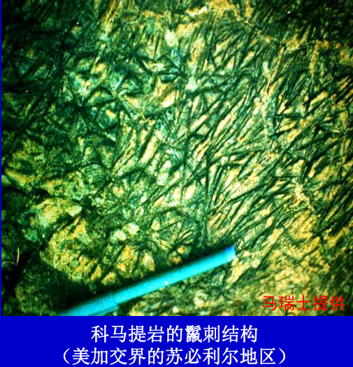
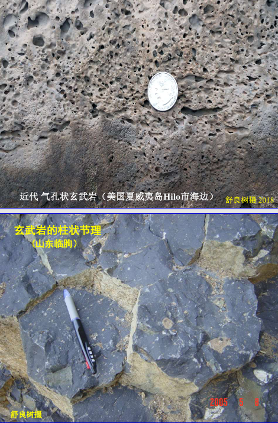
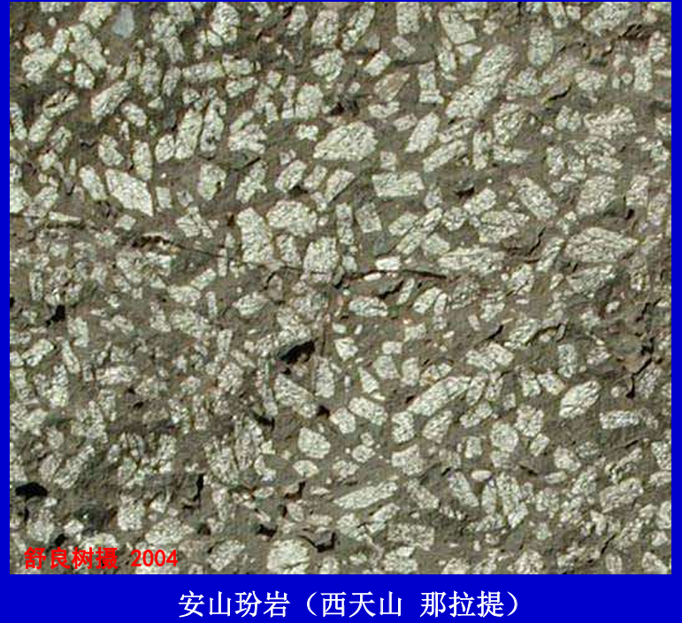
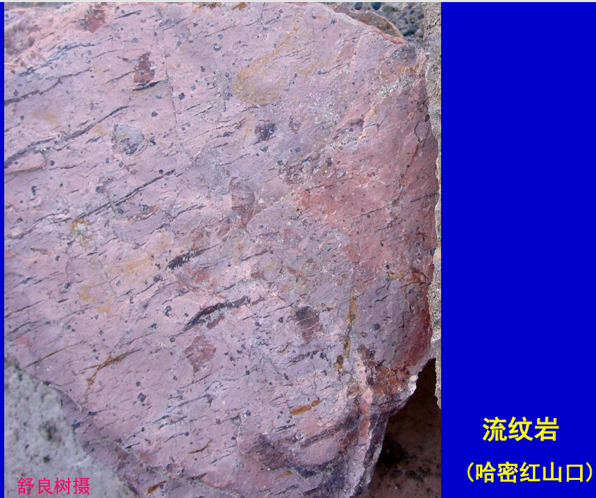
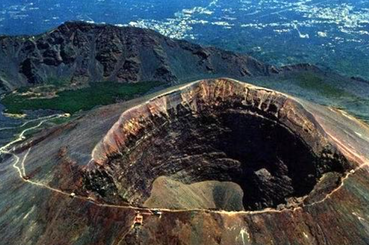
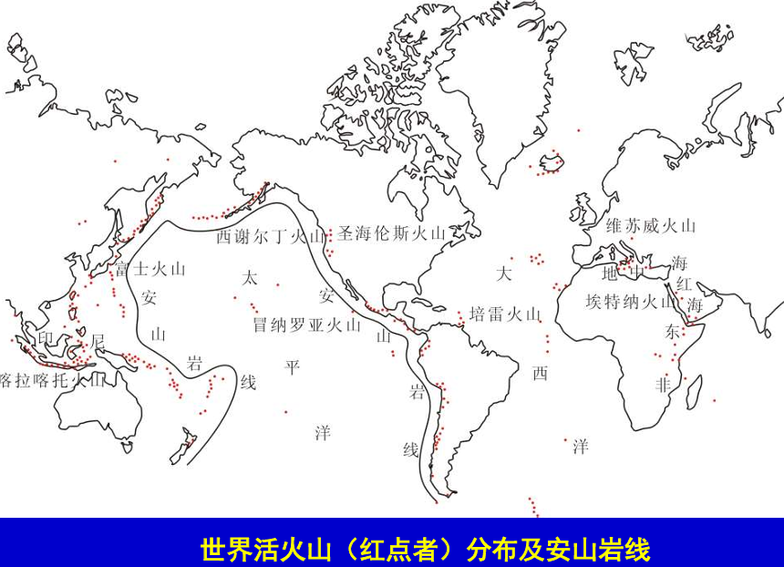

# 火山

# 火成岩

- **岩浆**: 地球内部高温熔融的岩石物质，主要成分是硅酸盐矿物熔体，含有少量气体和固体颗粒。
  - 成分: 硅酸盐,含有1%～8%挥发物质（水、F、Cl、H2S、CO2等）
  - 温度: `600℃～1400℃`
  - 压力: `1.0GPa`
  - 源区: 地表之下`50～200 km`
- **岩浆作用`magmatism`**: 岩浆发育、运动、固结成火成岩的作用。
  - **火山作用`volcanism`**：岩浆喷出地表的过程
  - **侵入作用`intrusion`**：岩浆在地下深处冷凝结晶固结的过程。高温高压下,活动能量大,能沿地壳薄弱带向低压的地表上涌
- **火成岩**: 岩浆由于岩浆作用形成的岩石，也称之为**岩浆岩**，是三大类岩石的主体，占地壳岩石体积的`2/3`。
  - **火山岩`volcanism rock`**: 由于火山作用，岩浆喷出地表冷凝形成的岩石
    - **火山碎屑岩**：火山通道周围的岩石 (简称「围岩」) 掉进岩浆，一块喷发到空中，炸碎后堆积冷凝固结的岩石，即岩浆把这些岩石碎块包裹起来形成了新的岩石。早期火山作用形成
    - **熔岩**: 岩浆流出地表，冷凝形成的岩石。晚期火山作用形成
  - **侵入岩`intrusive rock`**: 岩浆在地下深处冷凝形成的岩石
- 火成岩根据 `SiO2` 含量分类
  - **超基性岩**: `SiO2 < 45%`，如科马提岩

      

  - **基性岩**: `45% ≤ SiO2 < 52%`，如玄武岩

      

  - **中性岩**: `52% ≤ SiO2 < 63%`，如安山岩，**鉴定板块俯冲**

      

  - **酸性岩**: `SiO2 ≥ 63%`，如流纹岩
  
      

# 火山作用与火山岩

## 火山通道

- **火山通道**：岩浆流出的地方
- **次火山岩**: 岩浆沿通道上涌,在近地面冷凝，即在火山颈除形成的岩石
- **泥火山**：高压也可把地下泥砂和水喷发出来
- **复式火山锥**: 多次喷发产物。火山碎屑岩与熔岩互层产出

    

## 火山喷发物

火山喷发物构成物有
- **岩浆**：熔融态的硅酸盐物质
- **固体**: 火山碎屑岩中由岩浆包裹的地表岩石碎屑，根据固体颗粒大小，可对「火山碎屑岩」进行分类
  - 固体`<2mm` 是火山灰，构成凝灰岩
  - 固体`2mm～50mm` 是火山砾，构成火山角砾岩（火山灰胶结）
  - 固体`>50mm`是火山块，构成火山集块岩（火山灰胶结）
    - 火山弹：呈纺锤状
    - 浮岩: 气体快速逃逸飞行冷凝呈多孔火山渣
- **气体**: 水汽、二氧化碳、卤化物、硫化物

## 火山喷发

火山喷发条件
- 地壳活动: 地壳活动打破岩浆平衡，产生断裂，岩浆顺其上涌喷发
- 岩浆粘度：粘度低的岩浆易喷发 `[SiO4]4- / [AlSi3O8]-  +  K，Na，Ca，Mg，Fe`
  - 低粘度岩浆: 硅含量低，温度高，容易流动，喷发能量低，岩浆多为溢流
  - 高粘度岩浆: 硅含量高，温度低，不易流动，喷发能量高，岩浆多为爆发

火山喷发方式
- **裂隙式喷发**: 岩浆沿断裂带的喷溢
- **中心式喷发**：岩浆从火山口喷发，易形成火山堆
  - **近火山口**：固体喷发物多,形成火山碎屑岩
  - **远火山口**：熔岩流动形成熔岩岩

火山的喷发强度
- **强烈爆发**: 火山喷发早期，能量大，岩浆喷射到空中
- **宁静溢流**: 火山喷发晚期，能量小，岩浆沿地表流动

## 火山的阶段性

- 火成岩喷发一般顺序：基性岩 → 中性岩 → 酸性岩
- 火山口
  - 破火山口: 火山喷发后，火山口塌陷形成
  - 火山口湖: 火山口积水形成
- 火山类型
  - 活火山： 目前仍有喷发活动的火山
  - 死火山： 目前没有喷发活动的火山

## 火山岩分布

- **环太平洋火山带**：主要是中酸性火山岩。多为安山岩。 
  - **安山岩线`andesite line`**： 环太平洋火山带内侧的一条假想线，标志着太平洋火山活动的分界线。**靠近大洋一侧玄武岩为主，靠近大陆一侧安山岩为主**
- **地中海-印尼火山带**：近东西方向展布，基性到酸性均有。 
- **洋脊火山带**：太平洋洋脊、大西洋洋脊、印度洋洋脊； 玄武岩为主体。 
- **红海沿岸-东非裂谷带**：规模相对较小。近南北方向展布；基性火山岩和酸性火山岩发育。

