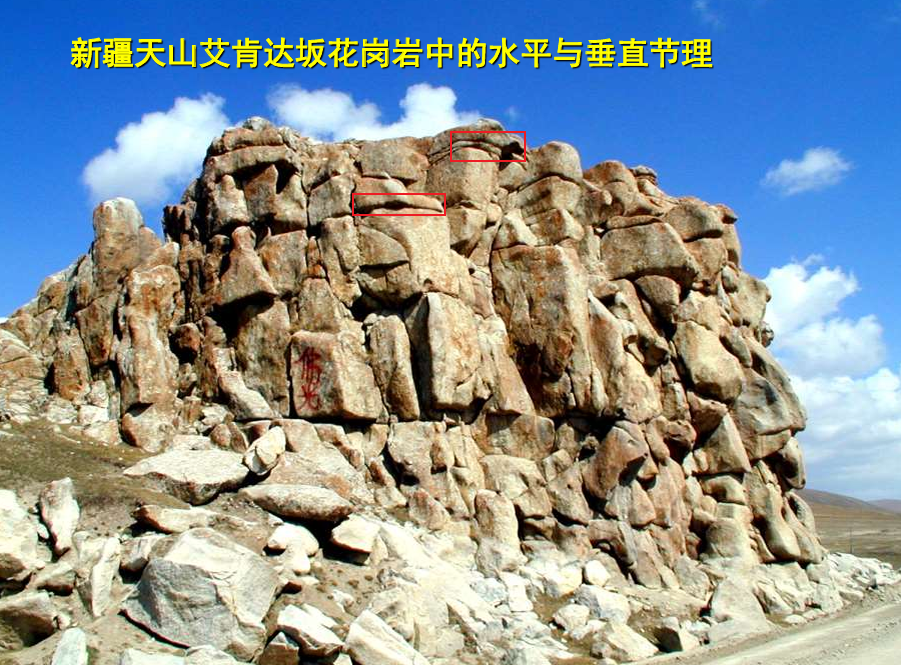
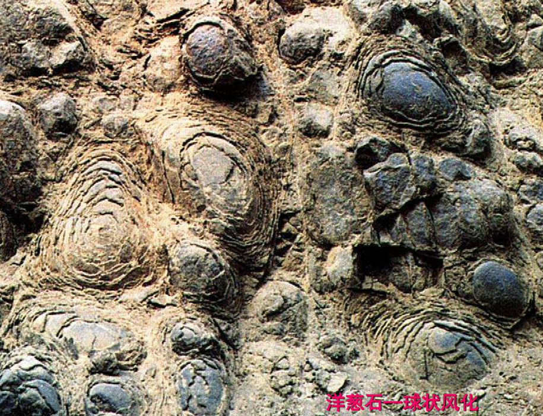
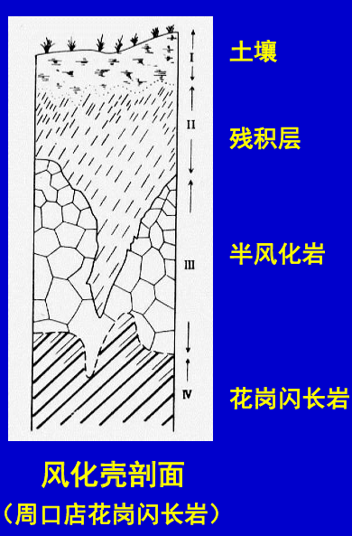
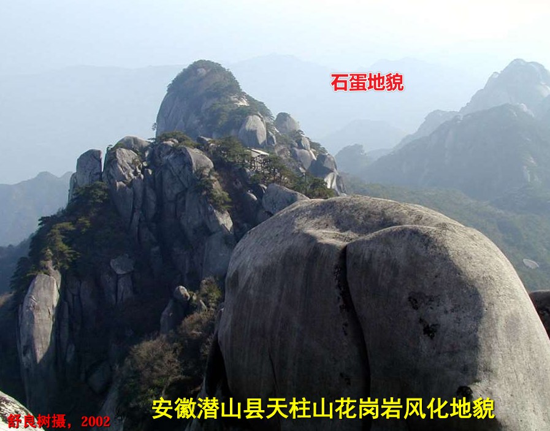
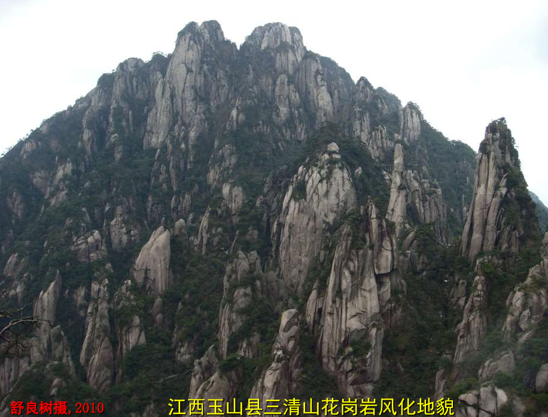

# 风化作用

# 基本概念

## 定义

**风化作用**：地表岩石在外动力（温度、压力、大气、水、生物）作用下发生机械破碎、化学分解和生物分解，在原地形成松散堆积物的过程。
- 风化：不发位移
- 侵蚀：发生位移
- 剥蚀：风化与侵蚀共同作用

## 机械风化

机械风化，也称之为物理风化
- 特征
  - 基本处于原地的机械破碎与分解
  - 不能改变化学成分,不会形成新矿物
  - 温差大的沙漠戈壁及干寒区表现最明显
- 方式
  - 热胀冷缩：在昼夜温差大的沙漠、戈壁滩，岩石里外受热不均，会产生鳞片状剥落
    - 沙漠：风化产物能被风吹走
    - 戈壁滩：风化产物不能被风吹走
  - 冰劈作用: 水在岩石缝中反复结冰、融化
  - 卸载作用: 深部岩石上升减压、剥蚀夷平，会造成岩石向上的膨胀, 产生与地面平行的膨胀节理(水平节理)
  - 盐分结晶撑裂作用: 岩石中多含盐，盐分在夜晚吸收水气而潮解; 白天烈日暴晒，水分蒸发，石缝中盐分过饱和而结晶，导致撑破岩石

  

## 化学风化

- 特征
  - 岩石在水、氧、二氧化碳作用下,发生化学分解
  - 发生化学反应，形成新矿物
  - 温湿的南方地区表现较明显
- 方式
  - 溶解作用：使矿物发生部分溶解与分化的作用
  - 水化作用: 水分子进入矿物晶格形成含水新矿物,导致体积膨胀,硬度降低
  - 水解作用: 弱酸强碱盐或强酸弱碱盐, 遇水会解离成带不同电荷的离子
  - 碳酸化作用: 含`CO2`的水溶液和矿物中`K、Na、Ca`等结合,形成碳酸盐矿物
  - 氧化作用: 黄铁矿容易氧化；含黑云母、角闪石及钾长石高的花岗岩含放射性元素。均不宜作建筑材料

## 生物风化

生物活动引起的岩石物理与化学变化
- 植物的根劈作用
- 生物分泌的有机酸,腐蚀岩石使之风化
- 人类的破坏

# 制约岩石风化

对岩石风化起制约作用的因素有
- 气候
- 地形
- 岩石性质
  - 球状风化：四周被井字形节理包围的均匀块状岩石，在化学风化与物理风化联合作用下，棱角消失，呈洋葱状圆化的现象

    

# 风化产物

- 风化产物的构成
  - 碎屑 (fragments): 机械风化的碎块； 
  - 易溶物质 (dissolve)：Ka，Na，Ca，Mg等,易流失； 
  - 难溶物质：Fe，Al等，多残留原地。
- 残积物: 岩石风化后残留原地的物质，会形成矿产
- 风化壳: 由风化产物组成的不连续的薄层

    

- 土壤: 地壳最上层风化产物，富含有机物质
- 风化地貌

    

    

