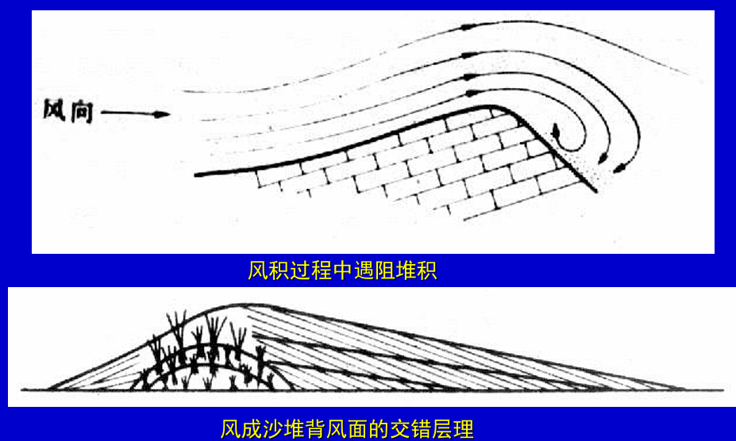
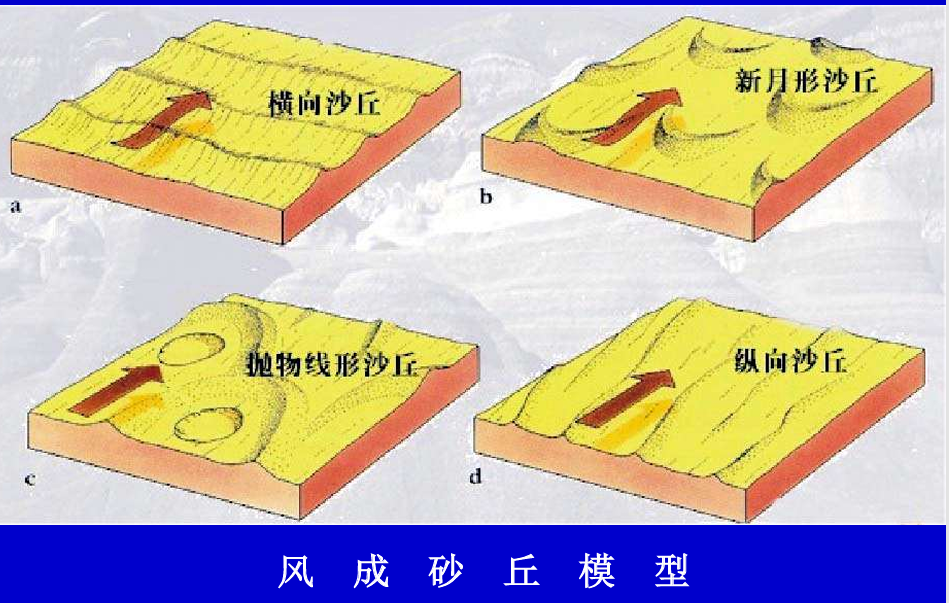

# 风的地质作用

# 概念

- 风的三要素
  - 风向:风的来源方向
  - 风速V (m/s)
  - 风力P (kg/m2) : ` P=1/2CV2`
- 风力划分: 英国海军大将浦福将风力P划为13级(0 ~ 12),最大风力12级(32.7-36.9 m/s)

# 风的侵蚀

## 风的侵蚀作用

- 吹蚀 Deflation：夹杂沙土的强风对地表的侵蚀作用。风速大、地表起伏小、阻力小的干旱区，尤为显著。戈壁和沙漠区容易产生涡流形成上举龙卷风。 
- 磨蚀 Abrasion: 风从多个方向对地表进行摩擦与冲撞。  
  - 风棱石 Windcut stone:风从多个方向对砾石进行磨蚀形成的一种边角奇异、油亮光滑的石头。 
  - 风蚀洞 Aeolian hole:风先将软的地方磨蚀成坑,而后产生坑内旋风，磨蚀成洞。

## 风蚀地貌

风蚀地貌，也被称之为「雅丹地貌」

- 风蚀洼地Depression：风长期吹蚀成的凹地。 
- 风蚀城堡Aeolian castle：一种特殊的风蚀残丘。岩层水平、软硬相间、垂直节理发育。如，克拉玛依的魔鬼城、塔里木的方城。 
- 蜂窝石Honeycombed：岩石各部分软硬不同发生差异磨蚀而成。  
- 风蚀谷Valley：沙漠的暴雨形成小冲沟，风将其改造成形状不规则的风蚀谷地。谷与谷之间则为风蚀的基岩残丘Monadnock。 
- 风蚀蘑菇Mashroom：风蚀残丘底部含沙高，易磨蚀成蘑菇状。风蚀柱Prism：风蚀顺垂直节理发生而成。

# 风的搬运

- 风与河流搬运的最大区别：风可将碎屑物从低处运至高处。 
- 风的搬运三方式：
  - 推移质蠕动搬运Creeping T， 
  - 跃移质跳跃搬运Saltation T， 
  - 悬移质悬浮搬运Suspension T。 
- 风沙流剖面：推移质 20%、跃移质 70%、悬移质 10%
  - **黄土高原靠悬移质形成**

# 风的沉积

## 概念

风沙沉积的原因

1. 风力减小：风力降低时碎屑重的沉降堆积。 
2. 遇阻堆积：遇树等阻障，碎屑物在迎风坡堆积。 在地形轻缓起伏处，碎屑物就在背风坡堆积，形成顺风向的斜层理。
3. 潮湿气流：颗粒间凝聚力增强致使碎屑物下降（降尘）。 
4. 两股气流相碰: 使碎屑下降。

**风沙主要在陡峭面沉积，且树林也能抵挡风沙**

风积物的特定
- 都是碎屑物(石英是主要的碎屑矿物)； 
- 分选性好；磨圆度好; 
- 铁镁质矿物即不稳定矿物（辉石、角闪石、黑云母、方解石）可以在风积物中大量存在； 
- 具大规模的交错层理，可达二十几米； 
- 以红色和黄色为主。  

## 风沙地貌

- 沙堆: 沙土堆积体。如下部有障碍物，会形成交错层理。  
- 砂丘Sand dune:由沙堆扩展而成。此时无障碍核心，整体是松散堆积。最大休止角为34度；重力作用下剪破，沙丘向前移动，背风坡处，容易形成顺风向的斜层理。  
   - 新月形砂丘，垂直于风向
   - 横向沙丘，垂直于风向
   - 纵向沙丘，平行于风向
   - 星形沙丘，多个方向的风形成
 
    

- 荒漠desert: 无人居住的荒凉土地。存在多种类型。 
  - 岩漠Rocky desert：基岩裸露、地表平坦,局部参差不齐，风化物易被搬走。 
  - 砾漠Gravel desert(戈壁gobi):粗大的风成砾石、风棱石地貌
  - 沙漠Sand desert：风沙沉积物的覆盖区。 
  - 泥漠Takyr:黏土组成的荒漠。 
  - 盐漠Salt desert：盐水浸渍的泥漠。
- 黄土地貌: 成片黄土分布区为黄土平原;黄土平原上升则成黄土高原
  - 黄土塬Loess table-land:流水下切形成的四边陡、顶上平的高地。 
  - 黄土梁Loess ridge:长条状的黄土高地。 
  - 黄土峁Loess shoulder:具浑圆顶部的黄土小山包,俗称黄土高坡；
