# 角度测试

# 理论

## 水平测量

**水平角**：地面上两点与测站点的在水平面上的夹角。取值范围 `0°~360°`

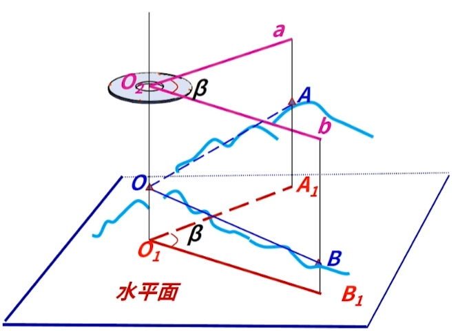
- `O`: 测站点
- `A`、`B`: 测量点
- `∠A1O1B1`: 水平角
- `a`: 在度盘上 `O1A1` 的度数
- `b`: 在度盘上 `O1B1` 的度数

根据经纬仪测试结果，水平角的计算公式：$\beta = b - a$

## 垂直测量

**竖直角**：在同一铅锤面内，观测视线与水平线之间的夹角。取值范围 `-90°~+90°`

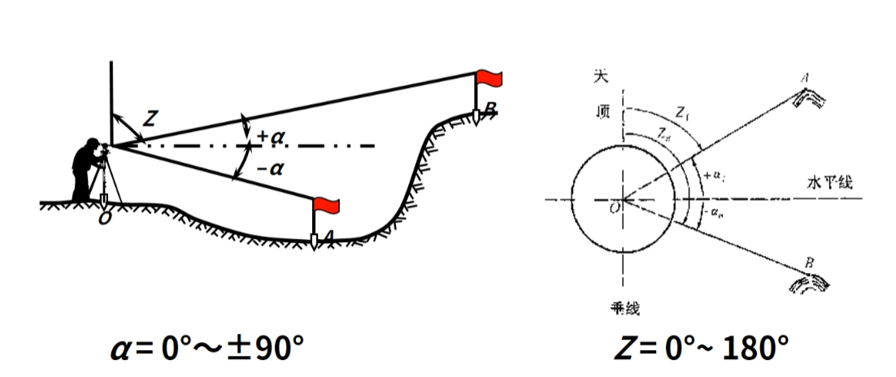
- `O`: 测站点
- `A`、`B`: 测量点

根据经纬仪测试结果，竖直角的计算公式：$\alpha = \text{视线度数} - \text{水平度数}$

此外，竖直角还有一个特殊的名称叫做**天顶距**，它是指观测视线与竖直线(向上的方向)之间的夹角。取值范围 `0°~180°`，计算公式：$Z + \alpha = 90°$

## 单位

角度的单位有
- 度 `°`
- 分 `'` ，`1° = 60'`
- 秒 `''`, `1' = 60''`

在测量中，通常使用度分秒的形式来表示角度，例如：`30°15'20''`

# 经纬仪

## 命名规范

经纬仪是一种常用的测量仪器，用于测量水平角和竖直角。根据不同的功能和精度要求，经纬仪可以分为 `DJ1`、`DJ2`、`DJ6`、`DJ15` 等不同的型号。
- `D`: 大地测量仪器
- `J`: 经纬仪
- 数字: 测角精度，单位秒，值越小精度越高

## 光学经纬仪

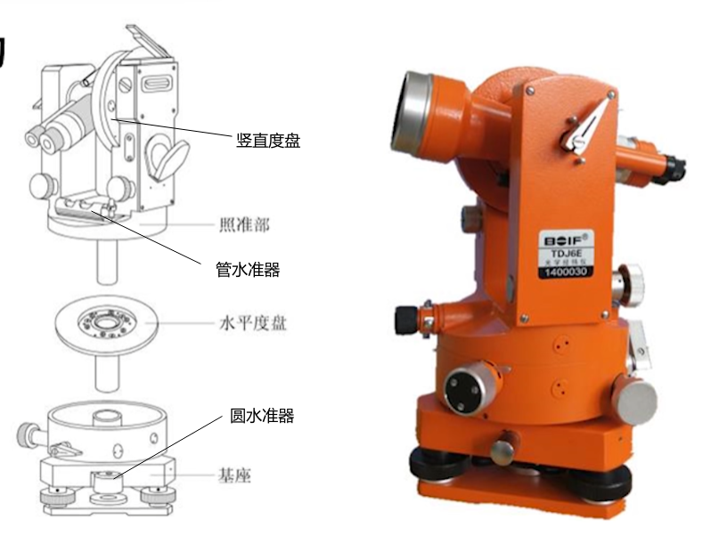

- **基座**
  - 脚螺旋
  - 底板
  - 圆水准器: 用于粗略整平仪器
- **照准部**
  - 望远镜: 用于观察目标点，并读取度盘上的读数
  - 管水准器：用于精确整平仪器
  - 光学对中器：用于将仪器的垂直轴对准测站点
- **度盘**
  - 水平度盘: 用于测量水平角，**保持固定，不沿着垂线旋转**
  - 垂直度盘: 用于测量竖直角，**与望远镜一同旋转**

## 使用

光学经纬仪的使用步骤如下：
1. **安置**: 安置三脚架，并将经纬仪安装在三脚架上
2. **对中**: 使用光学对中器，将仪器的垂直轴对准测站点
3. **粗平**: 调整圆水准器气泡居中，进行粗略整平
4. **精平**: 调整管水准器气泡居中，进行精确整平
5. 重复对中、粗平、精平的步骤，直到仪器稳定
6. **瞄准**: 瞄准目标点，并读取度盘上的读数
   - 测水平角: 用双丝/单丝平分
    
    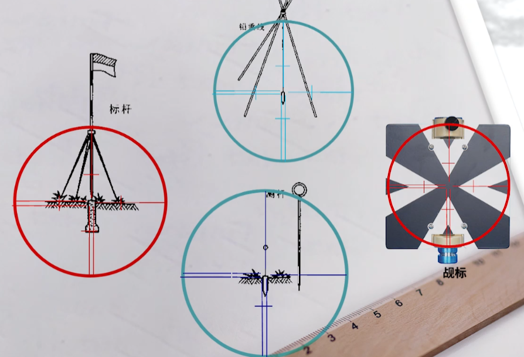

   - 测竖直角: 用横丝切目标顶部

    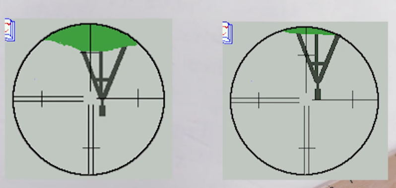

7. **读数**: 读取度盘上的读数，精确到 `0.1 分`，**即估读的秒的值，应当为 `6` 的倍数**

    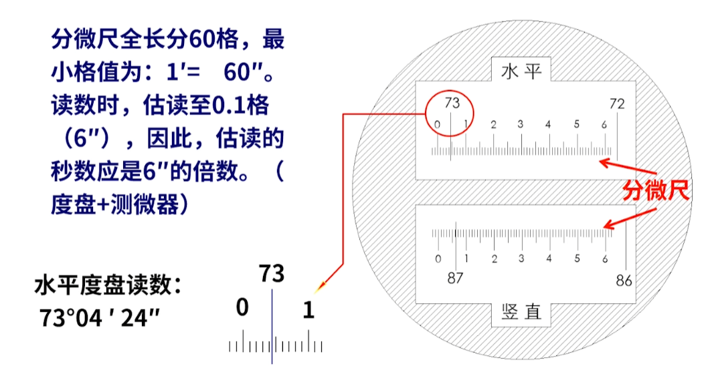

# 测量方法

## 水平角 - 测回法

**测回法**是测量水平角的一种常用方法，通过在盘左和盘右两个位置进行观测，以消除仪器误差的影响。
- **盘左**：竖盘在望远镜的左侧
- **盘右**：竖盘在望远镜的右侧

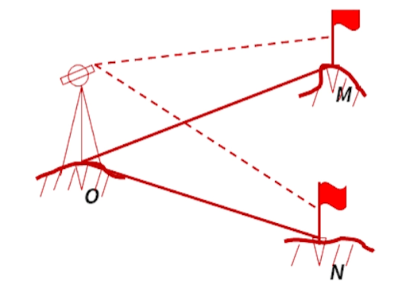

在站定`O`，测量 `M` 和 `N` 两点的水平角的步骤

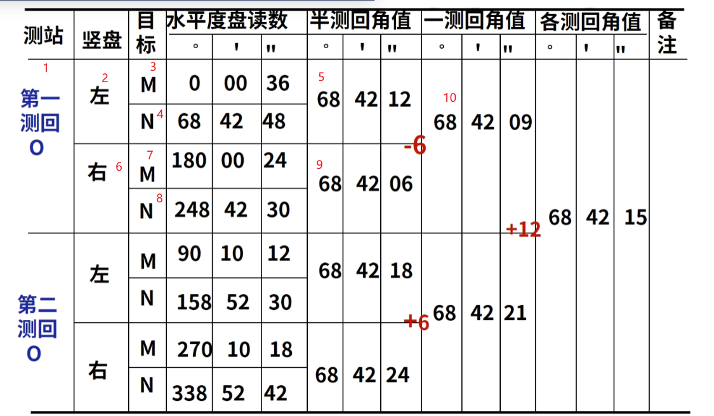

- 第一测回：将水平度盘瞄准 `M` 时归零
- 第 `n` 测回：将水平度盘瞄准 `M` 时, 会变换度盘值为 `i = 180° / n`，**削弱刻度误差**

## 竖直角

竖直度盘不同于水平度盘，是固定在望远镜上，会跟随望远镜一起旋转。因此，需要通过**竖直指针(固定不动)**来读取度数。此外度盘的刻度有**顺时针**和**逆时针**两种，分别对应不同的测量方法。

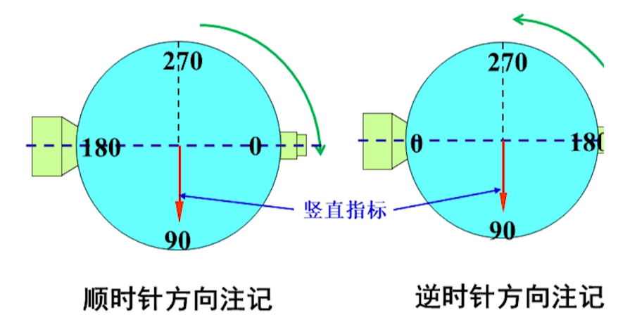

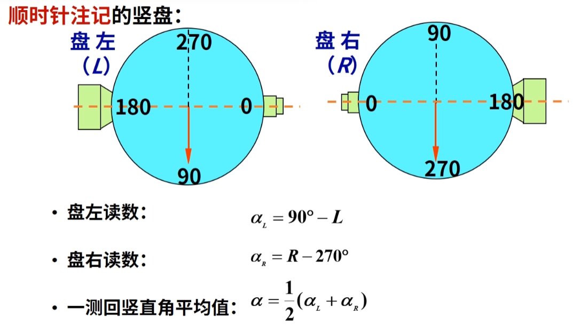

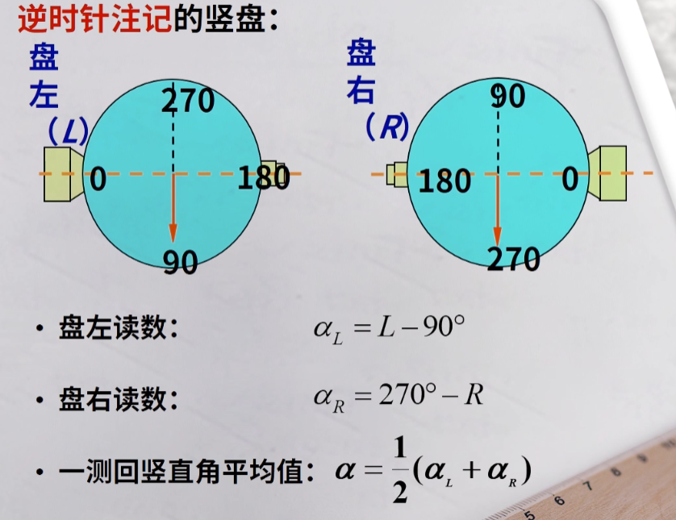

**竖盘指标差**：定义**竖直指针**是固定不动，且垂直向下，但实际制造时，不可能保证完全垂直，因此竖直指针与铅锤线间存在偏差夹角`i`，需要在测量时进行修正。

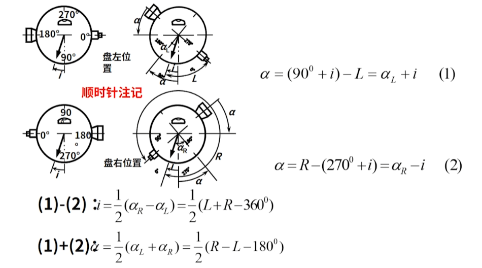

>[!note]
> 通过盘左和盘右两次测量，便可消除竖盘指标差的影响，得到更准确的竖直角测量结果。

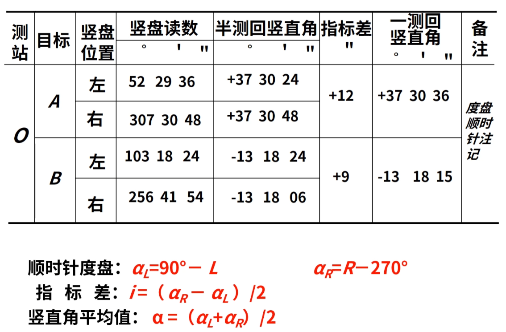

