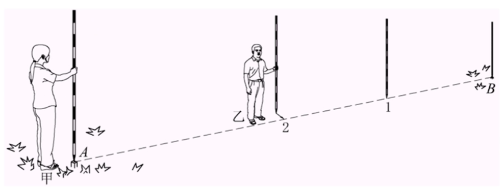
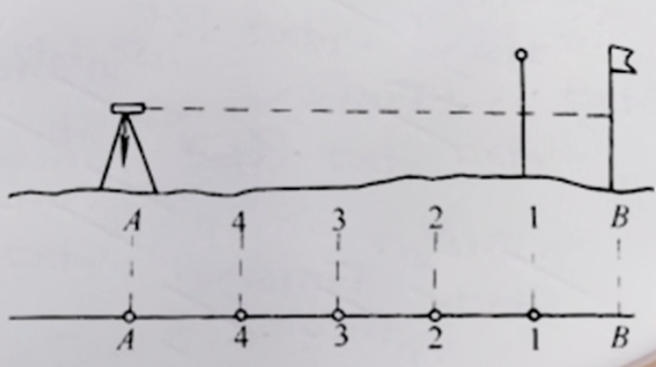
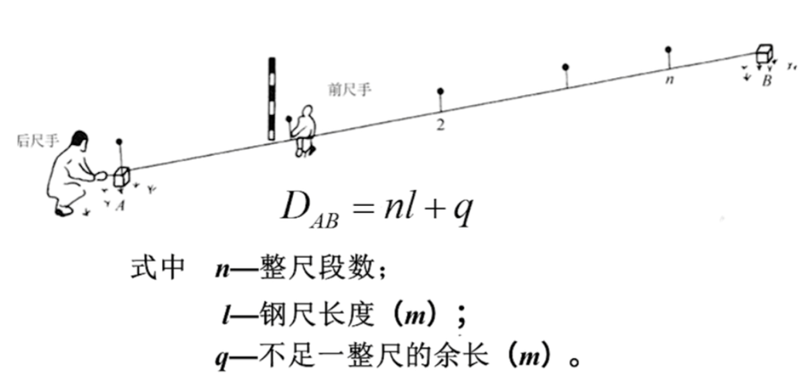
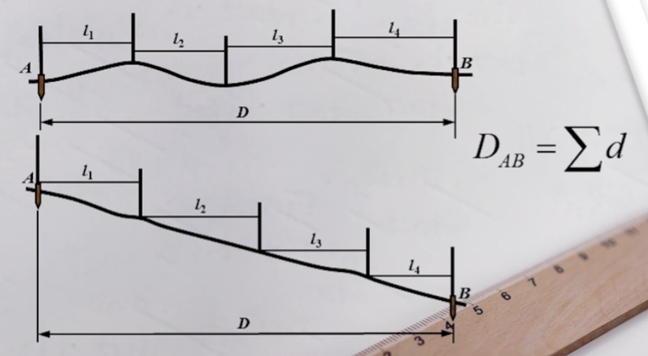
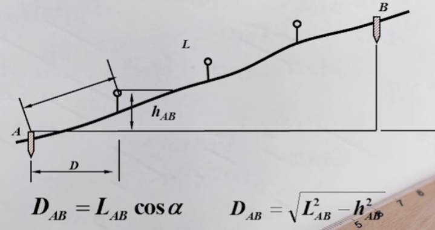
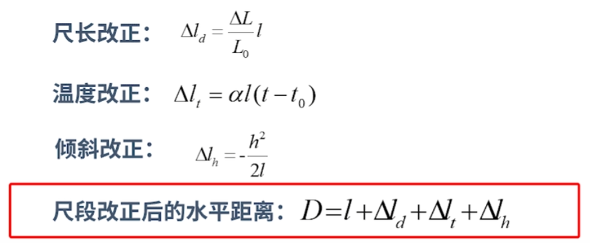
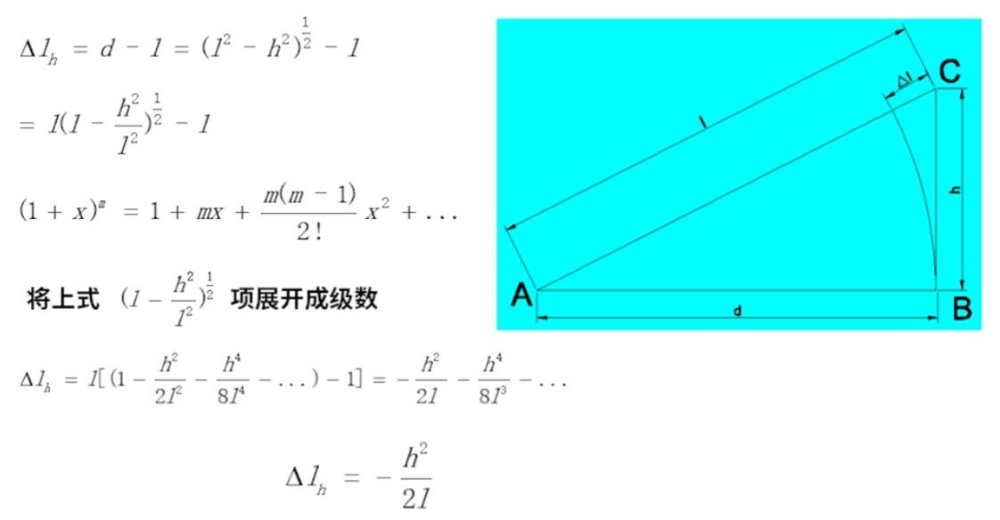

# 距离测量

# 概念

距离测量目的
- **水平距离**: 两点连线在水平面上的投影长度
- **倾向距离**：不同水平面上两点间连线长度

测量方案
- **钢尺测量**
- **视距测量**: 精度差
- **电磁波测距**: 昂贵
- **GPS 测距**

# 钢尺测量

## 测量方法

**直线定线**：地面两点间距离太大，无法通过一次测距获得距离，就需要分段测量，而保证所有分段都在一条直线上的工作就是直线定线
- **目估定线**

    

- **经纬仪定线**

    

将所有分段的距离测量出来就得到了两点间距离
- **平坦地面**

    

- **倾斜地面**

    

    

钢尺测量结果与理论值还存在误差，因此还需要对测量结果进行修正

## 倾斜改正

## 往返测

为了保证最终测量结果的精度，还会进行两点间距离往返测

$$
D = \frac{1}{2} (|D_1| + |D_2|)
$$

通过相对误差 $K$ 可以衡量往返测量结果的精度

$$
K = \frac{|D_1 - D_2 |}{D}
$$

