# 基本概念

# 地图

## 定义

地图发展
1. 原始地图 : 跟图画一样，把山川、道路、树木如实地画出来
2. 古代地图: 天文知识运用到了地图上，在地图上绘制天文点测量成果，**注意到了方位，运用了投影技术于经纬网**
3. 近代地图: 地图是地球表面在平面上的缩写

最终得到了现代地图的定义

> **地图**:是依据一定的数学法则，采用地图语言，经过制图综合来表示地球表面的图形。
> - 数学法则
> - 地图语言
> - 制图综合

## 数字测图

**数字测图**: 是通过数字相机采集数据，经过处理、建模、并最终可视化呈现的一种高新技术。作为一种全解析机助测图方法，与模拟测图相比具有显著优势和发展前景，是测绘发展的技术前沿
- **全站型电子速测仪(全站仪)**: 是由机械、光学、电子元件组合而成的测量仪器，集电子测角、测距、数据存储与计算功能于一体，可同步完成水平角、垂直角测量及斜距、平距、高差计算。

数字测图的模式
- 传统模式
  - 数字测记：野外测记，室内成图
    1. 全站仪野外数据采集，电子手簿记录，且复杂地形绘制草图
    2. 根据采集数据和草图，运用计算机绘制地图
  - 电子平板测绘模式: 全站仪加便携机加相应测图软件，在野外直接测图，可实时修改错误
- 现代模式
  - GPS测量模式（RTK的应用）
  - 全数字摄影测量

## 数字地图格式

- 数字线划图（DLG）: 直接用计算软件绘制的地图
  
    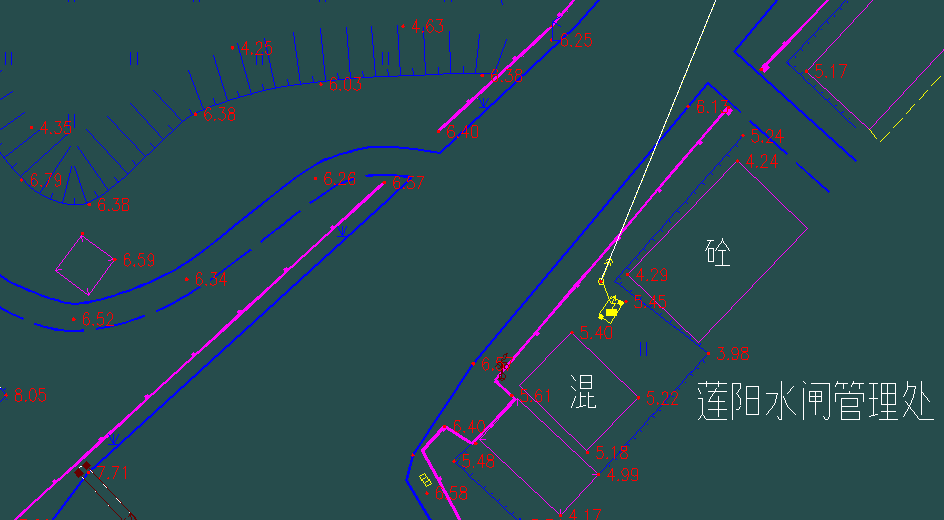

- 数字栅格地图（DRG）: 将现有纸质、胶片等地形图经扫描和几何纠正及色彩校正后得到的数字地图

    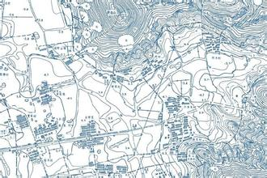

- 数字正射影像图（DOM）: 利用航空像片或遥感影像，经像元纠正，按图幅范围裁切生成的影像数据。

    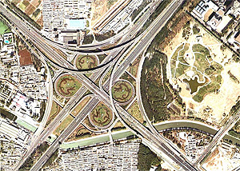

- 数字高程模型（DEM）: 通过有限的地形高程数据实现对地面地形的数字化模拟，即三维建模

    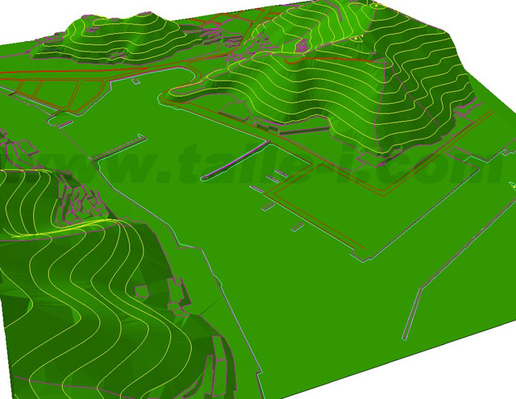

# 地形图测量方法

## 数字测图基本方法

测绘数字图的基本流程有
- 数据采集: 通过各种测量仪器获取地形数据
  - 野外数据采集: 利用全站仪、GPS等测量仪器在野外进行实地测量，获取点位信息、高程等数据。
  - 室内数据采集: 利用摄影测量、遥感等技术手段获取地形图数据。
- 数据预处理: 对采集的数据进行进一步的处理和加工，包括数据转换、坐标变换、精度调整等。
- 数据编辑与处理: 根据数据绘制地图
- 数据输出

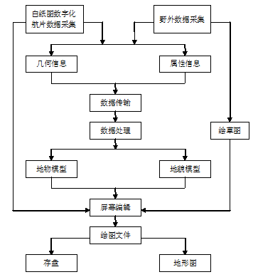

## 数字测图系统

**数字测图系统**: 实现数字绘图的整套工作流程
- 数据输入：地形数据采集
- 数据处理: 根据数据绘制地图
- 数据输出: 根据要求输出地图

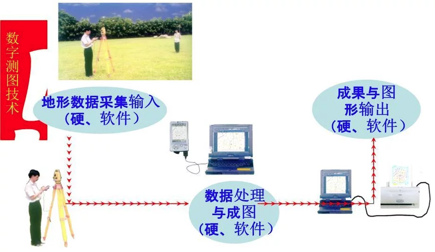

数字测图系统由一系列硬件和软件组成
- 数据采集设备
  - 野外数据采集设备: 全站仪、GNSS-RTK、遥感卫星
  - 室内输入设备: 数字化仪、扫描仪、解析测图仪
- 数据处理设备: 计算机
- 成果输出设备: 磁盘、显示器、打印机、绘图仪

测图系统分类
- 依据数据采集方法分类
  - 野外数字测图系统: 利用全站仪、GNSS RTK接收机在野外直接采集绘图信息并将其传输到计算机中，通过绘图软件进行数据处理形成绘图数据文件，然后由绘图仪输出地形图；测图精度最高
  - 原有地形图数字化系统：将原有纸质地图数字化
    - 手扶跟踪数字化
    - 扫描矢量化
  - 摄影测量与遥感数字成图系统: 利用摄影测量与遥感的方法获得测区的影像，构建三维模型，然后绘制地图
- 按硬件配置分类
  - 全站仪配合电子手薄测图系统
  - 电子平板测图系统
- 按输出成果内容分类
  - 大比例尺数字测图系统
  - 地形地籍测图系统
  - 地下管线测图系统
  - 城市规划成图管理系统

# 地形图基本知识

## 地形图概述

- **地形图**是按一定比例关系，将地面上所有的地物、地貌，经综合取舍，用规定的符号表示地物、地貌平面位置和高程的正射投影图。**地形图是地图的一个分支**
  - 主要表示内容是国家各部门、各行业共同需求的基本地理要素
  - 用等高线表示地形起伏
- **地形**
  - **地物**：指地面上天然或人工形成的物体，如平原，湖泊，河流，海洋，房屋
  - **地貌**: 指地表高低起伏的形态，如山地，丘陵，平原

## 比例尺

- **比例尺**：地形图上任一线段的长度，与地面上相应线段水平投影长度之比
    $$
        \text{比例尺} = \frac{d}{D} = \frac{1}{D/d} = \frac{1}{M}
    $$

    其中
    - $d$: 图上长度
    - $D$：实际地面投影长度
    - $M=\frac{D}{d}$: 比例尺分母

    分母越小，比例尺越大，地图描述越详细
- **表示方法**
  - 数字比例尺，例如 `1:500`，`1:1000`
  - 图示比例尺: 
    - 刻度表示图上距离，单位 `cm`
    - 刻度上的数字表示实际长度，单位 `m`

    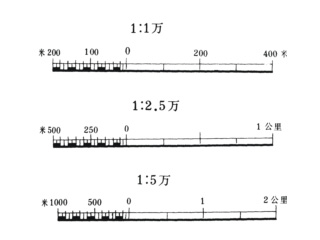

- 分类
  - 大比例尺: `1:500`, `1:1000`, `1:2000`, `1:5000`
  - 中比例尺: `1:10000`, `1:25000`, `1:50000`, `1:100000`
  - 小比例尺: `1:20万`, `1:50万`, `1:2000`, `1:100万`
- **精度**: 地形图上`0.1mm`长所代表的实际长度称为比例尺精度，例如 `1:500` 地形图的精度就是 `500 * 0.1 mm = 50 mm`

## 地形符号

### 符号

- **地形图图式**: 为便于测图和用图,在地形图上用各种点位、线条、符号、文字等表示实地的地物和地貌

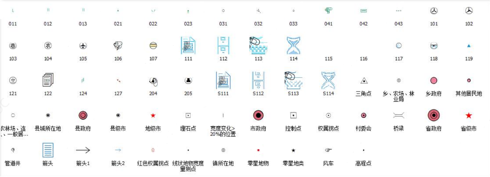

- **地物符号**: 是表示各种地物（包括天然的和人工建造的地物）的类别、形状、大小及位置的一种特定符号
  - 依比例符号: 把地物的轮廓按测图比例尺缩绘于图上，轮廓形状与地物的实地平面图形相似，轮廓内用一定符号（填绘符号或说明符号）或色彩表示这一范围内地物的性质，例如湖泊、住房
  - 不依比例符号：地物轮廓很小，无法按比例尺绘制，采用统一规定的符号进行表示，例如独立树、路灯、检修井
  - 半依比例符号：地物长度轮廓明显，宽度无法按照比例尺绘制，则只绘制长度轮廓，例如公路、铁路
  - 填充符号: 用以表示农业场地、森林植被等而均匀填绘于地类界轮廓内，其轮廓大小按比例尺测绘，而充填的单个符号既不表示地物的大小，也不表示地物的实际位置
- **地貌**: 描述地球表面高低起伏形态的等高线图

    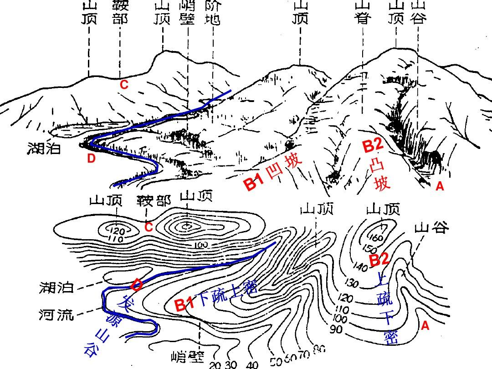

  - **等高线**：地面上高程相等的各相邻点所连成的闭合曲线，**等高线越密集，坡度越大**
    - 首曲线: 每隔若干条等高线（常见是 5 条）就会出现一条比其它线粗、上面还会标高程的等高线。
    - 计曲线: 功能同首曲线，用粗线表示
    - 间曲线: 首曲线之间的那几条普通等高线，用来表示地形细部起伏。
    - 助曲线: 在地形起伏很小、等高线很稀疏（例如平原、台地）时，为了增强可读性，在首曲线与间曲线之间，额外加的一条虚线或较弱的线。
  - **等高距**：相邻两条等高线间的高差，等高距越小，地形图上的等高线越多

    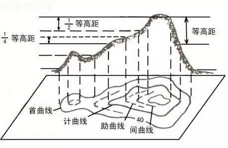

### 典型地貌

- 山头和洼地
  - 区别：山头内圈等高线高程大于外圈，洼地则相反
  - 示坡线：从高侧指向低侧的短线

    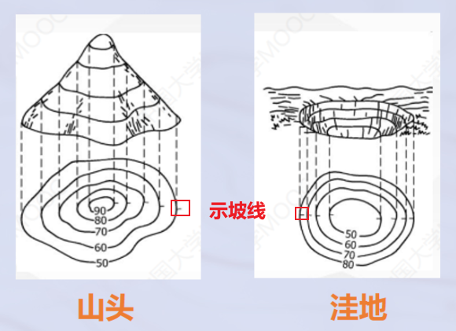

- 山脊与山谷
  - 山脊线（分水线）: 山体凸出部分
  - 山谷线（集水线）: 山体凹陷部分

    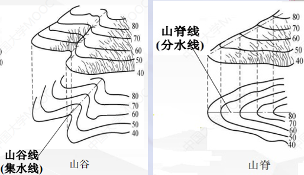

- 鞍部（垭口）: 两个山头中间的部分

    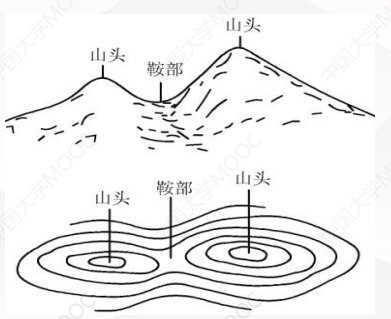

- 陡崖和悬崖
  - 陡崖： 坡度在`70°`以上的陡峭崖壁，用陡崖符号表示
  - 悬崖：上部向外突出，中间凹进，上部的等高线投影到水平面时与下部的等高线相交，下部凹进的等高线用虚线表示

    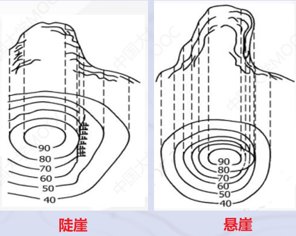

### 注记

**注记**
- **图内注记**

    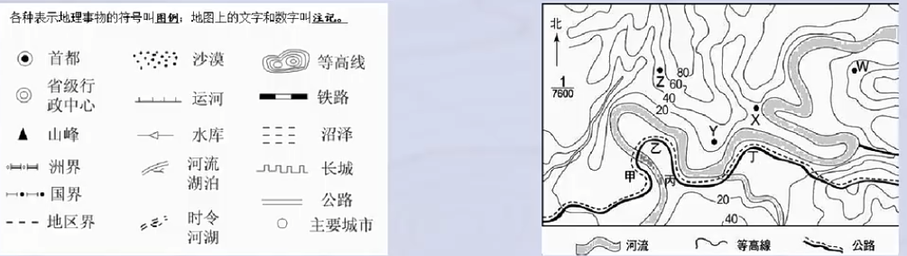

- **图外整饰注记**

    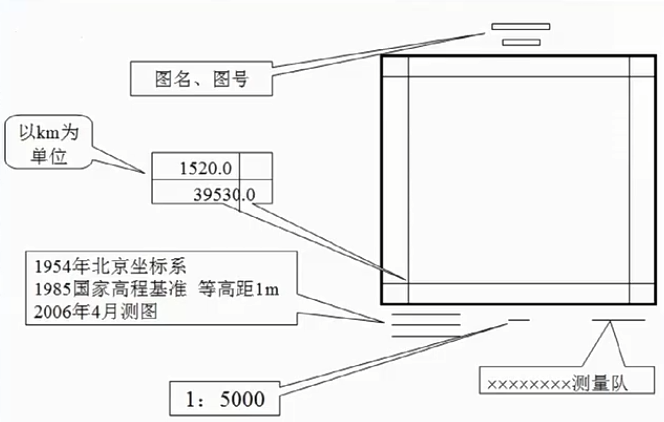

### 图廓

- 图廓线：地图的图框
  - 内图廓：测量边界线
  - 外图廓：图最外侧边界

    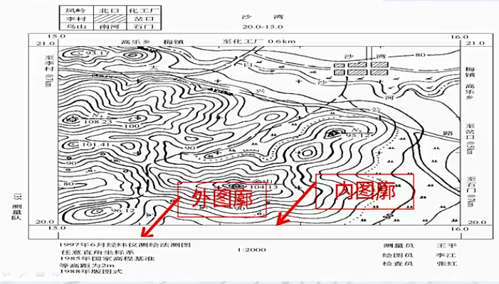

- 坐标网格：内图廓之内绘有 `10cm` 间隔，互相垂直的交叉短线

## 分幅

### 概念

**分幅**: 将一张大图划分为多个小图进行绘制、使用和管理。
- 梯形分幅: 
- 矩形分幅

### 梯形分幅编号

**国际分幅**：按照 `1:100万` 进行绘制，每幅图的经度差 `6`、维度差`4`绘制梯形分幅
- 纬度：使用字母进行编号
- 经度：使用数字进行编号

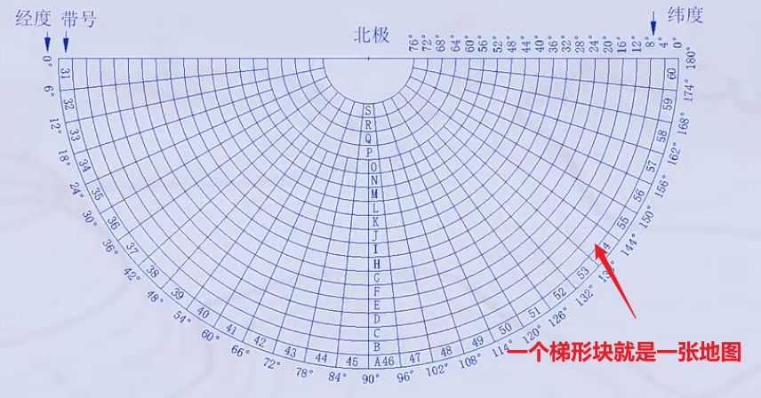

按照上述规则，可得到我国领土分幅

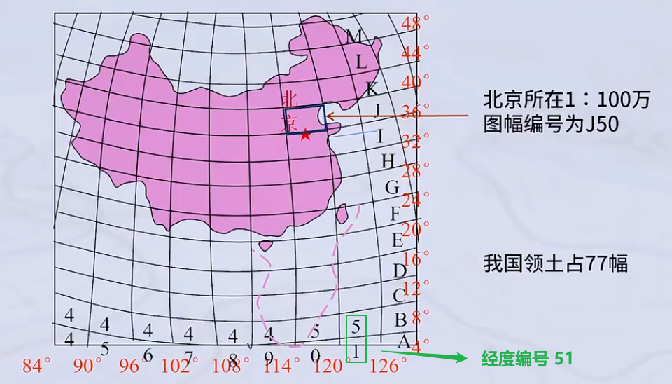

通过某地的经纬度 $(\lambda, \phi)$ ，可以计算其在 `1:100万` 地形图所处的图幅编号

$$
\begin{aligned}
    a &= \left \lfloor \frac{\phi}{4} \right \rfloor   + 1 \\ 
    b &= \left \lfloor \frac{\lambda}{6} \right \rfloor   + 31 \\ 
\end{aligned}
$$

其中
- `a`: 纬度编号
- `b`: 经度编号

`1:100万` 的比例尺绘制的是基本地形图，在此基础上，又进一步演变出了 `1:50万` ~ `1:5000` 更细小的分幅。**将一副 `1:100万` 的地形图，通过行、列拆分为比例尺更大的地形图**

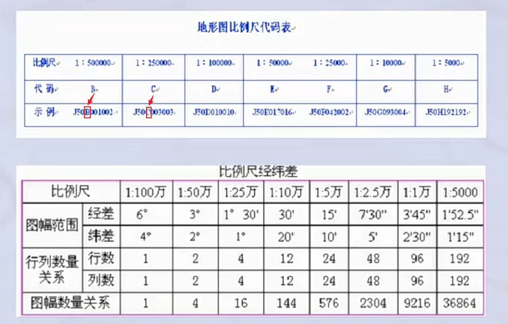

其编号便是由基本地形图 + 拆分后子地形图构成

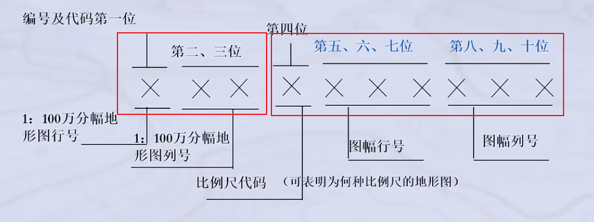

`1:100万` 的子地形图编号计算公式

$$
\begin{aligned}
    c &= \frac{4}{\Delta \phi} - \left \lfloor \left \lfloor \frac{\phi}{4} \right \rfloor / \Delta \phi \right \rfloor \\ 
    d &= \left \lfloor \left \lfloor \frac{\lambda}{6} \right \rfloor  / \Delta \lambda \right \rfloor + 1 \\ 
\end{aligned}
$$

其中
- $c$: 子图的行号
- $d$: 子图的列号
- $\Delta \phi$: 子图的纬度差
- $\Delta \lambda$：子图的经度差

### 矩形分幅编号

- 公里数编号法：以每幅图的图幅西南角坐标的公里数作为该图幅的编号

    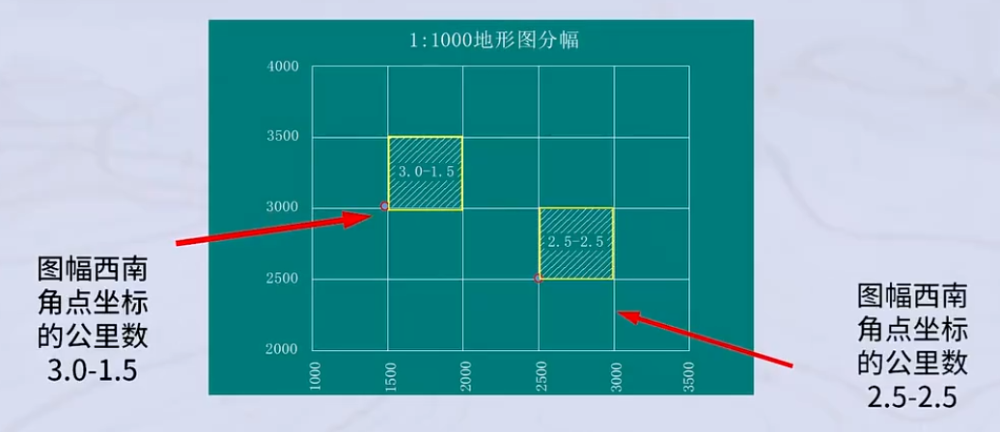

- 子图幅编号
  - 基本图幅：通过公里数编号法得到的图幅
  - 子图幅：坐标原点放置基本图幅的中心，将图幅划分为四个象限，可进行嵌套

    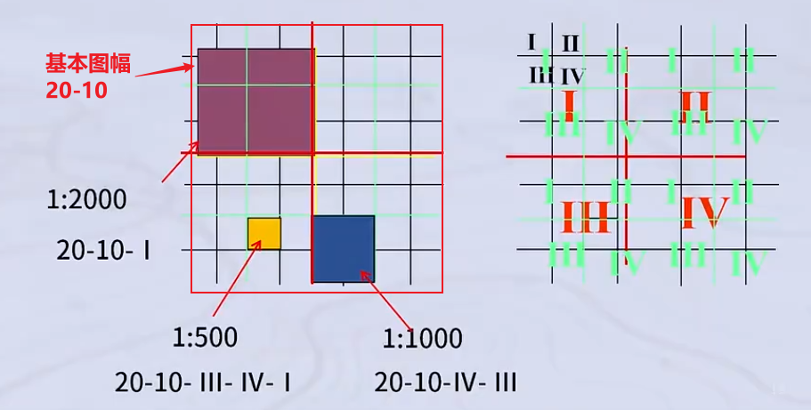

# 工程测量

## 概念

- **水准面**: 液体受重力影响而形成的静止表面，**不唯一**
- **大地水准面**：假设地球表面都被海水覆盖后，所形成的闭合水准曲面，**唯一**
- 测量基准
  - 外业(户外实地考察)测量
    - 基本面：大地水准面
    - 基准线：垂直于水准面的垂线
  - 内业(室内数据处理)制图
    - 基准面：由于地球的大地水准面凹凸不平，不能用于统一的数学描述，**因此，将地球假想为一个规则的椭球，而椭球面就是基准面**
      - `a = 6878140 m`: 长半轴
      - `b = 6356755 m`: 短半轴
      - `e = (a - b) / a = 1/298.257`: 扁率
      - `R = (2a + b) / 3 = 6371 km` : 地球半径
    - 基准线：椭球面的法线

  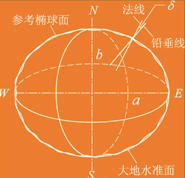

- 坐标系
  - 坐标原点 `O`
    - 地心坐标系：与参考椭球重合
    - 参心坐标系：与参考椭球不重合
  - `x`: 首子午线与赤道交点与 `O` 的连线
  - `y`: 地球旋转轴

  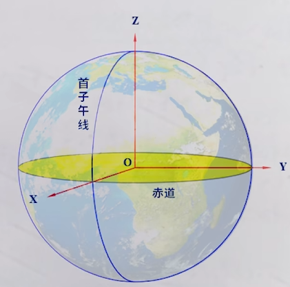

## 高斯投影

- **投影**：上述建立的坐标系是三维坐标系，并不利于绘图与观察。地球表面很大，到局部其实就能当作平面处理，**因此，为了方便地图绘制，要将三维坐标投影到地球表面，变成二维坐标**
- **高斯投影**：将地球按照一定的经度差划分为若干个投影带，然后投影到平面
  - 投影区的中央子午线、赤道线为轴线
  - 其他子午线为曲线，且与中央子午线轴对称分布

  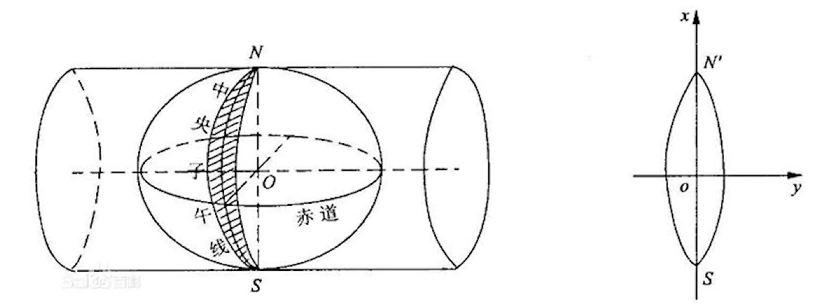

- 经度差
  - `3` 度，会划分 `120` 块投影带，从经度 `1.5` 开始

    $$
    \begin{aligned}
      N &= \left \lfloor \frac{L - 1.5}{3} \right \rfloor + 1 \\
      L。&= 3 N\\
    \end{aligned}
    $$

    其中，$N$ 表示投影带编号，从 1 开始；$L。$ 投影带的中央子午线经度；$L$ 任意经度

  - `6` 度，会划分 `60` 块投影带，从经度 `0` 开始
    $$
    \begin{aligned}
      N &= \left \lfloor \frac{L}{6} \right \rfloor + 1 \\
      L。&= 6 N - 3 \\
    \end{aligned}
    $$

  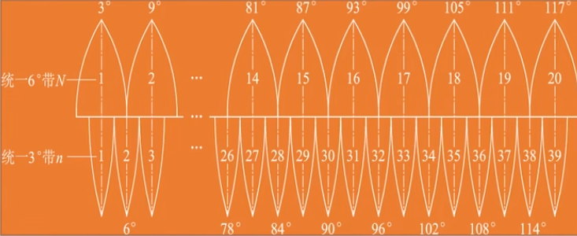

## 平面坐标系

经过高斯投影后，便能建立**高斯投影平面坐标系**
- 原点：赤道与投影带中央子午线交点
- `x`轴：投影带中央子午线，向北为正
- `y`轴：赤道，向东为正

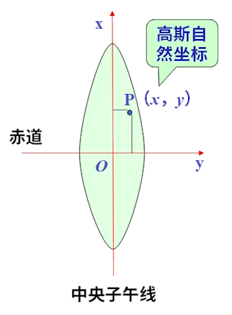

但是上述坐标系会导致坐标会出现负值，用于位置有点不太便利，对坐标系再做优化，即**国家统一坐标系**
- `x` 轴：我国处于北半球，就是正值，不用管
- `y` 轴： **将坐标系往西移动 `500km` ，使得投影带的中 `y` 坐标均为正值**。例如 `y=19367622 m` 所在投影带代号 `19`, 高斯投影平面坐标就为 `y1 = 367622 - 500000 = - 132377 m`

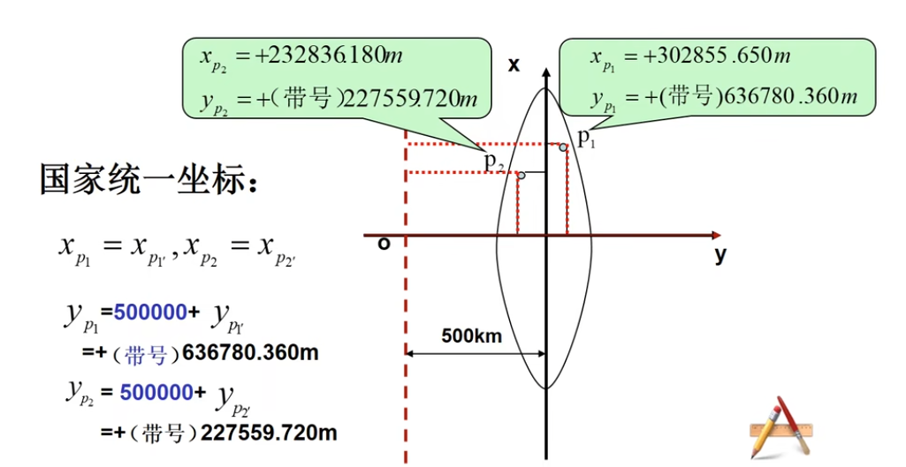

对于小区域的测区，则不需要这么复杂的高斯投影，直接大地水准面看作平面，建立独立的平面坐标系
- 原点：选定在测量区域的西南角，保证坐标均为正值
- `x`轴：北为正，纵轴
- `y`轴：东为正，横轴

## 高程系统

- **高程**：地面点沿铅锤方向到大地水准面的距离，**即海拔、绝对高程**
- **相对高程**：相对于任意水准面的距离
- **高差**：地面两点高程之差
  $$ h_{AB} = H_B - H_A$$
  其中 $h_{AB}$ 表示 B 点相对 A 点的高程关系
  - $ > 0$: B 点比 A 点高
  - $ < 0$: B 点比 A 点低
- 我国高程基准
  - **水准原点**：青岛观象山
  - **水准面**：黄海平均海面

  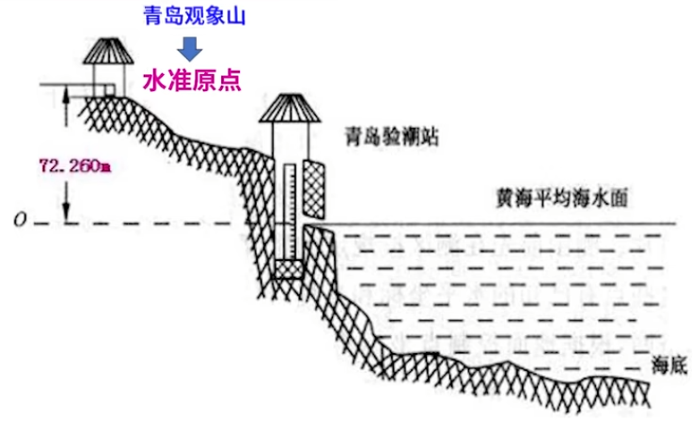

## 测量方法

### 测量要素

> [!note]
> 工程测量的主要目的就是测量出环境中的实际点位在「平面坐标系」与「高程系统」中的坐标值，为地图绘制准备数据

实际地面测量不能直接得到「平面坐标系」的 `x,y` 坐标值与「高程系统」高度值，只能得到
- 高程测量 -> 高差
- 角度测量 -> 水平角
- 距离测量 -> 水平距离

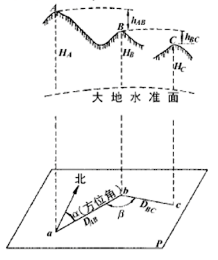

然后通过数据后处理得到「平面坐标系」与「高程系统」中的坐标值。

### 距离测量误差

我们测量只能在地面测量，不能真的在水准面上测量，这样也存在误差。例如想要测量 AB 的距离 S，但是我们实际测量得到的是 AC 距离 t ，其中 R 为地球半径

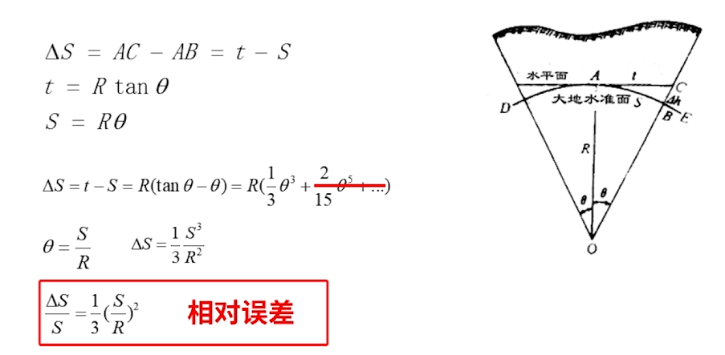

可知，当 S 距离远小于 R 时，相对误差可忽略不计

### 角度测量误差

由于地面真正平面，而是曲面，因此，实际的角度测量也存在偏差

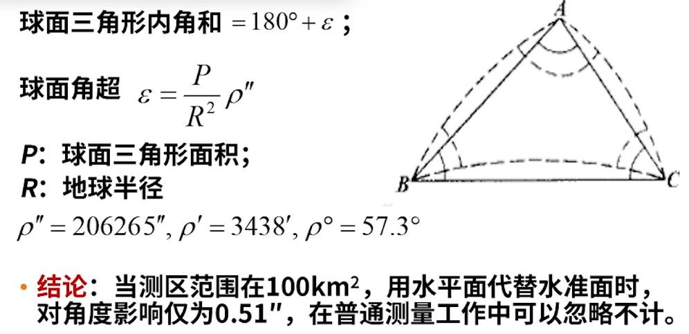

可知，当测量区域较小时，相对误差同样可以会略不计

### 高差误差

由于地面为曲面并非水平面，因此，实际的高差测量存在偏差

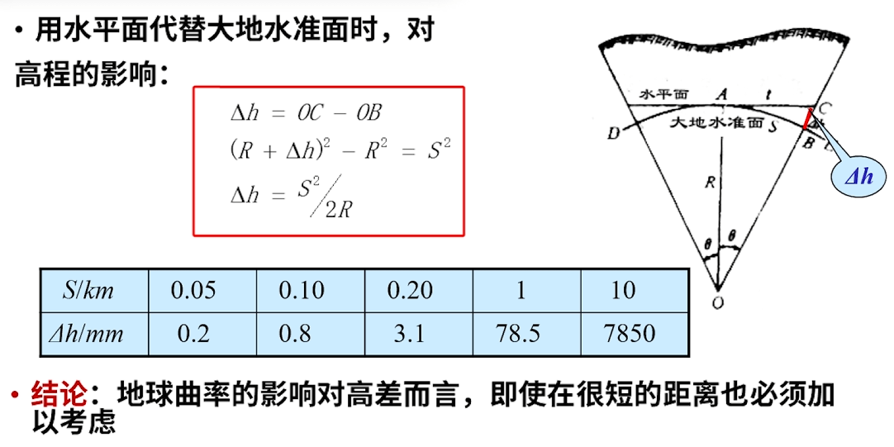

**高差误差不能忽略**

