<!-- fullWidth: false tocVisible: false tableWrap: true -->
# 高程测量

# 测量方法

- 水准测量：使用水准仪进行测量，通过比较两个点之间的高差来确定距离。
- 三角测量：通过测量两点之间的竖直角和水平角距离，利用三角公式计算两点之间的高度差。
- GPS测量：利用全球定位系统（GPS）进行测量，通过接收卫星信号并计算高度。

# 水准测量

## 原理

**水准测量**是一种常用的高程测量方法，它使用水准仪进行测量。水准仪是一种光学仪器，可以精确地测量两个点之间的高差。在测量过程中，需要将水准仪放置在两个点之间的某个位置，然后调整仪器的水平度盘，使视线与地面平行。接着，通过读取仪器上的读数来确定两点之间的高差。

- **前视**：基于已知`A` 测量`B`，`B` 为前视点
- **后视**：基于已知`A` 测量`B`，`A` 为后视点
- `a`: 水准仪后视读数
- `b`: 水准仪前视读数

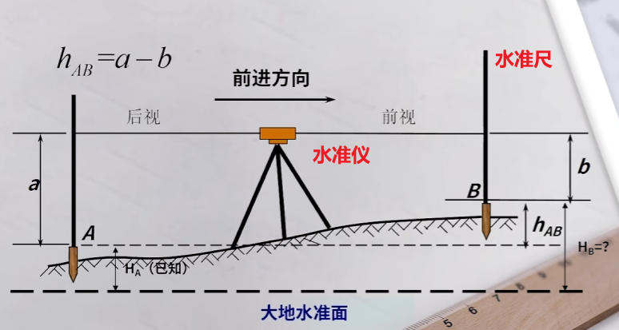

有了 $H_A$、 $a$ 和 $b$，就可以计算出 $H_B$

- **高差法**：$H_B = H_A + h_{AB}$
- **视线高度法**：$H_i = H_A + a, \ H_B = H_i - b$

## 连续水准测量

若两点之间的高度差较大，无法直接测量，则需要进行连续水准测量。在连续水准测量中，需要设置多个测站，每个测站都需要进行前视和后视测量。通过累加所有测站的高差，可以得到两点之间的总高差。

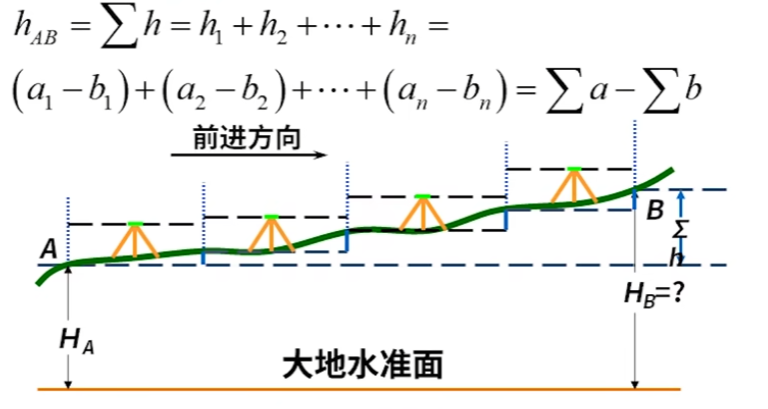

## 误差分析

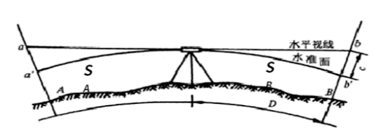

$$
\begin{align*}
h_{AB} &= a' - b' \\
aa' &= \frac{S_A^2}{2R}\\
bb' &= \frac{S_B^2}{2R} \\
h_{AB} &= (a - aa') - (b - bb')  \\
&= (a - b) - (\frac{S_A^2}{2R} - \frac{S_B^2}{2R}) \\
\end{align*}
$$

**只要水平仪放在两个测量点的中间，便能消除误差。**

# 设备

## 水准仪

### 概述

常用的水准仪包括：

- **微倾式水准仪**：需要手动调整仪器的垂直、水平
- **自动安平水准仪**：需要手动调整仪器的垂直，且自动调节水平
- **电子水准仪**：自动调整垂直、水平，且读数数字化

其精度划分四个等级，分别为 `D` 代表大地测量，`S` 代表水准仪

- **DS05级**：精度最高，误差小于 0.5mm/km。
- **DS1级**：精度较高，误差小于 1mm/km。
- **DS3级**：精度一般，误差小于 3mm/km。
- **DS10级**：精度较低，误差小于 10mm/km。

### 微倾式水准仪

- **望远镜**：用于观察目标点，并读取水准尺上的读数。
- **长水准器**：用于调整仪器的水平度盘，使视线与地面平行
- **圆水准器**：用于调整仪器的垂直度盘，使仪器大致垂直于地面

## 水准尺

**水准尺**：一种带有刻度的测量工具，用于读取水准仪上的读数

- **双面尺**：一面为黑色刻度，另一面为红色刻度。**常用**
  - **黑面**：读取范围`0 ~ 2m`
  - **红面**：读取范围`4.687m ~ 6.687m` 或`4.787m ~ 6.787m`
- **单面尺**：只有一面有刻度。
- **塔尺**：一种可伸缩的水准尺，便于携带和存储。

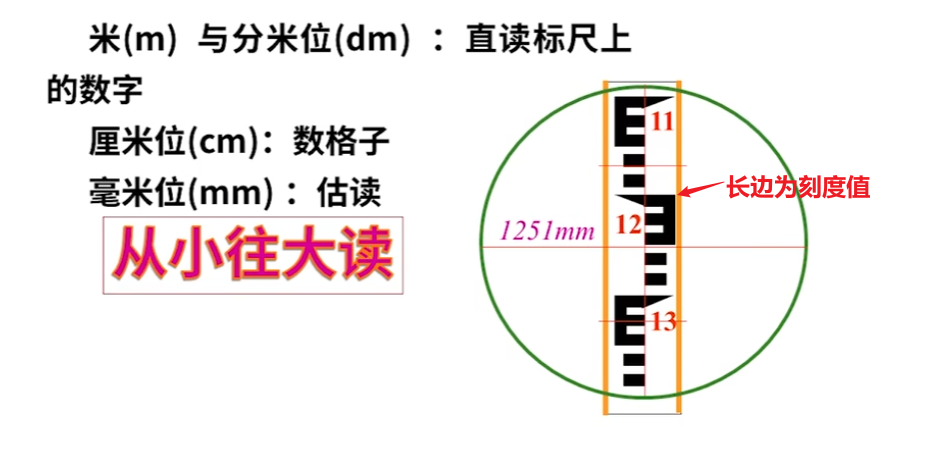

## 使用

- 微倾式水准仪
  1. **安置**: 安置三脚架
  2. **粗平**: 调整圆水准器气泡居中
  3. **瞄准**: 瞄准目标点，并读取水准尺上的读数
  4. **精平**: 调整长水准器气泡居中，使视线与地面平行
  5. **读数**: 读取仪器上的读数，并记录数据。
- 自动安平水准仪
  1. **安置**: 安置三脚架
  2. **粗平**: 调整圆水准器气泡居中
  3. **瞄准**: 瞄准目标点，并读取水准尺上的读数
  4. **读数**: 读取仪器上的读数，并记录数据。

# 测量

## 概念

- **水准点** `bench mark`：用于标记高程的高程控制点，通常设置在稳定的地面上。
- **水准路线**：由多个测站组成的水准测量路线
- **附合水准路线**：起点和终点都是已知高程的水准点

  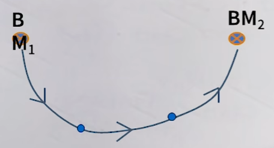
- **闭合水准路线**：起点和终点是同一个水准点

  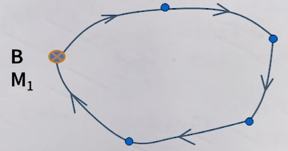
- **支水准路线**：起点是已知高程的水准点，终点是未知高程的点，**因此，必须进行往返测量**

  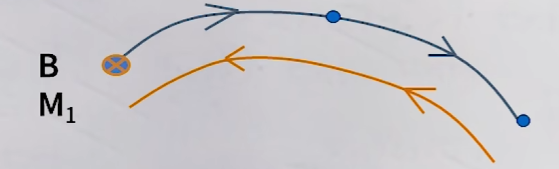
- **转点**：在[连续水准测量](#连续水准测量)中，用于传递高程的中间点

## 一测站

**一测站**：指在一个测站上完成的前视和后视测量，即一次高程测量的过程。

1. 在 A、B 两点之间安置水准仪，立水准尺于 A、B 两点
2. 粗平仪器，使圆水准器气泡居中
3. 瞄准 A 点，读取后视读数 $a$
4. 瞄准 B 点，读取前视读数 $b$
5. 计算高差 $h_{AB} = a - b$

## 连续水准测量

连续水准测量：指在多个测站上完成的前视和后视测量，即多次高程测量的过程。

1. 在 A、B 两点之间安置水准仪，立水准尺于 A、B 两点
2. 粗平仪器，使圆水准器气泡居中
3. 瞄准 A 点，读取后视读数 $a$
4. 瞄准 B 点，读取前视读数 $b$
5. 计算高差 $h_{1} = a - b$
6. 移动仪器到下一个测站，重复上述步骤

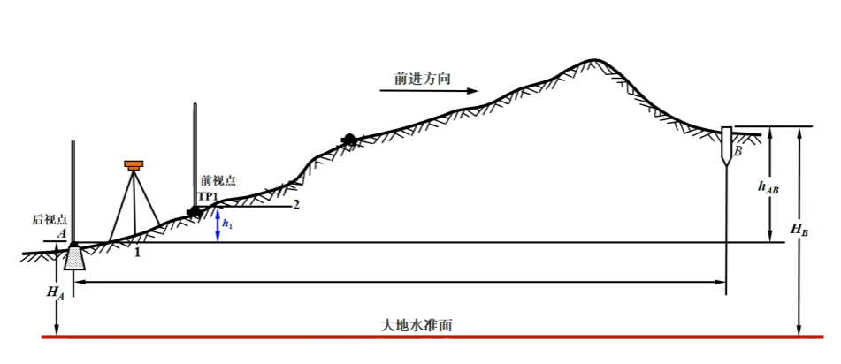

## 检核

### 测站检核

**测站检核**: 对于一次测站的测量结果进行检核，以确保数据的准确性。

- **两次仪器高法**：通过改变仪器的高度，重新测量前视和后视点，比较两次测量结果是否一致。

  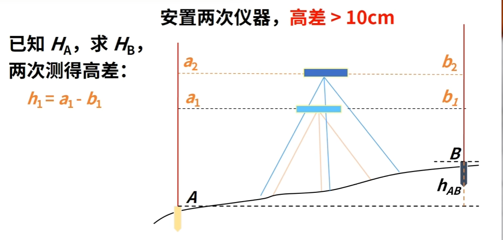
- **双面尺法**：使用双面尺进行测量，比较黑面和红面的读数是否一致。

  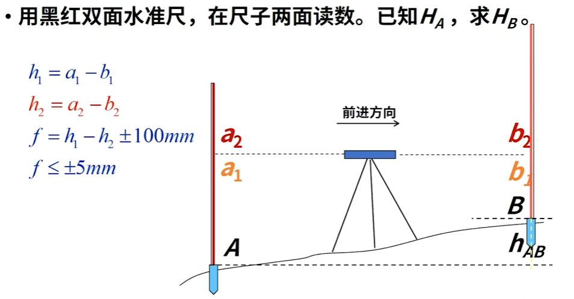

## 计算检核

**计算检核**：对一次测量结果进行计算，最终结果应该满足以下公式：

$$
\sum a - \sum b = \sum h = H_B - H_A
$$

## 成果检核

**成果检核**：对整个「水准路线」的测量结果进行检核，以确保数据的准确性。

- **闭合差**: 高差的观测值与理论值之差，应接近于零。

$$
f_h = \sum h_{测} - \sum h_{理}
$$

- **闭合水准路线**

$$
\begin{align*}
\sum h_{测} &= h_1 + h_2 + ... + h_n \\
\sum h_{理} &= 0 \\
f_h &= \sum h_{测}\\
\end{align*}
$$

- **附合水准路线**

$$
\begin{align*}
\sum h_{测} &= h_1 + h_2 + ... + h_n \\
\sum h_{理} &= H_B - H_A \\
f_h &= \sum h_{测} - (H_B - H_A)
\end{align*}
$$

- **支水准路线**

$$
\begin{align*}
\sum h_{测} &= \sum h_{往} + \sum h_{返} \\
\sum h_{理} &= 0 \\
f_h &= \sum h_{往} + \sum h_{返} \\
\end{align*}
$$

# 四等水准测量

## 概述

**四等水准测量**：是一种精度要求较高的水准测量范式，制定了测量规范，通常用于地形图测绘、工程测量等领域。

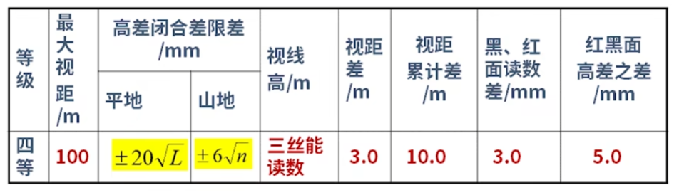

- **视距**：水平仪器到水准尺的距离，**通过目镜的上、下丝读数计算**

  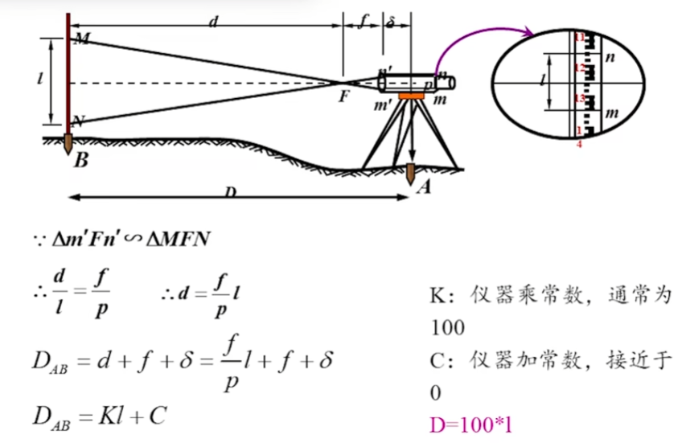
- `L`: 水准路线的总长度，单位为 `km`
- `n`: 测站总数，即一共测量了多少次
- **视距差**：前后视距之差
- **视距累积差**：所有测站的视距差之和

## 读数

四等水准测量要求使用双面尺进行读数，顺序为

- **黑面后视**：读取后视点黑面的读数
- **黑面前视**：读取前视点黑面的读数
- **红面前视**：转动前视尺，读取前视点红面的读数
- **红面后视**：转动后视尺，读取后视点红面的读数

每次读数时，需要记录目镜的上、中、下丝对于水准尺的读数。

- **上/下丝**：用于计算视距差和视距累积差
- **中丝**：用于计算高差

## 计算流程

### 外业数据处理

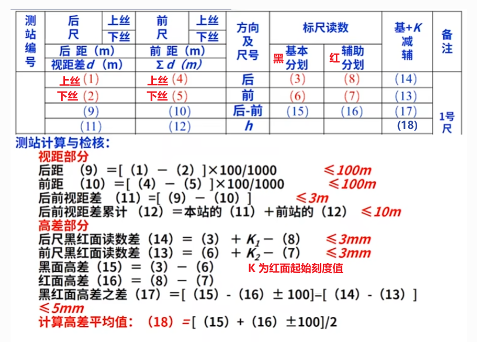

### 内业数据处理

对水准路线进行平差处理，即调整测量结果，使其满足理论值。具体步骤如下：

1. 计算高差闭合差，并校验闭合差
2. 分配高差闭合差，按照距离`L` 或测站数`n` 占比进行分配
3. 修正高差
4. 计算高程