# 控制测量

# 概念

- **控制网**：在测区范围内选择若干控制点，按一定规律与要求构成网状几何图形
  - **平面控制网**
  - **高程控制网**
- **控制测量**：测量构成控制网的控制点位置的工作
  - **平面控制测量**：基于距离测量与角度测试测量得到 `(x,y)` 坐标
  - **高程控制测量**：基于高程测量得到得到 `h` 的工作
- **控制测量目标**
  - 为测图/测区建立统一的控制网
  - 为各种细部测提供基准
  - 控制误差累积
- **图根控制测量**：为大比例尺地形图测绘进行的控制测量
  - **图根导线**：图根控制网
  - **图根点**：图根控制点

# 直线定向

- **直线定向**：确定测量直线与标准方向之间的关系
- **标准方向**
  - **真子午线方向**：地球表面某点的真子午线的切线方向，朝北极为正
  - **磁子午线方向**: 地球表面某点的磁场线切线方向，朝磁南极为正
  - **坐标纵轴方向**：在高斯平面坐标系中，坐标纵轴方向为投影带的中央子午线方向，朝北为正
- **方位角**：从标准方向的正向端起与直线顺时针方向的夹角 `0 ~ 360`
  - 真方位角 $A$
  - 磁方位角 $A_m$
  - 坐标方位角 $\alpha$
- 方位角关系
  - 磁偏角 $\delta$ : 真方位角与坐标方位角的夹角，真北方向右侧为正
  - 子午线收敛角 $\gamma$: 真方位角与坐标方位角的夹角，真北方向右侧为正

    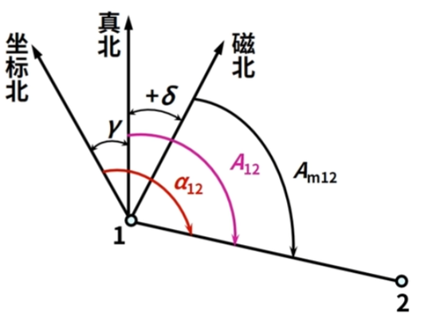

    $$
    \begin{align*}
        A &= A_m + \delta \\
        A &= \alpha + \gamma \\
        \alpha &= A_m + \delta - \gamma
    \end{align*}
    $$
- 正反坐标方位角: 同一直线两个端点处的坐标方位角

    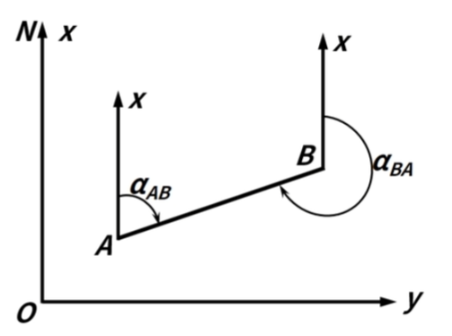

    $$
    \alpha_{AB} = \alpha_{BA} - 180
    $$

# 平面控制测量

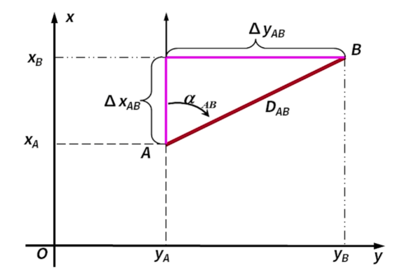

- **坐标正算**：已知直线某端点的方位角、长度和坐标位置，求解另外一端点的坐标
- **坐标反算**：已知直线两端点的坐标，求解直线长度与方位角
  - **象限角**：通过 `tan` 进行角度求解时，得到的是象限角

    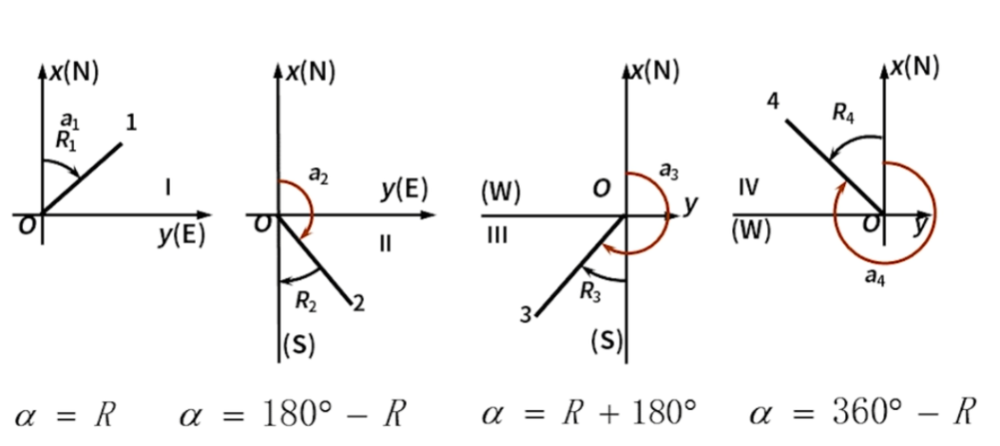

- **方位角推算**: 已知起始方位角以及折线的转折角，求解所有直线的方位角
  - **转折角 $\beta$**：通过角度测量获取

    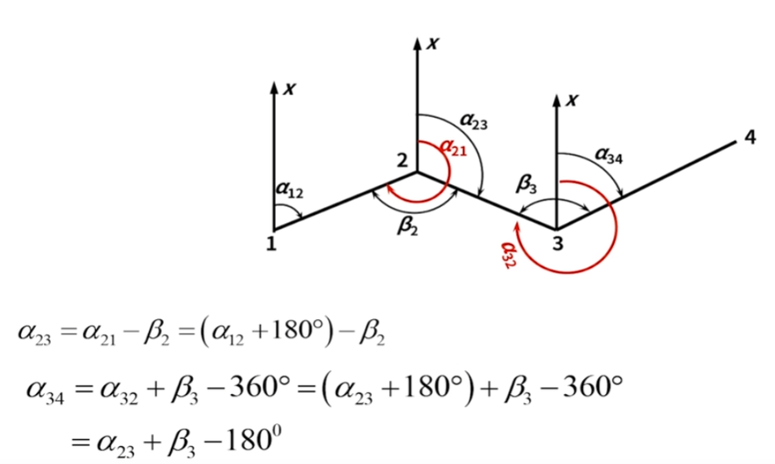

# 导线测量

## 外业作业

- **导线**：将测区相邻控制点用直线连接后构成的折线图
  - **闭合导线**
  
    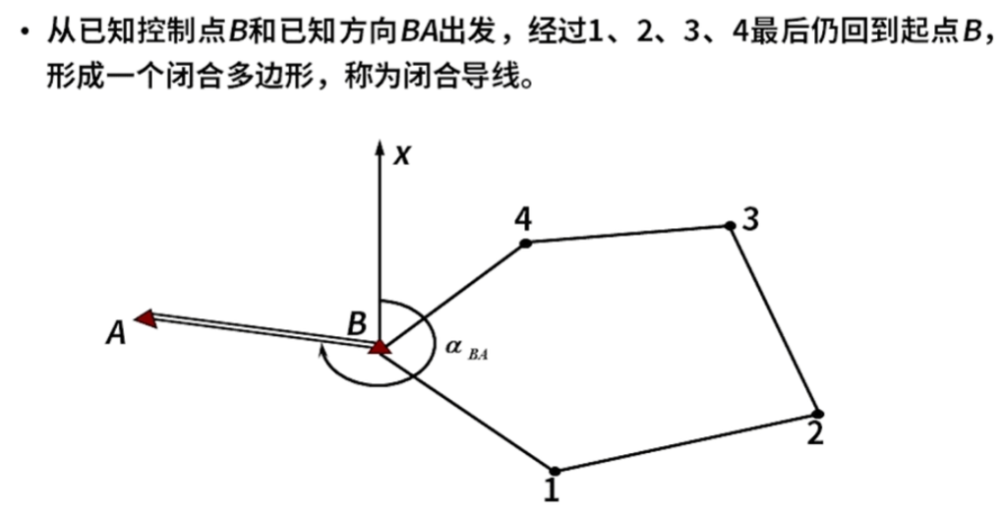

  - **附和导线**

    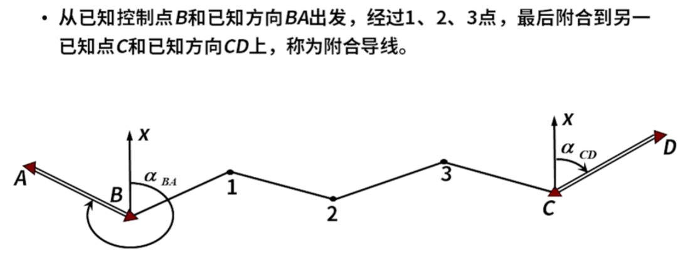

  - **支导线**

    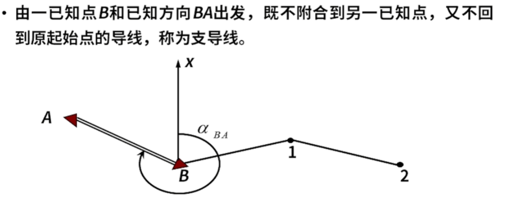

- **导线点**：导线的控制点
- **导线测量**：依次测量各导线边的长度与转折角

    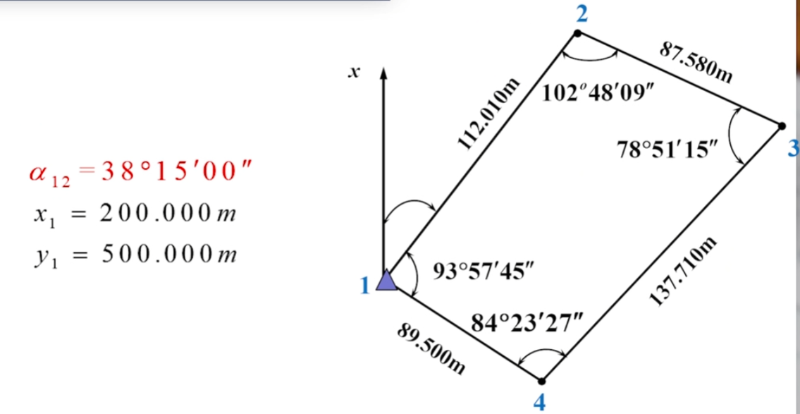

## 内业作业

- **闭合差**

    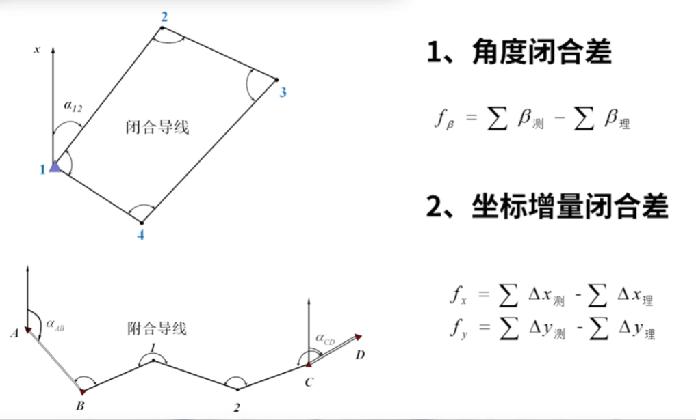

- **流程**

    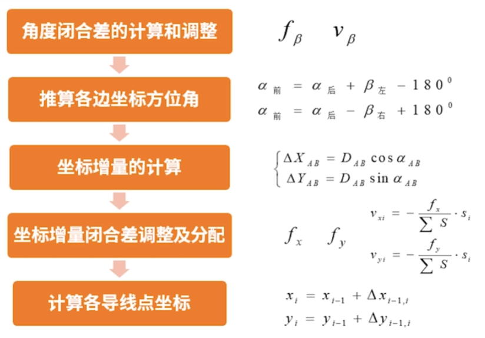
